# AI Differentiation Strategy
## AURA Villas Bali - Intelligent Property Management Systems

## Executive Summary

This document outlines AURA's comprehensive AI differentiation strategy, designed to create competitive advantages through intelligent automation, predictive analytics, and personalized experiences. Our approach combines cutting-edge technology with authentic Balinese hospitality, ensuring that AI enhances rather than replaces human connections.

## Core AI Philosophy

### "Intelligence Amplifying Humanity"
- **AI as Support**: Technology enhances human decision-making and service delivery
- **Cultural Preservation**: AI helps preserve and share authentic Balinese culture
- **Personalization at Scale**: Individual attention for every guest and property owner
- **Predictive Excellence**: Anticipate needs before they become issues
- **Continuous Learning**: Systems that improve through experience and feedback

## 1. AI-Powered Revenue Optimization

### 1.1 Dynamic Pricing Intelligence

#### Sophisticated Pricing Algorithm

```mermaid
graph TD
    subgraph "Market Intelligence"
        A["🏪 Competitor Analysis<br/>• Pricing Strategies<br/>• Availability Patterns<br/>• Feature Comparisons"]
        B["📊 Demand Forecasting<br/>• Booking Trends<br/>• Seasonal Patterns<br/>• Event Impact"]
        C["🌍 Economic Indicators<br/>• Exchange Rates<br/>• Travel Trends<br/>• Regional Events"]
    end
    
    subgraph "Property Intelligence"
        D["🏠 Property Features<br/>• Unique Amenities<br/>• Location Score<br/>• Guest Capacity"]
        E["⭐ Performance History<br/>• Occupancy Rates<br/>• Guest Reviews<br/>• Revenue Trends"]
        F["🎯 Owner Goals<br/>• Revenue Targets<br/>• Occupancy Goals<br/>• Market Position"]
    end
    
    subgraph "Real-Time Factors"
        G["📅 Availability Windows<br/>• Lead Time<br/>• Stay Duration<br/>• Date Flexibility"]
        H["🔍 Current Demand<br/>• Search Volume<br/>• Booking Velocity<br/>• Inquiry Patterns"]
        I["⚡ External Events<br/>• Local Festivals<br/>• Weather Conditions<br/>• Travel Alerts"]
    end
    
    subgraph "AI Processing Engine"
        J["🤖 Machine Learning Models<br/>• XGBoost Regression<br/>• Time Series Analysis<br/>• Neural Networks"]
        K["🎯 Optimization Algorithm<br/>• Revenue Maximization<br/>• Occupancy Balancing<br/>• Risk Assessment"]
    end
    
    A --> J
    B --> J
    C --> J
    D --> J
    E --> J
    F --> J
    G --> J
    H --> J
    I --> J
    
    J --> K
    
    K --> L["💰 Optimal Price Recommendation<br/>• Daily Rate Suggestion<br/>• Minimum Stay Requirements<br/>• Cancellation Policy Optimization"]
    
    style A fill:#e3f2fd
    style J fill:#f3e5f5
    style K fill:#e8f5e8
    style L fill:#fff3e0
```


#### Advanced Pricing Features
```typescript
interface DynamicPricingEngine {
  // Core Models
  demandPrediction: MLModel<DemandForecast>;
  competitorAnalysis: MLModel<MarketPositioning>;
  priceElasticity: MLModel<PriceSensitivity>;
  
  // Revenue Optimization
  revenueMaximization: OptimizationAlgorithm;
  occupancyTargeting: BalancingAlgorithm;
  riskAssessment: RiskModel;
  
  // Real-Time Processing
  processingEngine: {
    updateFrequency: "every 2 hours";
    dataLatency: "< 30 minutes";
    predictionHorizon: "90 days";
  };
  
  // Owner Integration
  ownerPreferences: {
    revenueGoals: RevenueTarget;
    occupancyThresholds: OccupancyRange;
    pricingFlexibility: FlexibilitySettings;
    approvalRequired: boolean;
  };
}
```

### 1.2 Market Intelligence System

#### Competitive Intelligence Platform
- **Real-Time Competitor Monitoring**: Automated tracking of competitor pricing, availability, and promotions
- **Market Positioning Analysis**: Understanding where each property stands in the competitive landscape
- **Opportunity Identification**: Spotting pricing gaps and market inefficiencies
- **Performance Benchmarking**: Comparing property performance against similar listings
- **Strategic Recommendations**: AI-generated suggestions for competitive positioning

#### Revenue Forecasting Models
- **Seasonal Trend Analysis**: Understanding historical patterns and seasonal variations
- **Event Impact Modeling**: Quantifying the impact of local events on demand and pricing
- **Economic Correlation Analysis**: Understanding how economic factors affect booking behavior
- **Long-Term Revenue Projections**: 12-month forward-looking revenue forecasts
- **Scenario Planning**: Multiple forecast scenarios based on different assumptions

## 2. Predictive Maintenance Intelligence

### 2.1 Equipment Health Monitoring

#### IoT-Driven Predictive System

```mermaid
flowchart TD
    subgraph "Sensor Network"
        A["🌊 Pool Systems<br/>• Chemical Sensors<br/>• Flow Meters<br/>• Pump Monitoring<br/>• Heater Status"]
        B["❄️ HVAC Systems<br/>• Temperature Sensors<br/>• Humidity Monitors<br/>• Filter Status<br/>• Energy Consumption"]
        C["💡 Electrical Systems<br/>• Load Monitoring<br/>• Circuit Health<br/>• Generator Status<br/>• Solar Panel Output"]
        D["🚰 Plumbing Systems<br/>• Pressure Monitoring<br/>• Flow Detection<br/>• Leak Sensors<br/>• Water Quality"]
    end
    
    subgraph "AI Analytics"
        E["🔍 Anomaly Detection<br/>• Pattern Recognition<br/>• Threshold Monitoring<br/>• Trend Analysis"]
        F["🎯 Failure Prediction<br/>• Time-to-Failure Models<br/>• Component Lifecycle<br/>• Risk Assessment"]
        G["📊 Optimization Engine<br/>• Maintenance Scheduling<br/>• Resource Allocation<br/>• Cost Minimization"]
    end
    
    subgraph "Action Systems"
        H["🛠️ Maintenance Planning<br/>• Work Order Generation<br/>• Parts Ordering<br/>• Vendor Scheduling"]
        I["📱 Staff Notifications<br/>• Priority Alerts<br/>• Task Assignment<br/>• Progress Tracking"]
        J["💰 Cost Optimization<br/>• Preventive vs Reactive<br/>• Vendor Selection<br/>• Inventory Management"]
    end
    
    A --> E
    B --> E
    C --> E
    D --> E
    
    E --> F
    F --> G
    
    G --> H
    G --> I
    G --> J
    
    style A fill:#e3f2fd
    style E fill:#f3e5f5
    style G fill:#e8f5e8
    style H fill:#fff3e0
```


#### Predictive Maintenance Benefits
```typescript
interface PredictiveMaintenanceBenefits {
  costReduction: {
    preventiveVsReactive: "70% cost reduction";
    equipmentLifeExtension: "25-40% longer lifespan";
    downtimeReduction: "80% reduction in unplanned downtime";
    partsCostOptimization: "15-20% parts cost savings";
  };
  
  guestExperience: {
    serviceDisruptionReduction: "90% fewer guest-facing issues";
    comfortMaintenance: "Optimal climate and amenity performance";
    proactiveService: "Issues resolved before guest awareness";
  };
  
  operational efficiency: {
    maintenanceScheduling: "Optimal timing for minimal impact";
    resourceAllocation: "Efficient staff and vendor utilization";
    inventoryOptimization: "Just-in-time parts management";
  };
}
```

### 2.2 Environmental Intelligence

#### Smart Environmental Controls
- **Climate Optimization**: AI-driven HVAC control for guest comfort and energy efficiency
- **Water Management**: Smart irrigation and pool chemical management
- **Energy Efficiency**: Automated lighting and power management systems
- **Air Quality Monitoring**: Maintaining optimal indoor air quality
- **Sustainability Tracking**: Environmental impact monitoring and optimization

## 3. Guest Experience Personalization

### 3.1 Guest Intelligence Platform

#### Comprehensive Guest Profiling

```mermaid
graph TD
    subgraph "Data Collection"
        A["👤 Booking Data<br/>• Demographics<br/>• Travel Patterns<br/>• Group Composition<br/>• Special Requests"]
        B["🔍 Behavioral Data<br/>• Website Interactions<br/>• Search Patterns<br/>• Booking Journey<br/>• Communication Preferences"]
        C["⭐ Feedback History<br/>• Previous Reviews<br/>• Survey Responses<br/>• Service Ratings<br/>• Complaint Resolution"]
        D["🌐 External Data<br/>• Social Media Insights<br/>• Travel Preferences<br/>• Cultural Background<br/>• Language Preferences"]
    end
    
    subgraph "AI Processing"
        E["🧠 Profile Analysis<br/>• Preference Extraction<br/>• Behavior Modeling<br/>• Satisfaction Predictors"]
        F["🎯 Personalization Engine<br/>• Experience Matching<br/>• Service Customization<br/>• Communication Styling"]
        G["🔮 Predictive Modeling<br/>• Satisfaction Prediction<br/>• Service Need Anticipation<br/>• Experience Optimization"]
    end
    
    subgraph "Personalized Experiences"
        H["🏠 Villa Matching<br/>• Perfect Property Selection<br/>• Amenity Alignment<br/>• Location Preferences"]
        I["🎁 Custom Services<br/>• Personalized Amenities<br/>• Cultural Experiences<br/>• Activity Recommendations"]
        J["💬 Communication Style<br/>• Preferred Channels<br/>• Language Selection<br/>• Interaction Frequency"]
    end
    
    A --> E
    B --> E
    C --> E
    D --> E
    
    E --> F
    F --> G
    
    G --> H
    G --> I
    G --> J
    
    style A fill:#e3f2fd
    style E fill:#f3e5f5
    style G fill:#e8f5e8
    style H fill:#fff3e0
```


#### Personalization Applications
```typescript
interface GuestPersonalizationSystem {
  profileAnalysis: {
    demographicSegmentation: GuestSegment;
    behavioralPatterns: BehaviorModel;
    preferenceMapping: PreferenceProfile;
    culturalAdaptation: CulturalProfile;
  };
  
  experienceCustomization: {
    villaRecommendations: PropertyMatch[];
    amenityPersonalization: CustomAmenity[];
    activitySuggestions: ActivityRecommendation[];
    diningPreferences: CulinaryProfile;
  };
  
  serviceOptimization: {
    communicationStyle: CommunicationPreference;
    serviceDeliveryTiming: ServiceSchedule;
    interactionFrequency: ContactPreference;
    culturalSensitivity: CulturalAdaptation;
  };
  
  satisfactionPrediction: {
    satisfactionScore: PredictedSatisfaction;
    riskFactors: SatisfactionRisk[];
    interventionTriggers: ProactiveAction[];
    improvementOpportunities: Enhancement[];
  };
}
```

### 3.2 Cultural Experience AI

#### Authentic Experience Matching
- **Cultural Interest Profiling**: Understanding guest interests in Balinese culture
- **Experience Authenticity Verification**: Ensuring cultural experiences are genuine and respectful
- **Local Partner Matching**: Connecting guests with appropriate cultural practitioners
- **Cultural Sensitivity Guidance**: Helping guests understand cultural norms and practices
- **Experience Impact Tracking**: Measuring the effectiveness of cultural programs

#### AI-Curated Cultural Journeys
- **Personalized Cultural Itineraries**: Custom cultural experience recommendations
- **Spiritual Journey Mapping**: Connecting guests with appropriate spiritual practices
- **Artisan Workshop Matching**: Pairing guests with master craftspeople
- **Community Engagement Opportunities**: Meaningful local community interactions
- **Cultural Learning Pathways**: Progressive cultural education experiences

## 4. Operational Intelligence

### 4.1 Staff Optimization AI

#### Intelligent Workforce Management
```typescript
interface StaffOptimizationSystem {
  predictiveScheduling: {
    demandForecasting: WorkloadPrediction;
    skillRequirementAnalysis: SkillMapping;
    optimalStaffing: StaffingRecommendation;
    shiftOptimization: ScheduleOptimization;
  };
  
  performanceAnalytics: {
    productivityMetrics: PerformanceAnalytics;
    qualityScoring: QualityAssessment;
    guestSatisfactionImpact: ServiceImpactAnalysis;
    improvementRecommendations: DevelopmentPlan;
  };
  
  resourceAllocation: {
    taskPrioritization: TaskRanking;
    skillMatching: StaffTaskAlignment;
    efficiencyOptimization: ResourceEfficiency;
    crossTrainingRecommendations: SkillDevelopment;
  };
  
  retentionPrediction: {
    turnoverRisk: RetentionRisk;
    satisfactionAnalysis: StaffSatisfaction;
    careerPathRecommendations: CareerDevelopment;
    interventionTriggers: RetentionAction;
  };
}
```

#### Intelligent Task Management
- **Dynamic Task Assignment**: AI-driven assignment based on skills, availability, and priority
- **Workload Balancing**: Ensuring optimal distribution of tasks across team members
- **Performance Prediction**: Forecasting task completion times and quality outcomes
- **Training Recommendations**: Identifying skill gaps and training opportunities
- **Career Development**: AI-guided career path recommendations for staff growth

### 4.2 Supply Chain Intelligence

#### Smart Inventory Management
- **Demand Forecasting**: Predicting supply needs based on occupancy and usage patterns
- **Automated Reordering**: Smart replenishment systems with optimal timing
- **Vendor Performance Analysis**: AI-driven evaluation of supplier reliability and quality
- **Cost Optimization**: Finding the best price-quality balance for all supplies
- **Sustainability Tracking**: Environmental impact assessment of supply choices

## 5. Financial Intelligence

### 5.1 Owner Financial Analytics

#### Advanced Financial Modeling

```mermaid
graph TD
    subgraph "Revenue Analytics"
        A["💰 Revenue Forecasting<br/>• Seasonal Predictions<br/>• Market Trend Analysis<br/>• Booking Pipeline Impact"]
        B["📊 Performance Benchmarking<br/>• Market Comparison<br/>• Property Ranking<br/>• ROI Analysis"]
    end
    
    subgraph "Cost Intelligence"
        C["💸 Expense Optimization<br/>• Cost Category Analysis<br/>• Vendor Performance<br/>• Efficiency Opportunities"]
        D["🔮 Predictive Budgeting<br/>• Future Cost Modeling<br/>• Capital Planning<br/>• Maintenance Forecasting"]
    end
    
    subgraph "Investment Insights"
        E["📈 ROI Optimization<br/>• Investment Recommendations<br/>• Upgrade Impact Analysis<br/>• Market Opportunity Assessment"]
        F["🎯 Strategic Planning<br/>• Growth Opportunities<br/>• Market Positioning<br/>• Competitive Strategy"]
    end
    
    A --> E
    B --> F
    C --> E
    D --> F
    
    style A fill:#e3f2fd
    style C fill:#f3e5f5
    style E fill:#e8f5e8
```


#### Owner Investment Intelligence
- **Property Value Optimization**: AI recommendations for property improvements with highest ROI
- **Market Timing Analysis**: Optimal timing for property upgrades and major investments
- **Competitive Positioning**: Strategic recommendations for market positioning
- **Risk Assessment**: Financial risk analysis and mitigation strategies
- **Growth Opportunities**: Identification of expansion and diversification opportunities

### 5.2 Revenue Optimization Engine

#### Multi-Dimensional Revenue Analysis
```typescript
interface RevenueOptimizationEngine {
  revenueStreams: {
    accommodationRevenue: AccommodationAnalysis;
    ancillaryServices: ServiceRevenueAnalysis;
    experiencePackages: ExperienceRevenueModel;
    partnerCommissions: PartnershipRevenue;
  };
  
  optimizationStrategies: {
    pricingOptimization: DynamicPricingStrategy;
    packageBundling: BundlingRecommendations;
    upsellOpportunities: UpsellSuggestions;
    crossSellPotential: CrossSellAnalysis;
  };
  
  performanceMetrics: {
    revenuePerAvailableRoom: RevPARAnalysis;
    averageDailyRate: ADROptimization;
    occupancyRateOptimization: OccupancyStrategy;
    totalRevenuePerGuest: GuestValueAnalysis;
  };
  
  forecastingModels: {
    shortTermForecasts: ShortTermRevenuePrediction;
    seasonalProjections: SeasonalRevenueModel;
    longTermTrends: LongTermRevenueForecasting;
    scenarioModeling: RevenueScenarioAnalysis;
  };
}
```

## 6. Competitive Intelligence Platform

### 6.1 Market Intelligence System

#### Comprehensive Market Analysis
- **Competitor Performance Tracking**: Real-time monitoring of competitor metrics
- **Market Share Analysis**: Understanding AURA's position in the market
- **Pricing Strategy Intelligence**: Competitive pricing analysis and recommendations
- **Feature Gap Analysis**: Identifying opportunities for service differentiation
- **Customer Sentiment Monitoring**: Tracking guest satisfaction across competitors

### 6.2 Strategic Intelligence

#### AI-Driven Strategic Insights
- **Market Opportunity Identification**: Spotting underserved market segments
- **Competitive Advantage Analysis**: Understanding and leveraging unique strengths
- **Threat Assessment**: Early warning system for competitive threats
- **Innovation Opportunities**: Identifying areas for technological advancement
- **Partnership Opportunities**: AI-identified strategic partnership possibilities

## 7. Implementation Roadmap

### Phase 1: Foundation (Months 1-6)
- **Core AI Infrastructure**: Establish data pipeline and basic ML capabilities
- **Dynamic Pricing System**: Implement basic revenue optimization
- **Guest Profiling Platform**: Basic personalization engine
- **Predictive Maintenance Pilot**: IoT sensors for critical equipment

### Phase 2: Enhancement (Months 7-12)
- **Advanced Personalization**: Full guest experience customization
- **Comprehensive Predictive Maintenance**: Full property monitoring
- **Staff Optimization AI**: Intelligent workforce management
- **Financial Intelligence Platform**: Advanced owner analytics

### Phase 3: Innovation (Months 13-18)
- **Cultural Experience AI**: Advanced cultural matching and curation
- **Strategic Intelligence Platform**: Comprehensive competitive analysis
- **Advanced Automation**: Fully integrated operational automation
- **Predictive Guest Services**: Anticipatory service delivery

## Success Metrics

### AI Performance Indicators
- **Revenue Impact**: 15-25% revenue increase through optimization
- **Cost Reduction**: 20-30% reduction in operational costs
- **Guest Satisfaction**: 10-15% improvement in satisfaction scores
- **Operational Efficiency**: 40-50% improvement in task completion rates
- **Predictive Accuracy**: >90% accuracy in maintenance and demand predictions

### Competitive Advantage Metrics
- **Market Share Growth**: Measurable increase in market share
- **Customer Lifetime Value**: Increased guest return rates and spending
- **Owner Retention**: >95% owner retention rate
- **Service Differentiation**: Unique AI capabilities not available from competitors
- **Innovation Leadership**: Recognition as technology leader in property management

This AI differentiation strategy positions AURA Villas Bali as the technology leader in boutique property management, delivering exceptional value through intelligent automation while preserving the authentic human touch that defines the AURA experience.