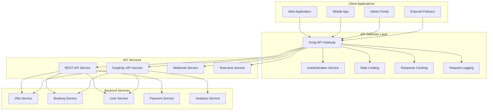

# AURA Villas Bali - API Architecture Specification
## RESTful & GraphQL API Design for Scalable Villa Management Platform

### Executive Summary

This document outlines the comprehensive API architecture for AURA Villas Bali, designed to support a microservices-based platform with high performance, scalability, and developer experience. The hybrid approach combines RESTful APIs for standard operations with GraphQL for complex data relationships and real-time features.

**Key Features:**
- Hybrid REST/GraphQL architecture
- Type-safe APIs with OpenAPI/GraphQL schema
- Real-time capabilities with subscriptions
- Comprehensive authentication & authorization
- Rate limiting and performance optimization
- Versioning strategy for backward compatibility

---

## 1. API Architecture Overview

### 1.1 Hybrid API Strategy

```typescript
interface APIArchitecture {
  restfulAPIs: {
    purpose: "Standard CRUD operations, integrations, webhooks";
    use_cases: ["Villa management", "Booking operations", "User authentication"];
    benefits: ["Simple integration", "Caching friendly", "Wide tooling support"];
  };
  
  graphqlAPI: {
    purpose: "Complex queries, real-time updates, mobile optimization";
    use_cases: ["Villa search", "Dashboard data", "Real-time notifications"];
    benefits: ["Flexible queries", "Real-time subscriptions", "Type safety"];
  };
  
  hybridApproach: {
    rationale: "Leverage strengths of both paradigms";
    implementation: "REST for operations, GraphQL for queries";
    migration: "Gradual adoption based on use case complexity";
  };
}
```

### 1.2 API Gateway Architecture



---

## 2. RESTful API Specification

### 2.1 Core Villa Management API

#### Villa Operations
```yaml
Villa Management Endpoints:

GET /api/v1/villas:
  summary: "List villas with pagination and filtering"
  parameters:
    - name: "area"
      in: "query"
      schema:
        type: "string"
        enum: ["Seminyak", "Ubud", "Canggu", "Uluwatu", "Sanur", "Nusa Dua"]
    - name: "guests"
      in: "query"
      schema:
        type: "integer"
        minimum: 1
    - name: "checkIn"
      in: "query"
      schema:
        type: "string"
        format: "date"
    - name: "checkOut"
      in: "query"
      schema:
        type: "string"
        format: "date"
    - name: "priceMin"
      in: "query"
      schema:
        type: "number"
    - name: "priceMax"
      in: "query"
      schema:
        type: "number"
    - name: "amenities"
      in: "query"
      schema:
        type: "array"
        items:
          type: "string"
    - name: "page"
      in: "query"
      schema:
        type: "integer"
        default: 1
    - name: "limit"
      in: "query"
      schema:
        type: "integer"
        default: 20
        maximum: 100
    - name: "sort"
      in: "query"
      schema:
        type: "string"
        enum: ["price_asc", "price_desc", "rating_desc", "created_desc"]
  responses:
    200:
      description: "Successful response"
      content:
        application/json:
          schema:
            type: "object"
            properties:
              data:
                type: "array"
                items:
                  $ref: "#/components/schemas/Villa"
              pagination:
                $ref: "#/components/schemas/Pagination"
              filters:
                $ref: "#/components/schemas/AppliedFilters"

GET /api/v1/villas/{villaId}:
  summary: "Get villa details by ID"
  parameters:
    - name: "villaId"
      in: "path"
      required: true
      schema:
        type: "string"
        format: "uuid"
    - name: "include"
      in: "query"
      schema:
        type: "array"
        items:
          type: "string"
          enum: ["images", "amenities", "reviews", "availability", "location", "owner"]
  responses:
    200:
      description: "Villa details"
      content:
        application/json:
          schema:
            $ref: "#/components/schemas/VillaDetailed"
    404:
      description: "Villa not found"
      content:
        application/json:
          schema:
            $ref: "#/components/schemas/Error"

POST /api/v1/villas:
  summary: "Create new villa (Owner/Admin only)"
  security:
    - bearerAuth: []
  requestBody:
    required: true
    content:
      application/json:
        schema:
          $ref: "#/components/schemas/VillaCreateRequest"
  responses:
    201:
      description: "Villa created successfully"
      content:
        application/json:
          schema:
            $ref: "#/components/schemas/Villa"
    400:
      description: "Validation error"
      content:
        application/json:
          schema:
            $ref: "#/components/schemas/ValidationError"
    401:
      description: "Unauthorized"
    403:
      description: "Insufficient permissions"

PUT /api/v1/villas/{villaId}:
  summary: "Update villa (Owner/Admin only)"
  security:
    - bearerAuth: []
  parameters:
    - name: "villaId"
      in: "path"
      required: true
      schema:
        type: "string"
        format: "uuid"
  requestBody:
    required: true
    content:
      application/json:
        schema:
          $ref: "#/components/schemas/VillaUpdateRequest"
  responses:
    200:
      description: "Villa updated successfully"
    404:
      description: "Villa not found"
    401:
      description: "Unauthorized"
    403:
      description: "Insufficient permissions"

DELETE /api/v1/villas/{villaId}:
  summary: "Delete villa (Admin only)"
  security:
    - bearerAuth: []
  parameters:
    - name: "villaId"
      in: "path"
      required: true
      schema:
        type: "string"
        format: "uuid"
  responses:
    204:
      description: "Villa deleted successfully"
    404:
      description: "Villa not found"
    401:
      description: "Unauthorized"
    403:
      description: "Insufficient permissions"
```

#### Villa Availability API
```yaml
Availability Endpoints:

GET /api/v1/villas/{villaId}/availability:
  summary: "Get villa availability for date range"
  parameters:
    - name: "villaId"
      in: "path"
      required: true
      schema:
        type: "string"
        format: "uuid"
    - name: "startDate"
      in: "query"
      required: true
      schema:
        type: "string"
        format: "date"
    - name: "endDate"
      in: "query"
      required: true
      schema:
        type: "string"
        format: "date"
  responses:
    200:
      description: "Availability calendar"
      content:
        application/json:
          schema:
            type: "object"
            properties:
              villaId:
                type: "string"
                format: "uuid"
              dateRange:
                type: "object"
                properties:
                  startDate:
                    type: "string"
                    format: "date"
                  endDate:
                    type: "string"
                    format: "date"
              availability:
                type: "array"
                items:
                  type: "object"
                  properties:
                    date:
                      type: "string"
                      format: "date"
                    available:
                      type: "boolean"
                    price:
                      type: "number"
                    minimumStay:
                      type: "integer"
                    notes:
                      type: "string"

PUT /api/v1/villas/{villaId}/availability:
  summary: "Update villa availability (Owner/Staff only)"
  security:
    - bearerAuth: []
  parameters:
    - name: "villaId"
      in: "path"
      required: true
      schema:
        type: "string"
        format: "uuid"
  requestBody:
    required: true
    content:
      application/json:
        schema:
          type: "object"
          properties:
            updates:
              type: "array"
              items:
                type: "object"
                properties:
                  date:
                    type: "string"
                    format: "date"
                  available:
                    type: "boolean"
                  price:
                    type: "number"
                  minimumStay:
                    type: "integer"
                  notes:
                    type: "string"
  responses:
    200:
      description: "Availability updated successfully"
    400:
      description: "Invalid date range or data"
    401:
      description: "Unauthorized"
    403:
      description: "Insufficient permissions"
```

### 2.2 Booking Management API

#### Booking Operations
```yaml
Booking Endpoints:

POST /api/v1/bookings/inquiry:
  summary: "Submit booking inquiry"
  requestBody:
    required: true
    content:
      application/json:
        schema:
          type: "object"
          required: ["villaId", "guestName", "guestEmail", "checkIn", "checkOut", "guests"]
          properties:
            villaId:
              type: "string"
              format: "uuid"
            guestName:
              type: "string"
              minLength: 2
              maxLength: 255
            guestEmail:
              type: "string"
              format: "email"
            guestPhone:
              type: "string"
              pattern: "^\\+?[1-9]\\d{1,14}$"
            checkIn:
              type: "string"
              format: "date"
            checkOut:
              type: "string"
              format: "date"
            guests:
              type: "integer"
              minimum: 1
            adults:
              type: "integer"
              minimum: 1
            children:
              type: "integer"
              minimum: 0
            infants:
              type: "integer"
              minimum: 0
            specialRequests:
              type: "array"
              items:
                type: "string"
            message:
              type: "string"
              maxLength: 1000
            experienceIds:
              type: "array"
              items:
                type: "string"
                format: "uuid"
  responses:
    201:
      description: "Inquiry submitted successfully"
      content:
        application/json:
          schema:
            type: "object"
            properties:
              bookingId:
                type: "string"
                format: "uuid"
              bookingReference:
                type: "string"
              status:
                type: "string"
                enum: ["inquiry"]
              estimatedTotal:
                type: "number"
              currency:
                type: "string"
              responseTime:
                type: "string"
                description: "Expected response time for confirmation"
    400:
      description: "Validation error"
    409:
      description: "Villa not available for selected dates"

GET /api/v1/bookings/{bookingId}:
  summary: "Get booking details"
  security:
    - bearerAuth: []
    - guestAccess: []
  parameters:
    - name: "bookingId"
      in: "path"
      required: true
      schema:
        type: "string"
        format: "uuid"
  responses:
    200:
      description: "Booking details"
      content:
        application/json:
          schema:
            $ref: "#/components/schemas/BookingDetailed"
    404:
      description: "Booking not found"
    401:
      description: "Unauthorized"
    403:
      description: "Access denied"

PUT /api/v1/bookings/{bookingId}/confirm:
  summary: "Confirm booking (Staff/Admin only)"
  security:
    - bearerAuth: []
  parameters:
    - name: "bookingId"
      in: "path"
      required: true
      schema:
        type: "string"
        format: "uuid"
  requestBody:
    required: true
    content:
      application/json:
        schema:
          type: "object"
          properties:
            finalAmount:
              type: "number"
            paymentTerms:
              type: "string"
            specialInstructions:
              type: "string"
            checkInInstructions:
              type: "string"
            emergencyContact:
              type: "object"
              properties:
                name:
                  type: "string"
                phone:
                  type: "string"
                whatsapp:
                  type: "string"
  responses:
    200:
      description: "Booking confirmed successfully"
    400:
      description: "Invalid booking state"
    404:
      description: "Booking not found"
    401:
      description: "Unauthorized"

POST /api/v1/bookings/{bookingId}/payment:
  summary: "Process booking payment"
  security:
    - bearerAuth: []
    - guestAccess: []
  parameters:
    - name: "bookingId"
      in: "path"
      required: true
      schema:
        type: "string"
        format: "uuid"
  requestBody:
    required: true
    content:
      application/json:
        schema:
          type: "object"
          required: ["paymentMethod", "amount"]
          properties:
            paymentMethod:
              type: "string"
              enum: ["stripe_card", "stripe_bank", "xendit_va", "xendit_ewallet", "bank_transfer"]
            amount:
              type: "number"
              minimum: 0
            currency:
              type: "string"
              default: "USD"
            paymentDetails:
              type: "object"
              description: "Payment method specific details"
            savePaymentMethod:
              type: "boolean"
              default: false
  responses:
    200:
      description: "Payment processed successfully"
      content:
        application/json:
          schema:
            type: "object"
            properties:
              transactionId:
                type: "string"
              status:
                type: "string"
                enum: ["completed", "processing", "requires_action"]
              clientSecret:
                type: "string"
                description: "For client-side payment confirmation"
              nextAction:
                type: "object"
                description: "Additional steps required"
    400:
      description: "Payment processing error"
    402:
      description: "Payment required"
```

### 2.3 User Management API

#### Authentication & User Operations
```yaml
Authentication Endpoints:

POST /api/v1/auth/register:
  summary: "Register new user account"
  requestBody:
    required: true
    content:
      application/json:
        schema:
          type: "object"
          required: ["email", "password", "firstName", "lastName"]
          properties:
            email:
              type: "string"
              format: "email"
            password:
              type: "string"
              minLength: 8
              pattern: "^(?=.*[a-z])(?=.*[A-Z])(?=.*\\d)(?=.*[@$!%*?&])[A-Za-z\\d@$!%*?&]"
            firstName:
              type: "string"
              minLength: 1
              maxLength: 100
            lastName:
              type: "string"
              minLength: 1
              maxLength: 100
            phone:
              type: "string"
              pattern: "^\\+?[1-9]\\d{1,14}$"
            nationality:
              type: "string"
              pattern: "^[A-Z]{2}$"
            dateOfBirth:
              type: "string"
              format: "date"
            marketingConsent:
              type: "boolean"
              default: false
  responses:
    201:
      description: "User registered successfully"
      content:
        application/json:
          schema:
            type: "object"
            properties:
              user:
                $ref: "#/components/schemas/User"
              tokens:
                $ref: "#/components/schemas/AuthTokens"
              emailVerificationRequired:
                type: "boolean"
    400:
      description: "Validation error"
    409:
      description: "Email already exists"

POST /api/v1/auth/login:
  summary: "User login"
  requestBody:
    required: true
    content:
      application/json:
        schema:
          type: "object"
          required: ["email", "password"]
          properties:
            email:
              type: "string"
              format: "email"
            password:
              type: "string"
            rememberMe:
              type: "boolean"
              default: false
            deviceInfo:
              type: "object"
              properties:
                deviceType:
                  type: "string"
                  enum: ["web", "mobile", "tablet"]
                deviceName:
                  type: "string"
                userAgent:
                  type: "string"
  responses:
    200:
      description: "Login successful"
      content:
        application/json:
          schema:
            type: "object"
            properties:
              user:
                $ref: "#/components/schemas/User"
              tokens:
                $ref: "#/components/schemas/AuthTokens"
              requiresMFA:
                type: "boolean"
    401:
      description: "Invalid credentials"
    423:
      description: "Account locked"

POST /api/v1/auth/refresh:
  summary: "Refresh access token"
  requestBody:
    required: true
    content:
      application/json:
        schema:
          type: "object"
          required: ["refreshToken"]
          properties:
            refreshToken:
              type: "string"
  responses:
    200:
      description: "Token refreshed successfully"
      content:
        application/json:
          schema:
            $ref: "#/components/schemas/AuthTokens"
    401:
      description: "Invalid refresh token"

POST /api/v1/auth/logout:
  summary: "User logout"
  security:
    - bearerAuth: []
  requestBody:
    content:
      application/json:
        schema:
          type: "object"
          properties:
            allDevices:
              type: "boolean"
              default: false
              description: "Logout from all devices"
  responses:
    204:
      description: "Logout successful"
    401:
      description: "Invalid token"
```

---

## 3. GraphQL API Specification

### 3.1 Schema Design

```graphql
# Villa and Location Types
type Villa {
  id: ID!
  name: String!
  slug: String!
  story: String
  storyTeaser: String
  bedrooms: Int!
  bathrooms: Int!
  maxGuests: Int!
  basePrice: Float!
  currency: String!
  status: VillaStatus!
  featured: Boolean!
  rating: Float
  reviewCount: Int!
  
  # Relationships
  location: Location!
  images: [VillaImage!]!
  amenities: [Amenity!]!
  availability(startDate: Date!, endDate: Date!): [AvailabilitySlot!]!
  reviews(limit: Int = 10, offset: Int = 0): ReviewConnection!
  seasonalRates: [SeasonalRate!]!
  owner: User
  
  # Computed fields
  averagePrice(startDate: Date, endDate: Date): Float
  isAvailable(checkIn: Date!, checkOut: Date!): Boolean!
  similarVillas(limit: Int = 5): [Villa!]!
  bookingStatus(checkIn: Date!, checkOut: Date!): BookingAvailability!
}

type Location {
  id: ID!
  area: VillaArea!
  address: String!
  coordinates: Coordinates!
  neighborhood: String
  nearbyAttractions: [String!]!
  distanceToBeachMeters: Int
  distanceToAirportKm: Int
  distanceToShoppingKm: Int
  
  # Relationships
  villas: [Villa!]!
  areaGuide: AreaGuide
  weatherInfo: WeatherInfo
}

type VillaImage {
  id: ID!
  url: String!
  altText: String
  caption: String
  imageType: ImageType!
  displayOrder: Int!
  width: Int
  height: Int
  isPrimary: Boolean!
}

type Amenity {
  id: ID!
  name: String!
  slug: String!
  category: AmenityCategory!
  icon: String
  description: String
  isHighlighted: Boolean!
}

# Booking Types
type Booking {
  id: ID!
  bookingReference: String!
  villa: Villa!
  guest: User
  guestName: String!
  guestEmail: String!
  guestPhone: String
  checkIn: Date!
  checkOut: Date!
  guests: Int!
  adults: Int
  children: Int
  infants: Int
  baseAmount: Float!
  cleaningFee: Float!
  serviceFee: Float!
  taxes: Float!
  totalAmount: Float!
  currency: String!
  status: BookingStatus!
  paymentStatus: PaymentStatus!
  specialRequests: [String!]
  experiences: [ExperienceBooking!]!
  createdAt: DateTime!
  confirmedAt: DateTime
  
  # Computed fields
  stayDuration: Int!
  isPastStay: Boolean!
  canReview: Boolean!
  canCancel: Boolean!
}

type ExperienceBooking {
  id: ID!
  experience: Experience!
  participants: Int!
  preferredDate: Date
  preferredTime: Time
  unitPrice: Float!
  totalAmount: Float!
  status: BookingStatus!
}

type Review {
  id: ID!
  booking: Booking!
  villa: Villa!
  guest: User
  rating: Int!
  title: String
  comment: String
  cleanlinessRating: Int
  communicationRating: Int
  locationRating: Int
  valueRating: Int
  isVerified: Boolean!
  isPublished: Boolean!
  guestName: String!
  guestLocation: String
  stayDate: Date!
  ownerResponse: String
  ownerResponseDate: DateTime
  createdAt: DateTime!
}

# User and Authentication Types
type User {
  id: ID!
  email: String!
  firstName: String!
  lastName: String!
  phone: String
  avatar: String
  role: UserRole!
  nationality: String
  preferredLanguage: String!
  preferredCurrency: String!
  emailVerified: Boolean!
  phoneVerified: Boolean!
  
  # Relationships (based on role)
  bookings(limit: Int = 10, offset: Int = 0): BookingConnection!
  reviews(limit: Int = 10, offset: Int = 0): ReviewConnection!
  ownedVillas: [Villa!]! # For owners
  preferences: UserPreferences
  
  # Computed fields
  totalBookings: Int!
  memberSince: DateTime!
  loyaltyTier: LoyaltyTier
}

type UserPreferences {
  experienceTypes: [ExperienceCategory!]!
  preferredAreas: [VillaArea!]!
  budgetRangeMin: Float
  budgetRangeMax: Float
  groupSizePreference: Int
  amenityPreferences: [String!]!
  dietaryRestrictions: [String!]!
  accessibilityNeeds: [String!]!
}

# Search and Filtering Types
input VillaSearchFilters {
  areas: [VillaArea!]
  checkIn: Date
  checkOut: Date
  guests: Int
  priceMin: Float
  priceMax: Float
  bedrooms: Int
  amenities: [String!]
  experienceTypes: [ExperienceCategory!]
  features: [VillaFeature!]
  rating: Float
  instantBook: Boolean
}

type VillaSearchResult {
  villas: VillaConnection!
  facets: SearchFacets!
  suggestions: [String!]!
  totalCount: Int!
  searchTime: Float!
}

type SearchFacets {
  areas: [AreaFacet!]!
  priceRanges: [PriceRangeFacet!]!
  amenities: [AmenityFacet!]!
  bedroomCounts: [BedroomCountFacet!]!
  ratings: [RatingFacet!]!
}

# Analytics Types (Admin/Owner only)
type VillaAnalytics {
  villa: Villa!
  period: AnalyticsPeriod!
  
  # Performance metrics
  views: Int!
  inquiries: Int!
  bookings: Int!
  revenue: Float!
  occupancyRate: Float!
  averageBookingValue: Float!
  
  # Trend data
  viewsTrend: [DataPoint!]!
  inquiriesTrend: [DataPoint!]!
  bookingsTrend: [DataPoint!]!
  revenueTrend: [DataPoint!]!
  
  # Comparative data
  marketPosition: MarketPosition!
  competitiveAnalysis: CompetitiveAnalysis!
}

type OwnerDashboard {
  user: User!
  villas: [Villa!]!
  
  # Summary metrics
  totalRevenue: Float!
  totalBookings: Int!
  averageRating: Float!
  occupancyRate: Float!
  
  # Recent activity
  recentBookings: [Booking!]!
  recentReviews: [Review!]!
  recentInquiries: [Booking!]!
  
  # Alerts and notifications
  maintenanceAlerts: [MaintenanceAlert!]!
  lowPerformanceVillas: [Villa!]!
  marketingOpportunities: [MarketingOpportunity!]!
}

# Enums
enum VillaStatus {
  ACTIVE
  INACTIVE
  MAINTENANCE
  PENDING_APPROVAL
}

enum VillaArea {
  SEMINYAK
  UBUD
  CANGGU
  ULUWATU
  SANUR
  NUSA_DUA
}

enum BookingStatus {
  INQUIRY
  CONFIRMED
  CANCELLED
  COMPLETED
  NO_SHOW
}

enum PaymentStatus {
  PENDING
  PROCESSING
  COMPLETED
  FAILED
  REFUNDED
}

enum UserRole {
  GUEST
  OWNER
  STAFF
  ADMIN
}

enum AmenityCategory {
  ESSENTIAL
  LUXURY
  EXPERIENCE
  SAFETY
}

enum ExperienceCategory {
  CULINARY
  WELLNESS
  ADVENTURE
  CULTURAL
  ROMANTIC
}

# Root Query Type
type Query {
  # Villa queries
  villa(id: ID, slug: String): Villa
  villas(
    filters: VillaSearchFilters
    sort: VillaSortInput = {field: CREATED_AT, order: DESC}
    pagination: PaginationInput = {limit: 20, offset: 0}
  ): VillaSearchResult!
  
  featuredVillas(limit: Int = 6): [Villa!]!
  popularVillas(area: VillaArea, limit: Int = 10): [Villa!]!
  
  # Search queries
  searchVillas(
    query: String!
    filters: VillaSearchFilters
    pagination: PaginationInput = {limit: 20, offset: 0}
  ): VillaSearchResult!
  
  searchSuggestions(query: String!, limit: Int = 5): [String!]!
  
  # Booking queries
  booking(id: ID!): Booking
  bookings(
    filters: BookingFilters
    pagination: PaginationInput = {limit: 20, offset: 0}
  ): BookingConnection!
  
  # User queries
  me: User
  userBookings(
    status: BookingStatus
    pagination: PaginationInput = {limit: 10, offset: 0}
  ): BookingConnection!
  
  # Experience queries
  experiences(
    category: ExperienceCategory
    area: VillaArea
    pagination: PaginationInput = {limit: 20, offset: 0}
  ): ExperienceConnection!
  
  # Analytics queries (authenticated)
  villaAnalytics(
    villaId: ID!
    period: AnalyticsPeriod = LAST_30_DAYS
  ): VillaAnalytics!
  
  ownerDashboard: OwnerDashboard!
  
  # Admin queries
  adminDashboard: AdminDashboard!
  systemHealth: SystemHealth!
}

# Root Mutation Type
type Mutation {
  # Booking mutations
  submitBookingInquiry(input: BookingInquiryInput!): BookingInquiryResult!
  confirmBooking(bookingId: ID!, input: BookingConfirmationInput!): Booking!
  cancelBooking(bookingId: ID!, reason: String): Booking!
  
  # Payment mutations
  processPayment(bookingId: ID!, input: PaymentInput!): PaymentResult!
  refundPayment(transactionId: ID!, amount: Float, reason: String!): RefundResult!
  
  # Review mutations
  submitReview(input: ReviewInput!): Review!
  respondToReview(reviewId: ID!, response: String!): Review!
  
  # Villa management mutations (Owner/Admin)
  createVilla(input: VillaCreateInput!): Villa!
  updateVilla(id: ID!, input: VillaUpdateInput!): Villa!
  updateVillaAvailability(villaId: ID!, updates: [AvailabilityUpdateInput!]!): [AvailabilitySlot!]!
  uploadVillaImages(villaId: ID!, images: [ImageUploadInput!]!): [VillaImage!]!
  
  # User mutations
  updateProfile(input: UserUpdateInput!): User!
  updatePreferences(input: UserPreferencesInput!): UserPreferences!
  
  # Admin mutations
  approveVilla(villaId: ID!): Villa!
  suspendVilla(villaId: ID!, reason: String!): Villa!
  manageUser(userId: ID!, action: UserManagementAction!, reason: String): User!
}

# Root Subscription Type
type Subscription {
  # Real-time booking updates
  bookingUpdates(villaId: ID): BookingUpdate!
  bookingStatusChanged(bookingId: ID!): Booking!
  
  # Real-time availability updates
  availabilityChanged(villaId: ID!): AvailabilityUpdate!
  
  # Price updates
  priceUpdates(villaId: ID): PriceUpdate!
  
  # User notifications
  userNotifications: UserNotification!
  
  # Owner/Admin updates
  newInquiry(ownerId: ID): Booking! # For owners
  maintenanceAlert(villaId: ID): MaintenanceAlert! # For owners
  systemAlert: SystemAlert! # For admins
}
```

### 3.2 Resolver Implementation Strategy

```typescript
// Example resolver implementation for complex villa search
interface VillaResolvers {
  Query: {
    searchVillas: async (
      parent: any,
      args: {
        query: string;
        filters?: VillaSearchFilters;
        pagination?: PaginationInput;
      },
      context: GraphQLContext
    ) => {
      // Implement Elasticsearch-based search
      const searchParams = buildElasticsearchQuery(args.query, args.filters);
      const searchResults = await context.searchService.searchVillas(searchParams);
      
      // Apply additional business logic filters
      const filteredResults = await applyBusinessLogicFilters(searchResults, context);
      
      // Track search analytics
      await context.analyticsService.trackSearch({
        query: args.query,
        filters: args.filters,
        resultCount: filteredResults.total,
        userId: context.user?.id,
        sessionId: context.sessionId
      });
      
      return {
        villas: await formatVillaResults(filteredResults, context),
        facets: await generateSearchFacets(searchResults, context),
        suggestions: await getSearchSuggestions(args.query, context),
        totalCount: filteredResults.total,
        searchTime: searchResults.took
      };
    };
  };
  
  Villa: {
    // Efficient data loading with DataLoader
    availability: async (villa: Villa, args: { startDate: Date; endDate: Date }, context: GraphQLContext) => {
      return context.dataLoaders.villaAvailability.load({
        villaId: villa.id,
        startDate: args.startDate,
        endDate: args.endDate
      });
    };
    
    // Computed field with caching
    averagePrice: async (villa: Villa, args: { startDate?: Date; endDate?: Date }, context: GraphQLContext) => {
      const cacheKey = `villa:${villa.id}:avgPrice:${args.startDate}:${args.endDate}`;
      const cached = await context.redis.get(cacheKey);
      
      if (cached) return parseFloat(cached);
      
      const avgPrice = await context.pricingService.calculateAveragePrice(
        villa.id,
        args.startDate,
        args.endDate
      );
      
      await context.redis.setex(cacheKey, 3600, avgPrice.toString()); // Cache for 1 hour
      return avgPrice;
    };
    
    // Complex recommendation algorithm
    similarVillas: async (villa: Villa, args: { limit: number }, context: GraphQLContext) => {
      return context.recommendationService.findSimilarVillas(villa.id, {
        limit: args.limit,
        factors: ['location', 'price', 'amenities', 'guest_preferences'],
        excludeUnavailable: true
      });
    };
  };
  
  Subscription: {
    bookingUpdates: {
      subscribe: withFilter(
        (parent: any, args: { villaId?: string }, context: GraphQLContext) => {
          // Verify user has permission to subscribe to updates
          if (!context.user || !hasBookingUpdatePermission(context.user, args.villaId)) {
            throw new Error('Unauthorized');
          }
          
          return context.pubsub.asyncIterator('BOOKING_UPDATES');
        },
        (payload: any, args: { villaId?: string }, context: GraphQLContext) => {
          // Filter updates based on user permissions and villa ownership
          return !args.villaId || payload.villaId === args.villaId;
        }
      )
    };
  };
}
```

---

## 4. API Security & Authentication

### 4.1 Authentication Strategy

```typescript
interface AuthenticationFlow {
  jwtStrategy: {
    accessToken: {
      expiry: "15 minutes";
      algorithm: "RS256";
      claims: ["user_id", "role", "permissions", "session_id"];
    };
    refreshToken: {
      expiry: "30 days";
      storage: "Redis with user session data";
      rotation: "On each refresh";
    };
  };
  
  oauthIntegration: {
    providers: ["Google", "Facebook", "Apple"];
    implementation: "NextAuth.js";
    userMapping: "Automatic profile creation";
  };
  
  guestAccess: {
    mechanism: "Temporary JWT for booking inquiries";
    permissions: ["view_booking", "update_own_booking"];
    expiry: "24 hours";
  };
}
```

### 4.2 Authorization Framework

```typescript
// Role-based access control with permissions
interface RBACSystem {
  roles: {
    guest: {
      permissions: [
        "villa:read",
        "booking:create_inquiry",
        "booking:read_own",
        "review:create_own"
      ];
    };
    owner: {
      permissions: [
        "villa:read",
        "villa:create_own",
        "villa:update_own",
        "booking:read_villa_bookings",
        "booking:manage_villa_bookings",
        "analytics:view_villa_analytics"
      ];
    };
    staff: {
      permissions: [
        "villa:read",
        "villa:update",
        "booking:read",
        "booking:manage",
        "user:read",
        "review:moderate"
      ];
    };
    admin: {
      permissions: [
        "*:*" // Full access
      ];
    };
  };
  
  contextualPermissions: {
    villa_owner: "Can manage own villas";
    booking_guest: "Can access own bookings";
    review_author: "Can edit own reviews";
  };
}

// Middleware implementation
async function authorizeRequest(
  requiredPermission: string,
  context: GraphQLContext
): Promise<boolean> {
  const { user, resource } = context;
  
  if (!user) return false;
  
  // Check role-based permissions
  const hasRolePermission = checkRolePermission(user.role, requiredPermission);
  if (hasRolePermission) return true;
  
  // Check contextual permissions
  const hasContextualPermission = await checkContextualPermission(
    user,
    resource,
    requiredPermission
  );
  
  return hasContextualPermission;
}
```

### 4.3 Rate Limiting Strategy

```yaml
Rate Limiting Configuration:

Global Limits:
  - 1000 requests per hour per IP
  - 10000 requests per hour per authenticated user
  
Endpoint-Specific Limits:
  Search API:
    - 100 requests per minute per IP
    - 300 requests per minute per authenticated user
    
  Booking API:
    - 10 booking inquiries per hour per IP
    - 20 booking inquiries per hour per authenticated user
    
  Upload API:
    - 20 uploads per hour per authenticated user
    - 100MB total upload size per hour
    
  Authentication API:
    - 5 login attempts per 15 minutes per IP
    - 3 password reset requests per hour per email

Implementation:
  Provider: "Redis-based sliding window"
  Headers: "X-RateLimit-Limit, X-RateLimit-Remaining, X-RateLimit-Reset"
  Response: "429 Too Many Requests with Retry-After header"
```

---

## 5. Performance Optimization

### 5.1 Caching Strategy

```typescript
interface CachingStrategy {
  levels: {
    cdn: {
      provider: "CloudFlare";
      cached: ["Static assets", "Villa images", "Public villa data"];
      ttl: "24 hours for images, 1 hour for data";
    };
    
    apiGateway: {
      provider: "Kong with Redis";
      cached: ["Villa listings", "Search results", "Area data"];
      ttl: "15 minutes for listings, 5 minutes for search";
    };
    
    applicationCache: {
      provider: "Redis Cluster";
      cached: ["User sessions", "Villa availability", "Pricing data"];
      ttl: "1 hour for availability, 5 minutes for pricing";
    };
    
    databaseCache: {
      provider: "PostgreSQL + Redis";
      cached: ["Query results", "Computed fields", "Aggregations"];
      ttl: "Based on data volatility";
    };
  };
  
  invalidationStrategy: {
    eventDriven: "Cache invalidation on data updates";
    tags: "Cache tagging for selective invalidation";
    versioning: "API versioning for cache compatibility";
  };
}
```

### 5.2 Query Optimization

```typescript
// GraphQL query optimization with DataLoader
interface DataLoaderConfig {
  villaImages: new DataLoader(async (villaIds: string[]) => {
    const images = await db.villaImages.findMany({
      where: { villaId: { in: villaIds } }
    });
    return villaIds.map(id => 
      images.filter(img => img.villaId === id)
    );
  });
  
  villaAmenities: new DataLoader(async (villaIds: string[]) => {
    const amenities = await db.villaAmenities.findMany({
      where: { villaId: { in: villaIds } },
      include: { amenity: true }
    });
    return villaIds.map(id =>
      amenities.filter(va => va.villaId === id).map(va => va.amenity)
    );
  });
  
  userBookings: new DataLoader(async (userIds: string[]) => {
    const bookings = await db.bookings.findMany({
      where: { guestId: { in: userIds } },
      orderBy: { createdAt: 'desc' }
    });
    return userIds.map(id =>
      bookings.filter(booking => booking.guestId === id)
    );
  });
}

// Query complexity analysis
const queryComplexityConfig = {
  maximumComplexity: 1000,
  variables: {},
  createError: (max: number, actual: number) => {
    return new Error(
      `Query complexity ${actual} exceeds maximum complexity ${max}`
    );
  },
  rules: [depthLimit(10), costAnalysis({ maximumCost: 1000 })]
};
```

### 5.3 Real-time Features

```typescript
// WebSocket/Server-Sent Events for real-time updates
interface RealTimeConfig {
  subscriptionEngine: {
    provider: "GraphQL Subscriptions with Redis PubSub";
    transport: "WebSocket + Server-Sent Events fallback";
    authentication: "JWT token validation";
    authorization: "Per-subscription permission check";
  };
  
  eventTypes: {
    bookingUpdates: {
      channels: ["villa:{villaId}", "user:{userId}"];
      frequency: "Real-time";
      retention: "24 hours";
    };
    
    availabilityChanges: {
      channels: ["villa:{villaId}", "area:{area}"];
      frequency: "Real-time";
      retention: "1 hour";
    };
    
    priceUpdates: {
      channels: ["villa:{villaId}"];
      frequency: "Batched every 5 minutes";
      retention: "1 hour";
    };
  };
  
  scalability: {
    horizontalScaling: "Redis Cluster for multi-instance support";
    loadBalancing: "Sticky sessions for WebSocket connections";
    fallback: "Polling mechanism for unsupported clients";
  };
}
```

---

## 6. API Versioning & Documentation

### 6.1 Versioning Strategy

```typescript
interface VersioningStrategy {
  restAPI: {
    method: "URL path versioning (/api/v1/, /api/v2/)";
    deprecationPolicy: "12 months support for previous version";
    backwardCompatibility: "Additive changes only within version";
    migration: "Automated migration guides and tools";
  };
  
  graphqlAPI: {
    method: "Schema evolution with field deprecation";
    deprecationPolicy: "@deprecated directive with removal timeline";
    fieldVersioning: "Additive fields, deprecated field marking";
    breaking: "New schema version for breaking changes";
  };
  
  sdkVersioning: {
    javascript: "Semantic versioning with automated releases";
    mobile: "Platform-specific SDK versioning";
    documentation: "Version-specific documentation sites";
  };
}
```

### 6.2 API Documentation

```yaml
Documentation Strategy:

OpenAPI Specification:
  - Auto-generated from TypeScript interfaces
  - Interactive Swagger UI at /api/docs
  - Postman collection auto-generation
  - Code examples in multiple languages

GraphQL Documentation:
  - GraphQL Playground at /graphql
  - Schema introspection enabled
  - Query examples and use cases
  - Real-time schema updates

SDK Documentation:
  - TypeScript definitions included
  - JSDoc comments for IntelliSense
  - Usage examples and tutorials
  - Integration guides

Developer Portal:
  - Getting started guides
  - Authentication tutorials
  - Rate limiting documentation
  - Webhook setup guides
  - Testing environments
```

---

## 7. Monitoring & Analytics

### 7.1 API Monitoring

```typescript
interface APIMonitoring {
  metrics: {
    performance: [
      "Request latency (p50, p95, p99)",
      "Throughput (requests per second)",
      "Error rates by endpoint",
      "Cache hit rates"
    ];
    
    business: [
      "API usage by client type",
      "Most popular endpoints",
      "User journey analytics",
      "Revenue per API call"
    ];
    
    technical: [
      "Database query performance",
      "External service latency",
      "Memory and CPU usage",
      "Error logs and stack traces"
    ];
  };
  
  alerting: {
    sla: "99.9% uptime, <500ms p95 latency";
    thresholds: {
      errorRate: ">1% for 5 minutes";
      latency: "p95 >1000ms for 5 minutes";
      availability: "<99% for 1 minute";
    };
    channels: ["PagerDuty", "Slack", "Email"];
  };
  
  tools: {
    apm: "New Relic for application performance";
    logging: "Structured logging with Winston + ELK stack";
    tracing: "Distributed tracing with Jaeger";
    uptime: "External monitoring with Pingdom";
  };
}
```

### 7.2 API Analytics

```typescript
interface APIAnalytics {
  usage: {
    tracking: [
      "Endpoint usage patterns",
      "User behavior flows",
      "Feature adoption rates",
      "API client distribution"
    ];
    
    businessIntelligence: [
      "Revenue attribution by API usage",
      "Customer segmentation by API behavior",
      "Product feature success metrics",
      "ROI analysis for API investments"
    ];
  };
  
  reporting: {
    realTime: "Live dashboards for operations team";
    daily: "Usage summaries and trend analysis";
    weekly: "Business impact reports";
    monthly: "Strategic planning and roadmap data";
  };
  
  dataGovernance: {
    privacy: "GDPR-compliant data collection";
    retention: "Data retention policies by type";
    anonymization: "User data anonymization for analytics";
    consent: "User consent management for tracking";
  };
}
```

---

## Conclusion

This API architecture specification provides a comprehensive foundation for AURA Villas Bali's technology platform. The hybrid REST/GraphQL approach offers flexibility for different use cases while maintaining performance and developer experience.

**Key Benefits:**
- **Scalability**: Microservices-ready architecture with independent scaling
- **Performance**: Multi-layer caching and query optimization
- **Security**: Comprehensive authentication, authorization, and rate limiting
- **Developer Experience**: Type-safe APIs with excellent documentation
- **Real-time Features**: WebSocket subscriptions for live updates
- **Analytics**: Comprehensive monitoring and business intelligence

**Implementation Timeline:**
- **Phase 1 (Months 1-3)**: Core REST APIs and basic GraphQL schema
- **Phase 2 (Months 4-6)**: Advanced GraphQL features and real-time subscriptions
- **Phase 3 (Months 7-12)**: Performance optimization and analytics platform

The architecture is designed to support the platform's growth from startup to enterprise scale while maintaining code quality, security, and performance standards.