# C4 Model - Property Management System Architecture
## AURA Villas Bali - Comprehensive System Diagrams

## Overview
This document presents the complete C4 model architecture diagrams for AURA Villas Bali's property management system, showing system context, containers, components, and code-level organization.

## Level 1: System Context Diagram

```mermaid
graph TB
    subgraph "External Users"
        VillaOwner["🏠 Villa Owners<br/>Property Investors<br/>• View Performance<br/>• Manage Settings<br/>• Approve Expenses<br/>• Monitor Operations"]
        Guest["👤 Guests<br/>Property Renters<br/>• Book Villas<br/>• Access Services<br/>• Provide Feedback<br/>• Request Support"]
        Staff["👥 AURA Staff<br/>Operations Team<br/>• Manage Properties<br/>• Serve Guests<br/>• Complete Tasks<br/>• Report Issues"]
        Admin["👨‍💼 System Admin<br/>Management Team<br/>• System Configuration<br/>• User Management<br/>• Performance Monitoring<br/>• Strategic Planning"]
    end
    
    subgraph "AURA Property Management Platform"
        AuraSystem["🏝️ AURA Property Management System<br/><br/>Core Capabilities:<br/>• Villa Portfolio Management<br/>• Guest Experience Orchestration<br/>• Owner Transparency & Reporting<br/>• AI-Powered Optimization<br/>• Operational Workflow Automation<br/>• Financial Management & Analytics<br/>• Cultural Experience Curation<br/>• Predictive Maintenance<br/>• Real-time Communication Hub"]
    end
    
    subgraph "External Systems"
        BookingPlatforms["🛏️ Booking Platforms<br/>Airbnb, Booking.com, VRBO<br/>• Property Distribution<br/>• Reservation Management<br/>• Calendar Synchronization<br/>• Rate Management"]
        
        PaymentSystems["💳 Payment Processors<br/>Stripe, Local Banks<br/>• Payment Processing<br/>• Multi-currency Support<br/>• Payout Automation<br/>• Financial Compliance"]
        
        CommunicationServices["📧 Communication Services<br/>SendGrid, Twilio, WhatsApp<br/>• Email Marketing<br/>• SMS Notifications<br/>• Guest Communication<br/>• Emergency Alerts"]
        
        FinancialServices["🏦 Financial & Tax Services<br/>Banks, Tax Authorities<br/>• Bank Transfers<br/>• Tax Reporting<br/>• Compliance Monitoring<br/>• Currency Exchange"]
        
        LocalServices["🌴 Local Service Providers<br/>Vendors, Cultural Partners<br/>• Maintenance Services<br/>• Cultural Experiences<br/>• Transportation<br/>• Emergency Services"]
        
        AICloudServices["🤖 AI & Analytics Platforms<br/>AWS AI, OpenAI, Custom ML<br/>• Predictive Analytics<br/>• Natural Language Processing<br/>• Computer Vision<br/>• Revenue Optimization"]
        
        IoTPlatforms["📡 IoT & Monitoring<br/>AWS IoT, Sensor Networks<br/>• Property Monitoring<br/>• Environmental Control<br/>• Security Systems<br/>• Energy Management"]
        
        GoogleServices["🔍 Google Services<br/>Maps, Analytics, Cloud<br/>• Location Services<br/>• Performance Analytics<br/>• Search Integration<br/>• Cloud Infrastructure"]
    end
    
    %% User interactions with AURA system
    VillaOwner <--> AuraSystem
    Guest <--> AuraSystem
    Staff <--> AuraSystem
    Admin <--> AuraSystem
    
    %% AURA system integrations
    AuraSystem <--> BookingPlatforms
    AuraSystem <--> PaymentSystems
    AuraSystem <--> CommunicationServices
    AuraSystem <--> FinancialServices
    AuraSystem <--> LocalServices
    AuraSystem <--> AICloudServices
    AuraSystem <--> IoTPlatforms
    AuraSystem <--> GoogleServices
    
    %% Guest interactions with external platforms
    Guest -.-> BookingPlatforms
    Guest -.-> PaymentSystems
    
    %% Owner interactions with external services
    VillaOwner -.-> FinancialServices
    
    classDef users fill:#e3f2fd
    classDef auraSystem fill:#f3e5f5
    classDef external fill:#e8f5e8
    classDef communication fill:#fff3e0
    
    class VillaOwner,Guest,Staff,Admin users
    class AuraSystem auraSystem
    class BookingPlatforms,PaymentSystems,FinancialServices,LocalServices external
    class CommunicationServices,AICloudServices,IoTPlatforms,GoogleServices communication
```

## Level 2: Container Diagram

```mermaid
graph TB
    subgraph "Client Applications"
        OwnerMobile["📱 Owner Mobile App<br/>React Native<br/>• Real-time Dashboard<br/>• Performance Metrics<br/>• Communication Hub<br/>• Document Access"]
        
        OwnerWeb["🖥️ Owner Web Portal<br/>Next.js 15 App<br/>• Comprehensive Analytics<br/>• Financial Reports<br/>• Property Management<br/>• Advanced Features"]
        
        StaffApp["👥 Staff Mobile App<br/>React Native<br/>• Task Management<br/>• Guest Communication<br/>• Quality Checklists<br/>• Real-time Updates"]
        
        GuestApp["👤 Guest Mobile App<br/>Progressive Web App<br/>• Villa Information<br/>• Service Requests<br/>• Cultural Experiences<br/>• Local Recommendations"]
        
        AdminDashboard["👨‍💼 Admin Dashboard<br/>Next.js Management<br/>• System Monitoring<br/>• User Management<br/>• Performance Analytics<br/>• Strategic Planning"]
    end
    
    subgraph "API Gateway & Load Balancing"
        APIGateway["🔌 GraphQL API Gateway<br/>Apollo Federation<br/>• Request Routing<br/>• Authentication<br/>• Rate Limiting<br/>• Response Caching"]
        
        LoadBalancer["⚖️ Load Balancer<br/>NGINX/Cloudflare<br/>• Traffic Distribution<br/>• SSL Termination<br/>• DDoS Protection<br/>• Geographic Routing"]
    end
    
    subgraph "Core Microservices"
        PropertyService["🏠 Property Management Service<br/>Node.js/TypeScript<br/>• Villa Data Management<br/>• Booking Coordination<br/>• Maintenance Scheduling<br/>• Quality Control"]
        
        GuestService["👤 Guest Experience Service<br/>Node.js/TypeScript<br/>• Guest Profile Management<br/>• Service Orchestration<br/>• Communication Routing<br/>• Experience Personalization"]
        
        FinancialService["💰 Financial Management Service<br/>Node.js/TypeScript<br/>• Revenue Tracking<br/>• Expense Management<br/>• Owner Payouts<br/>• Financial Reporting"]
        
        OperationsService["⚙️ Operations Management Service<br/>Node.js/TypeScript<br/>• Staff Coordination<br/>• Task Management<br/>• Workflow Automation<br/>• Resource Allocation"]
        
        AIService["🤖 AI & Analytics Service<br/>Python/FastAPI<br/>• Predictive Analytics<br/>• Revenue Optimization<br/>• Maintenance Prediction<br/>• Guest Personalization"]
        
        NotificationService["📢 Notification Service<br/>Node.js/TypeScript<br/>• Multi-channel Messaging<br/>• Real-time Alerts<br/>• Email Campaigns<br/>• Push Notifications"]
        
        IntegrationService["🔗 Integration Service<br/>Node.js/TypeScript<br/>• External API Management<br/>• Data Synchronization<br/>• Booking Platform Integration<br/>• Payment Processing"]
    end
    
    subgraph "Data Layer"
        PrimaryDB["🗄️ Primary Database<br/>PostgreSQL Cluster<br/>• Transactional Data<br/>• ACID Compliance<br/>• High Availability<br/>• Automated Backups"]
        
        CacheLayer["⚡ Cache Layer<br/>Redis Cluster<br/>• Session Management<br/>• API Response Cache<br/>• Real-time Data<br/>• Queue Management"]
        
        AnalyticsDB["📊 Analytics Database<br/>ClickHouse<br/>• Time-series Data<br/>• Performance Metrics<br/>• Business Intelligence<br/>• Reporting Queries"]
        
        SearchEngine["🔍 Search Engine<br/>Elasticsearch<br/>• Property Search<br/>• Guest Preferences<br/>• Content Indexing<br/>• Recommendation Data"]
        
        FileStorage["📁 File Storage<br/>AWS S3/CDN<br/>• Images & Videos<br/>• Documents<br/>• Backups<br/>• Static Assets"]
        
        TimeSeriesDB["📈 Time Series Database<br/>InfluxDB<br/>• IoT Sensor Data<br/>• Performance Metrics<br/>• Real-time Monitoring<br/>• Predictive Analytics"]
    end
    
    subgraph "Infrastructure Services"
        MessageQueue["📬 Message Queue<br/>Apache Kafka<br/>• Event Streaming<br/>• Service Communication<br/>• Data Pipeline<br/>• Real-time Processing"]
        
        MonitoringStack["📊 Monitoring & Logging<br/>ELK Stack + Grafana<br/>• Application Monitoring<br/>• Log Aggregation<br/>• Performance Metrics<br/>• Alerting System"]
        
        BackupService["💾 Backup Service<br/>Automated Backup<br/>• Database Backups<br/>• File System Backups<br/>• Disaster Recovery<br/>• Point-in-time Recovery"]
        
        SecurityService["🔒 Security Service<br/>OAuth2/JWT<br/>• Authentication<br/>• Authorization<br/>• Audit Logging<br/>• Threat Detection"]
    end
    
    %% Client connections
    OwnerMobile --> LoadBalancer
    OwnerWeb --> LoadBalancer
    StaffApp --> LoadBalancer
    GuestApp --> LoadBalancer
    AdminDashboard --> LoadBalancer
    
    LoadBalancer --> APIGateway
    
    %% API Gateway to services
    APIGateway --> PropertyService
    APIGateway --> GuestService
    APIGateway --> FinancialService
    APIGateway --> OperationsService
    APIGateway --> AIService
    APIGateway --> NotificationService
    APIGateway --> IntegrationService
    
    %% Service to data connections
    PropertyService --> PrimaryDB
    GuestService --> PrimaryDB
    FinancialService --> PrimaryDB
    OperationsService --> PrimaryDB
    
    PropertyService --> CacheLayer
    GuestService --> CacheLayer
    FinancialService --> CacheLayer
    
    AIService --> AnalyticsDB
    AIService --> TimeSeriesDB
    GuestService --> SearchEngine
    PropertyService --> SearchEngine
    
    PropertyService --> FileStorage
    GuestService --> FileStorage
    
    %% Infrastructure connections
    NotificationService --> MessageQueue
    IntegrationService --> MessageQueue
    
    PropertyService --> SecurityService
    GuestService --> SecurityService
    FinancialService --> SecurityService
    
    classDef client fill:#e3f2fd
    classDef gateway fill:#f3e5f5
    classDef service fill:#e8f5e8
    classDef data fill:#fff3e0
    classDef infrastructure fill:#f0f0f0
    
    class OwnerMobile,OwnerWeb,StaffApp,GuestApp,AdminDashboard client
    class APIGateway,LoadBalancer gateway
    class PropertyService,GuestService,FinancialService,OperationsService,AIService,NotificationService,IntegrationService service
    class PrimaryDB,CacheLayer,AnalyticsDB,SearchEngine,FileStorage,TimeSeriesDB data
    class MessageQueue,MonitoringStack,BackupService,SecurityService infrastructure
```

## Level 3: Component Diagram - Property Management Service

```mermaid
graph TB
    subgraph "API Layer"
        GraphQLAPI["🔌 GraphQL API<br/>• Property Queries<br/>• Mutation Resolvers<br/>• Subscription Handlers<br/>• Schema Federation"]
        
        RESTEndpoints["🌐 REST Endpoints<br/>• Legacy API Support<br/>• Webhook Receivers<br/>• File Upload Handlers<br/>• Health Checks"]
    end
    
    subgraph "Business Logic Layer"
        PropertyManager["🏠 Property Manager<br/>• Property CRUD Operations<br/>• Availability Management<br/>• Feature Configuration<br/>• Status Monitoring"]
        
        BookingCoordinator["📅 Booking Coordinator<br/>• Reservation Management<br/>• Calendar Synchronization<br/>• Booking Validation<br/>• Guest Coordination"]
        
        MaintenanceScheduler["🔧 Maintenance Scheduler<br/>• Work Order Management<br/>• Preventive Scheduling<br/>• Vendor Coordination<br/>• Quality Control"]
        
        RevenueOptimizer["💰 Revenue Optimizer<br/>• Dynamic Pricing<br/>• Market Analysis<br/>• Performance Tracking<br/>• Yield Management"]
        
        GuestExperienceManager["✨ Guest Experience Manager<br/>• Service Orchestration<br/>• Personalization Engine<br/>• Cultural Integration<br/>• Satisfaction Tracking"]
    end
    
    subgraph "Service Layer"
        PropertyRepository["📦 Property Repository<br/>• Data Access Layer<br/>• Query Optimization<br/>• Transaction Management<br/>• Caching Strategy"]
        
        BookingService["📊 Booking Service<br/>• Booking Logic<br/>• Availability Calculator<br/>• Rate Management<br/>• Guest Services"]
        
        MaintenanceService["🛠️ Maintenance Service<br/>• Work Order Processing<br/>• Vendor Management<br/>• Quality Assurance<br/>• Cost Tracking"]
        
        AnalyticsService["📈 Analytics Service<br/>• Performance Metrics<br/>• Trend Analysis<br/>• Reporting Engine<br/>• Predictive Modeling"]
        
        NotificationDispatcher["📢 Notification Dispatcher<br/>• Event Publishing<br/>• Multi-channel Messaging<br/>• Template Management<br/>• Delivery Tracking"]
    end
    
    subgraph "Integration Layer"
        ChannelManagerIntegration["🔗 Channel Manager<br/>• Platform Synchronization<br/>• Rate Distribution<br/>• Inventory Management<br/>• Booking Import"]
        
        PaymentGatewayIntegration["💳 Payment Gateway<br/>• Payment Processing<br/>• Refund Management<br/>• Currency Conversion<br/>• Compliance Handling"]
        
        IoTDeviceIntegration["📡 IoT Device Manager<br/>• Sensor Data Collection<br/>• Device Control<br/>• Status Monitoring<br/>• Alert Generation"]
        
        AIServiceIntegration["🤖 AI Service Connector<br/>• Predictive Analytics<br/>• Optimization Requests<br/>• Model Training Data<br/>• Insight Generation"]
    end
    
    subgraph "Data Access Layer"
        DatabaseConnector["🗄️ Database Connector<br/>• Connection Pooling<br/>• Query Execution<br/>• Transaction Handling<br/>• Error Recovery"]
        
        CacheManager["⚡ Cache Manager<br/>• Redis Integration<br/>• Cache Strategies<br/>• Invalidation Logic<br/>• Performance Optimization"]
        
        FileManager["📁 File Manager<br/>• S3 Integration<br/>• Image Processing<br/>• Document Storage<br/>• CDN Management"]
        
        SearchIndexer["🔍 Search Indexer<br/>• Elasticsearch Integration<br/>• Index Management<br/>• Search Optimization<br/>• Real-time Updates"]
    end
    
    %% API to Business Logic
    GraphQLAPI --> PropertyManager
    GraphQLAPI --> BookingCoordinator
    GraphQLAPI --> MaintenanceScheduler
    GraphQLAPI --> RevenueOptimizer
    GraphQLAPI --> GuestExperienceManager
    
    RESTEndpoints --> PropertyManager
    RESTEndpoints --> BookingCoordinator
    
    %% Business Logic to Services
    PropertyManager --> PropertyRepository
    PropertyManager --> AnalyticsService
    PropertyManager --> NotificationDispatcher
    
    BookingCoordinator --> BookingService
    BookingCoordinator --> AnalyticsService
    BookingCoordinator --> NotificationDispatcher
    
    MaintenanceScheduler --> MaintenanceService
    MaintenanceScheduler --> NotificationDispatcher
    
    RevenueOptimizer --> AnalyticsService
    RevenueOptimizer --> BookingService
    
    GuestExperienceManager --> BookingService
    GuestExperienceManager --> NotificationDispatcher
    
    %% Services to Integration
    BookingService --> ChannelManagerIntegration
    BookingService --> PaymentGatewayIntegration
    
    MaintenanceService --> IoTDeviceIntegration
    
    AnalyticsService --> AIServiceIntegration
    RevenueOptimizer --> AIServiceIntegration
    
    %% Services to Data Access
    PropertyRepository --> DatabaseConnector
    PropertyRepository --> CacheManager
    PropertyRepository --> SearchIndexer
    
    BookingService --> DatabaseConnector
    BookingService --> CacheManager
    
    MaintenanceService --> DatabaseConnector
    MaintenanceService --> FileManager
    
    AnalyticsService --> DatabaseConnector
    AnalyticsService --> CacheManager
    
    NotificationDispatcher --> DatabaseConnector
    
    classDef api fill:#e3f2fd
    classDef business fill:#f3e5f5
    classDef service fill:#e8f5e8
    classDef integration fill:#fff3e0
    classDef data fill:#f0f0f0
    
    class GraphQLAPI,RESTEndpoints api
    class PropertyManager,BookingCoordinator,MaintenanceScheduler,RevenueOptimizer,GuestExperienceManager business
    class PropertyRepository,BookingService,MaintenanceService,AnalyticsService,NotificationDispatcher service
    class ChannelManagerIntegration,PaymentGatewayIntegration,IoTDeviceIntegration,AIServiceIntegration integration
    class DatabaseConnector,CacheManager,FileManager,SearchIndexer data
```

## Level 4: Code Diagram - Property Management Domain

## Data Flow Diagrams

### Property Management Data Flow

```mermaid
flowchart TD
    A["👤 Property Owner<br/>Creates/Updates Property"] --> B["🔍 Input Validation<br/>Business Rules Check"]
    
    B --> C{"✅ Valid Data?"}
    C -->|No| D["❌ Return Validation Errors"]
    C -->|Yes| E["💾 Save to Database<br/>Update Search Index"]
    
    E --> F["📊 Analytics Processing<br/>Performance Calculation"]
    F --> G["🔄 Cache Update<br/>Invalidate Related Data"]
    G --> H["📢 Event Publishing<br/>Property Updated Event"]
    
    H --> I["📱 Real-time Updates<br/>Owner Portal Notification"]
    H --> J["🔗 External Sync<br/>Channel Manager Update"]
    H --> K["📈 Analytics Update<br/>Performance Metrics"]
    
    I --> L["👥 Staff Notification<br/>Task Assignment"]
    J --> M["🌐 Platform Distribution<br/>Airbnb, Booking.com"]
    K --> N["📊 Reporting Engine<br/>Dashboard Updates"]
    
    style A fill:#e3f2fd
    style E fill:#f3e5f5
    style H fill:#e8f5e8
    style I fill:#fff3e0
```

### Booking Process Data Flow

### Maintenance Workflow Data Flow

```mermaid
flowchart TD
    subgraph "Issue Detection"
        A["🤖 IoT Sensors<br/>Anomaly Detection"]
        B["👥 Staff Inspection<br/>Quality Checks"]
        C["👤 Guest Report<br/>Service Request"]
        D["📊 Predictive AI<br/>Maintenance Prediction"]
    end
    
    subgraph "Issue Processing"
        E["📋 Issue Evaluation<br/>Priority Assessment<br/>Resource Requirements"]
        F["🎯 Task Creation<br/>Work Order Generation<br/>Assignment Logic"]
        G["📱 Staff Notification<br/>Mobile App Alert<br/>Task Assignment"]
    end
    
    subgraph "Execution & Tracking"
        H["👨‍🔧 Staff Action<br/>Task Execution<br/>Progress Updates"]
        I["📊 Quality Control<br/>Completion Verification<br/>Photo Documentation"]
        J["💰 Cost Tracking<br/>Expense Recording<br/>Budget Impact"]
    end
    
    subgraph "Reporting & Learning"
        K["📈 Performance Analysis<br/>Efficiency Metrics<br/>Cost Analysis"]
        L["🏠 Owner Updates<br/>Portal Notification<br/>Report Generation"]
        M["🤖 AI Learning<br/>Pattern Recognition<br/>Prediction Improvement"]
    end
    
    A --> E
    B --> E
    C --> E
    D --> E
    
    E --> F
    F --> G
    
    G --> H
    H --> I
    I --> J
    
    J --> K
    K --> L
    K --> M
    
    M --> D
    
    style A fill:#e3f2fd
    style E fill:#f3e5f5
    style H fill:#e8f5e8
    style L fill:#fff3e0
```

This comprehensive C4 model provides a complete architectural view of the AURA property management system, from high-level system context down to detailed component interactions and code organization. The diagrams illustrate how all components work together to deliver the exceptional property management experience that differentiates AURA in the market.