# Comprehensive Architecture Summary
## AURA Villas Bali - Property Management Service Architecture

## Executive Overview

This document provides a comprehensive summary of the property management service architecture designed for AURA Villas Bali. The architecture addresses villa owner pain points while leveraging cutting-edge technology to create competitive advantages through transparency, automation, and exceptional service delivery.

## Architecture Philosophy

### Core Principles
1. **Owner-Centric Design**: Every system component serves villa owner needs first
2. **Transparency by Default**: Complete visibility into operations and financials
3. **Human-Technology Balance**: AI amplifies human expertise rather than replacing it
4. **Cultural Authenticity**: Preserving and sharing authentic Balinese hospitality
5. **Scalable Boutique**: Maintaining personal touch while enabling growth
6. **Predictive Excellence**: Anticipating needs before they become issues

### Design Goals
- **95%+ Owner Retention Rate**: Exceptional service that keeps owners loyal
- **4.8+ Guest Satisfaction**: Consistently outstanding guest experiences
- **15-25% Revenue Optimization**: AI-driven revenue improvements
- **40-50% Operational Efficiency**: Streamlined processes and automation
- **Complete Financial Transparency**: Real-time visibility into all financial aspects

## 1. Service Architecture Framework

### Tiered Service Packages

#### Essential Operations (15% Commission)
**Target Market**: First-time rental owners, smaller properties
- Basic guest services (8AM-8PM support)
- Property care coordination
- Monthly reporting and owner portal access
- **Value Proposition**: Professional management at competitive rates

#### Premium Experience (18% Commission)
**Target Market**: Established owners, mid-range properties
- Enhanced 24/7 guest services with concierge
- Weekly property inspections with reports
- Dedicated operations manager
- **Value Proposition**: Comprehensive service with personal attention

#### Boutique Full Service (20-22% Commission)
**Target Market**: Luxury properties, hands-off owners
- Complete staff management under AURA payroll
- Full financial management and tax reporting
- Strategic planning and CAPEX assistance
- **Value Proposition**: Complete ownership delegation with luxury standards

### Service Delivery Excellence

#### Quality Assurance Framework

```mermaid
graph LR
    A["🎯 Service Standards<br/>• Cultural Authenticity<br/>• Response Times<br/>• Quality Metrics<br/>• Guest Satisfaction"] --> B["📊 Continuous Monitoring<br/>• Real-time Tracking<br/>• Performance Analytics<br/>• Feedback Integration<br/>• Improvement Loops"]
    
    B --> C["🔄 Optimization Process<br/>• AI-driven Insights<br/>• Process Refinement<br/>• Staff Development<br/>• System Enhancement"]
    
    C --> D["✨ Exceptional Outcomes<br/>• Satisfied Owners<br/>• Happy Guests<br/>• Efficient Operations<br/>• Sustainable Growth"]
    
    D --> A
    
    style A fill:#e3f2fd
    style B fill:#f3e5f5
    style C fill:#e8f5e8
    style D fill:#fff3e0
```


## 2. Technology Architecture Stack

### Frontend Applications
- **Owner Mobile App**: React Native with real-time dashboard
- **Owner Web Portal**: Next.js 15 with advanced analytics
- **Staff Mobile App**: React Native for task management
- **Guest Experience App**: Progressive Web App for service access

### Backend Services (Microservices Architecture)
- **Property Management Service**: Node.js/TypeScript for core villa operations
- **Guest Experience Service**: Service orchestration and personalization
- **Financial Management Service**: Revenue, expenses, and owner payouts
- **AI & Analytics Service**: Python/FastAPI for machine learning
- **Operations Management**: Staff coordination and workflow automation
- **Integration Service**: External platform and payment integrations

### Data Architecture
- **Primary Database**: PostgreSQL cluster for transactional data
- **Cache Layer**: Redis cluster for performance optimization
- **Analytics Database**: ClickHouse for business intelligence
- **Time Series Database**: InfluxDB for IoT and performance metrics
- **Search Engine**: Elasticsearch for property and content search
- **File Storage**: AWS S3 with CDN for assets and documents

### AI & Machine Learning Stack
- **Revenue Optimization**: XGBoost and neural networks for pricing
- **Predictive Maintenance**: Time series analysis and anomaly detection
- **Guest Personalization**: Recommendation engines and preference learning
- **Operational Intelligence**: Resource optimization and demand forecasting

## 3. Owner Portal Architecture

### Real-Time Dashboard Components

#### Financial Overview
```typescript
interface OwnerDashboard {
  realTimeMetrics: {
    monthlyRevenue: Money;
    occupancyRate: Percentage;
    guestSatisfaction: Rating;
    propertyStatus: HealthScore;
  };
  
  performanceAnalytics: {
    revenueProjection: RevenueForcast;
    marketComparison: BenchmarkData;
    optimizationOpportunities: Insight[];
    trendAnalysis: TrendData;
  };
  
  operationalInsights: {
    upcomingBookings: Booking[];
    maintenanceAlerts: Alert[];
    guestCommunications: Message[];
    staffActivity: ActivityLog[];
  };
  
  financialReporting: {
    monthlyStatement: FinancialReport;
    expenseBreakdown: ExpenseAnalysis;
    payoutSchedule: PayoutInfo;
    taxDocuments: TaxReport[];
  };
}
```

#### Interactive Features
- **Drill-Down Analytics**: Deep-dive into any metric or data point
- **Custom Reporting**: Generate reports based on specific criteria
- **Real-Time Alerts**: Immediate notifications for important events
- **Mobile Optimization**: Full functionality on mobile devices
- **Multi-Property Management**: Unified view for multiple properties

## 4. Operational Systems Excellence

### Staff Management Structure

#### Organizational Framework
- **General Manager**: Strategic oversight and owner relations
- **Operations Manager**: Day-to-day property management
- **Supervisory Roles**: Guest experience, housekeeping, maintenance, grounds
- **Operational Staff**: Guest relations, cleaning, maintenance, garden care

#### Performance Management System
- **Cultural Integration**: Authentic Balinese hospitality training
- **Skills Development**: Continuous training and career advancement
- **Performance Metrics**: Guest satisfaction, efficiency, quality scores
- **Recognition Programs**: Performance-based incentives and recognition

### Maintenance Excellence

#### Predictive Maintenance Framework

```mermaid
flowchart TD
    A["📊 IoT Data Collection<br/>Sensors + Staff Observations"] --> B["🤖 AI Analysis<br/>Pattern Recognition + Prediction"]
    
    B --> C["🎯 Maintenance Planning<br/>Optimal Timing + Resource Allocation"]
    
    C --> D["👨‍🔧 Execution<br/>Quality Work + Documentation"]
    
    D --> E["📈 Performance Analysis<br/>Effectiveness + Cost Optimization"]
    
    E --> A
    
    style A fill:#e3f2fd
    style B fill:#f3e5f5
    style C fill:#e8f5e8
    style D fill:#fff3e0
```


#### Benefits Delivered
- **70% Cost Reduction**: Preventive vs reactive maintenance savings
- **90% Issue Prevention**: Problems resolved before guest impact
- **25-40% Equipment Life Extension**: Optimal maintenance timing
- **80% Downtime Reduction**: Minimal service disruptions

## 5. AI Differentiation Strategy

### Revenue Optimization Intelligence

#### Dynamic Pricing Engine
- **Market Intelligence**: Real-time competitor and demand analysis
- **Predictive Analytics**: Revenue forecasting and optimization
- **Automated Adjustments**: Real-time rate updates based on market conditions
- **Performance Tracking**: ROI measurement and strategy refinement

#### Expected Outcomes
- **15-25% Revenue Increase**: Through intelligent pricing optimization
- **85%+ Occupancy Rates**: Balanced revenue and occupancy strategy
- **Market Leadership**: Competitive advantage through superior pricing intelligence

### Guest Experience Personalization

#### AI-Powered Personalization
- **Guest Profiling**: Comprehensive preference learning and analysis
- **Cultural Matching**: Authentic Balinese experience recommendations
- **Service Customization**: Tailored service delivery based on preferences
- **Satisfaction Prediction**: Proactive intervention for potential issues

#### Measurable Impact
- **10-15% Satisfaction Increase**: Through personalized experiences
- **Higher Return Rates**: Improved guest loyalty and repeat bookings
- **Premium Pricing Capability**: Justified through superior experience quality

## 6. Financial Architecture Excellence

### Transparent Financial Management

#### Commission Structure
- **Complete Transparency**: Detailed breakdown of all commission components
- **Performance Incentives**: Reduced commissions for exceeding targets
- **Flexible Models**: Standard, performance-based, and hybrid options
- **Owner Control**: Approval workflows for all significant expenses

#### Revenue Streams
```typescript
interface RevenueArchitecture {
  accommodation: {
    dynamicPricing: DynamicRateModel;
    seasonalOptimization: SeasonalStrategy;
    packageBundling: PackageModel;
  };
  
  experiences: {
    culturalExperiences: ExperienceRevenue;
    conciergeServices: ServiceRevenue;
    partnershipCommissions: CommissionModel;
  };
  
  optimization: {
    aiPricingEngine: AIOptimizationModel;
    marketIntelligence: MarketAnalysisModel;
    performanceTracking: PerformanceModel;
  };
}
```

### Advanced Analytics Platform

#### Financial Intelligence
- **Predictive Revenue Modeling**: Machine learning-based revenue forecasting
- **Cost Optimization**: AI-driven expense analysis and recommendations
- **Investment Planning**: ROI analysis for property improvements
- **Risk Management**: Financial risk assessment and mitigation strategies

## 7. Implementation Roadmap

### Phase 1: Foundation (Months 1-6)
**Core System Deployment**
- Property management system with basic AI features
- Owner portal with essential functionality
- Staff management and training programs
- Initial IoT sensor installation for key properties

**Expected Outcomes**
- 3-5 properties onboarded
- Basic operational efficiency improvements
- Owner satisfaction baseline establishment
- Staff recruitment and training completion

### Phase 2: Enhancement (Months 7-12)
**Advanced Feature Implementation**
- Full AI revenue optimization system
- Comprehensive predictive maintenance
- Advanced owner portal features
- Guest personalization engine

**Expected Outcomes**
- 10-15 properties under management
- 15%+ revenue optimization achieved
- 40%+ operational efficiency improvements
- Owner satisfaction >95%

### Phase 3: Scale & Innovation (Months 13-24)
**Market Leadership & Expansion**
- Full AI integration across all systems
- Market expansion to additional regions
- Advanced cultural experience programs
- Strategic partnerships and integrations

**Expected Outcomes**
- 25+ properties under management
- Market leadership position established
- Technology platform licensing opportunities
- International expansion preparation

## 8. Competitive Advantages

### Technology Leadership
- **AI-First Approach**: Leading-edge artificial intelligence integration
- **Predictive Capabilities**: Anticipating needs before they become issues
- **Real-Time Intelligence**: Instant insights and automated responses
- **Scalable Architecture**: Growth-ready technology foundation

### Service Excellence
- **Cultural Authenticity**: Genuine Balinese hospitality integration
- **Personal Touch**: Boutique-level service at scale
- **Transparent Operations**: Complete visibility for owners
- **Proactive Service**: Anticipating and addressing needs proactively

### Financial Performance
- **Revenue Optimization**: AI-driven pricing and yield management
- **Cost Efficiency**: Predictive maintenance and resource optimization
- **Transparent Pricing**: Clear, fair, and competitive commission structures
- **Performance Incentives**: Aligned interests between AURA and owners

## 9. Success Metrics & KPIs

### Owner Success Indicators
```typescript
interface SuccessMetrics {
  ownerSatisfaction: {
    retentionRate: ">95%";
    satisfactionScore: ">4.8/5";
    recommendationRate: ">90%";
    responseTime: "<2 hours";
  };
  
  financialPerformance: {
    revenueOptimization: "15-25% improvement";
    costEfficiency: "20-30% reduction";
    profitMargin: "Market leading";
    payoutAccuracy: ">99.9%";
  };
  
  operationalExcellence: {
    guestSatisfaction: ">4.8/5";
    occupancyRate: ">85%";
    maintenanceEfficiency: "90% predictive";
    staffRetention: ">90%";
  };
  
  technologyLeadership: {
    systemUptime: ">99.9%";
    automationLevel: "70%+ processes";
    dataAccuracy: ">99.5%";
    innovationIndex: "Market leading";
  };
}
```

### Market Impact Projections
- **Market Share Growth**: 25%+ local market share within 2 years
- **Industry Recognition**: Technology and service excellence awards
- **Expansion Opportunities**: Regional and international growth potential
- **Platform Value**: Technology licensing and partnership opportunities

## 10. Risk Management & Mitigation

### Technology Risks
- **System Redundancy**: Multiple backup systems and failover mechanisms
- **Data Security**: Enterprise-grade security and compliance frameworks
- **Vendor Dependencies**: Diversified technology stack and vendor relationships
- **Scalability Planning**: Architecture designed for 10x growth capacity

### Operational Risks
- **Staff Retention**: Comprehensive training, competitive compensation, career development
- **Quality Control**: Multi-tier quality assurance and continuous monitoring
- **Cultural Sensitivity**: Authentic cultural integration and community respect
- **Regulatory Compliance**: Proactive compliance monitoring and adaptation

### Financial Risks
- **Revenue Concentration**: Diversified revenue streams and owner base
- **Currency Fluctuation**: Multi-currency capabilities and hedging strategies
- **Economic Downturns**: Flexible service models and cost structures
- **Competition**: Continuous innovation and service differentiation

## Conclusion

The AURA Villas Bali property management service architecture represents a comprehensive, technology-enabled solution that addresses every aspect of villa ownership and management. By combining cutting-edge AI and automation with authentic Balinese hospitality, AURA creates a unique value proposition that delivers exceptional results for villa owners while preserving the cultural authenticity that makes Bali special.

This architecture positions AURA as the premium property management solution in Bali, with the foundation for regional expansion and industry leadership. The combination of transparent operations, predictive intelligence, and exceptional service delivery creates sustainable competitive advantages that will drive long-term success for both AURA and its villa owner partners.

### Key Deliverables Summary

1. **Service Architecture Framework** - Tiered packages with transparent pricing
2. **Owner Portal Architecture** - Real-time dashboards and comprehensive analytics
3. **Operational Systems Design** - Efficient workflows and staff management
4. **Technology Stack Architecture** - Scalable, AI-enabled infrastructure
5. **Financial Architecture** - Transparent, automated financial management
6. **AI Differentiation Strategy** - Intelligence-driven competitive advantages
7. **C4 Model Diagrams** - Complete system architecture visualization
8. **Implementation Roadmap** - Phased deployment strategy with clear milestones

This comprehensive architecture provides the foundation for AURA to become the leading property management company in Bali and beyond, delivering exceptional value to villa owners through the perfect blend of technology innovation and cultural authenticity.