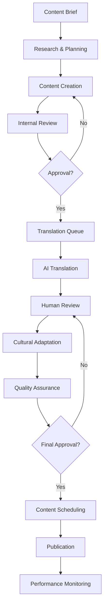

# AURA Villas Bali - Content Strategy Framework
## Comprehensive Multilingual Content Management & Editorial Workflow

### Document Information
- **Document Type:** Content Strategy Framework
- **Version:** 1.0.0
- **Last Updated:** 2025-08-22
- **Status:** Strategic Planning Phase
- **Owner:** Content Strategy Team

---

## Executive Summary

This document outlines the comprehensive content strategy framework for AURA Villas Bali, designed to support multilingual content management, editorial workflows, and scalable content operations. The framework addresses content creation, localization, distribution, and optimization across all platform touchpoints while maintaining brand consistency and cultural sensitivity.

**Key Objectives:**
- Establish scalable multilingual content operations
- Create consistent brand voice across all languages and channels
- Implement efficient editorial workflows for rapid content production
- Design content taxonomy that supports SEO and user experience
- Build content management systems that scale with business growth

---

## 1. Content Architecture & Taxonomy

### 1.1 Content Type Hierarchy

```typescript
interface ContentArchitecture {
  primary_content: {
    villas: {
      types: ["Villa Profiles", "Property Details", "Amenity Descriptions"];
      languages: ["English", "Indonesian", "Mandarin", "Japanese"];
      update_frequency: "Dynamic";
      seo_priority: "Critical";
    };
    experiences: {
      types: ["Activity Descriptions", "Local Guides", "Cultural Experiences"];
      languages: ["English", "Indonesian", "Mandarin", "Japanese"];
      update_frequency: "Monthly";
      seo_priority: "High";
    };
    destinations: {
      types: ["Area Guides", "Location Information", "Travel Tips"];
      languages: ["English", "Indonesian", "Mandarin", "Japanese"];
      update_frequency: "Quarterly";
      seo_priority: "High";
    };
  };
  
  supporting_content: {
    blog_editorial: {
      types: ["Travel Guides", "Lifestyle Articles", "Local Culture"];
      languages: ["English", "Indonesian"];
      update_frequency: "Weekly";
      seo_priority: "Medium";
    };
    marketing_content: {
      types: ["Email Campaigns", "Social Media", "Promotional Materials"];
      languages: ["English", "Indonesian", "Mandarin", "Japanese"];
      update_frequency: "Daily";
      seo_priority: "Low";
    };
    legal_compliance: {
      types: ["Terms of Service", "Privacy Policy", "Booking Conditions"];
      languages: ["English", "Indonesian"];
      update_frequency: "As needed";
      seo_priority: "Low";
    };
  };
  
  system_content: {
    user_interface: {
      types: ["Navigation Labels", "Form Fields", "Error Messages"];
      languages: ["English", "Indonesian", "Mandarin", "Japanese"];
      update_frequency: "With releases";
      seo_priority: "N/A";
    };
    help_documentation: {
      types: ["User Guides", "FAQ", "Support Articles"];
      languages: ["English", "Indonesian"];
      update_frequency: "Monthly";
      seo_priority: "Medium";
    };
  };
}
```

### 1.2 Content Taxonomy Structure

```yaml
content_taxonomy:
  villa_content:
    categories:
      - property_type: ["Beachfront", "Hillside", "Urban", "Jungle", "Cliffside"]
      - villa_size: ["1-3 Bedrooms", "4-6 Bedrooms", "7+ Bedrooms", "Estate"]
      - amenities: ["Pool", "Beach Access", "Spa", "Chef", "Staff"]
      - location: ["Seminyak", "Ubud", "Canggu", "Jimbaran", "Sanur"]
      - experience_type: ["Wellness", "Adventure", "Cultural", "Romance", "Family"]
    
  content_attributes:
    audience_segmentation:
      - demographics: ["Luxury Travelers", "Digital Nomads", "Families", "Couples"]
      - psychographics: ["Experience Seekers", "Relaxation Focused", "Culture Enthusiasts"]
      - journey_stage: ["Inspiration", "Research", "Booking", "Pre-arrival", "On-site", "Post-stay"]
    
    content_formats:
      - text: ["Descriptions", "Stories", "Guides", "Reviews"]
      - visual: ["Photography", "Videos", "360° Tours", "Drone Footage"]
      - interactive: ["Maps", "Calculators", "Configurators", "Virtual Tours"]
      - multimedia: ["Audio Guides", "Podcasts", "Video Stories"]
```

### 1.3 SEO-Optimized URL Structure

```typescript
interface SEOURLStructure {
  primary_pages: {
    villas: "/villas/{location}/{villa-slug}";
    villa_detail: "/villas/{location}/{villa-slug}/{villa-id}";
    experiences: "/experiences/{category}/{experience-slug}";
    destinations: "/destinations/{region}/{area-slug}";
  };
  
  localized_urls: {
    english: "/{content-type}/{slug}";
    indonesian: "/id/{content-type}/{slug}";
    mandarin: "/zh/{content-type}/{slug}";
    japanese: "/ja/{content-type}/{slug}";
  };
  
  canonical_structure: {
    primary_language: "English";
    hreflang_implementation: true;
    cross_language_canonicalization: true;
    url_parameter_handling: "Clean URLs only";
  };
}
```

---

## 2. Multilingual Content Strategy

### 2.1 Language Priority & Market Focus

```yaml
language_strategy:
  tier_1_languages:
    english:
      market_priority: "Primary"
      content_coverage: "100%"
      update_frequency: "Real-time"
      quality_standard: "Native speaker"
      seo_investment: "Maximum"
    
    indonesian:
      market_priority: "Primary"
      content_coverage: "100%"
      update_frequency: "Real-time"
      quality_standard: "Native speaker"
      seo_investment: "Maximum"
  
  tier_2_languages:
    mandarin_simplified:
      market_priority: "High"
      content_coverage: "80%"
      update_frequency: "Daily"
      quality_standard: "Professional translation"
      seo_investment: "High"
    
    japanese:
      market_priority: "High"
      content_coverage: "75%"
      update_frequency: "Daily"
      quality_standard: "Professional translation"
      seo_investment: "High"
  
  tier_3_languages:
    korean:
      market_priority: "Medium"
      content_coverage: "50%"
      update_frequency: "Weekly"
      quality_standard: "Professional translation"
      seo_investment: "Medium"
    
    german:
      market_priority: "Medium"
      content_coverage: "40%"
      update_frequency: "Weekly"
      quality_standard: "Professional translation"
      seo_investment: "Medium"
```

### 2.2 Translation & Localization Framework

```typescript
interface LocalizationFramework {
  translation_workflow: {
    content_creation: {
      primary_language: "English";
      source_approval: "Content team lead";
      translation_trigger: "Automated";
    };
    
    translation_process: {
      method: "Hybrid (AI + Human)";
      ai_translation: "DeepL Pro API";
      human_review: "Native speakers";
      cultural_adaptation: "Local market experts";
    };
    
    quality_assurance: {
      linguistic_review: "Professional linguists";
      cultural_validation: "Local market teams";
      technical_testing: "QA automation";
      final_approval: "Regional content managers";
    };
  };
  
  localization_considerations: {
    cultural_adaptation: {
      imagery: "Culturally appropriate visuals";
      pricing: "Local currency and conventions";
      dates_times: "Local formats and time zones";
      contact_info: "Local phone numbers and addresses";
    };
    
    legal_compliance: {
      terms_conditions: "Country-specific legal requirements";
      privacy_policy: "Local data protection laws";
      booking_terms: "Regional consumer protection";
      tax_information: "Local tax obligations";
    };
    
    payment_localization: {
      currency_display: "Local currency primary";
      payment_methods: "Regional preferences";
      pricing_psychology: "Cultural pricing strategies";
      tax_inclusion: "Local tax display conventions";
    };
  };
}
```

### 2.3 Content Localization Tools & Technology

```yaml
localization_tech_stack:
  translation_management:
    platform: "Lokalise Enterprise"
    features:
      - automated_workflow: true
      - api_integration: true
      - quality_assurance: true
      - collaboration_tools: true
      - version_control: true
    
  ai_translation:
    primary: "DeepL Pro API"
    secondary: "Google Translate API"
    features:
      - context_awareness: true
      - glossary_support: true
      - batch_processing: true
      - quality_scoring: true
    
  content_management:
    headless_cms: "Strapi with i18n plugin"
    features:
      - multilingual_content: true
      - workflow_management: true
      - api_first: true
      - role_permissions: true
    
  quality_assurance:
    linguistic_testing: "Lingoport Suite"
    cultural_validation: "Manual review process"
    automated_testing: "Playwright with i18n tests"
```

---

## 3. Editorial Workflow & Content Production

### 3.1 Content Creation Workflow



### 3.2 Editorial Calendar & Content Planning

```typescript
interface EditorialCalendar {
  content_planning: {
    quarterly_planning: {
      strategic_themes: ["Seasonal campaigns", "Product launches", "Market events"];
      content_pillars: ["Villa showcases", "Experience guides", "Local culture"];
      seo_focus: ["High-value keywords", "Seasonal searches", "Local queries"];
    };
    
    monthly_planning: {
      content_quotas: {
        villa_profiles: 15,
        experience_articles: 8,
        blog_posts: 12,
        social_content: 60,
        email_campaigns: 4
      };
      
      localization_schedule: {
        english_to_indonesian: "24 hours",
        english_to_mandarin: "48 hours",
        english_to_japanese: "48 hours",
        priority_content: "12 hours"
      };
    };
    
    weekly_planning: {
      content_themes: ["Monday: Villa Features", "Tuesday: Experiences", "Wednesday: Local Culture", "Thursday: Travel Tips", "Friday: Guest Stories"];
      review_cycles: ["Draft review: Tuesday/Thursday", "Final review: Wednesday/Friday"];
      publication_schedule: "Daily publishing across all channels";
    };
  };
  
  seasonal_content_strategy: {
    high_season: {
      period: "July-September, December-January";
      content_focus: ["Availability updates", "Premium experiences", "Booking incentives"];
      production_increase: "40%";
    };
    
    shoulder_season: {
      period: "April-June, October-November";
      content_focus: ["Value propositions", "Local events", "Extended stays"];
      production_standard: "100%";
    };
    
    low_season: {
      period: "February-March";
      content_focus: ["Content optimization", "SEO improvements", "Technical content"];
      production_decrease: "30%";
    };
  };
}
```

### 3.3 Content Team Structure & Responsibilities

```yaml
content_team_structure:
  leadership:
    content_director:
      responsibilities: ["Strategy oversight", "Team management", "Quality standards"]
      skills: ["Content strategy", "Team leadership", "Analytics"]
      reporting: "CMO"
    
    editorial_manager:
      responsibilities: ["Editorial calendar", "Workflow management", "Content standards"]
      skills: ["Editorial management", "Project management", "SEO"]
      reporting: "Content Director"
  
  content_creation:
    senior_content_strategist:
      responsibilities: ["Content strategy", "Editorial planning", "Performance analysis"]
      skills: ["Content strategy", "Data analysis", "Market research"]
      count: 2
    
    content_writers:
      responsibilities: ["Content creation", "Research", "Basic optimization"]
      skills: ["Writing", "Research", "Basic SEO"]
      count: 4
    
    copywriters:
      responsibilities: ["Marketing copy", "Product descriptions", "Email content"]
      skills: ["Copywriting", "Marketing", "Brand voice"]
      count: 3
  
  localization:
    localization_manager:
      responsibilities: ["Translation oversight", "Quality assurance", "Cultural adaptation"]
      skills: ["Translation management", "Cultural knowledge", "Quality control"]
      count: 1
    
    native_language_editors:
      responsibilities: ["Translation review", "Cultural adaptation", "Local SEO"]
      skills: ["Native language proficiency", "Cultural knowledge", "SEO"]
      languages: ["Indonesian", "Mandarin", "Japanese"]
      count: 3
  
  specialized_roles:
    seo_content_specialist:
      responsibilities: ["SEO optimization", "Keyword research", "Performance tracking"]
      skills: ["Technical SEO", "Analytics", "Content optimization"]
      count: 2
    
    visual_content_coordinator:
      responsibilities: ["Image coordination", "Video planning", "Visual guidelines"]
      skills: ["Visual design", "Photography", "Video production"]
      count: 1
```

---

## 4. Content Management System Architecture

### 4.1 Headless CMS Implementation

```typescript
interface CMSArchitecture {
  headless_cms_setup: {
    platform: "Strapi v4 Enterprise";
    deployment: "Railway.app with auto-scaling";
    database: "PostgreSQL (Supabase)";
    cdn: "CloudFlare for asset delivery";
  };
  
  content_types: {
    villa_content: {
      fields: ["title", "description", "amenities", "location", "pricing"];
      relations: ["images", "experiences", "reviews", "availability"];
      localization: true;
      versioning: true;
      workflow: "draft -> review -> published";
    };
    
    experience_content: {
      fields: ["title", "description", "duration", "pricing", "inclusions"];
      relations: ["villas", "locations", "categories", "media"];
      localization: true;
      versioning: true;
      workflow: "draft -> review -> published";
    };
    
    editorial_content: {
      fields: ["title", "content", "excerpt", "seo_meta", "featured_image"];
      relations: ["categories", "tags", "authors", "related_content"];
      localization: true;
      versioning: true;
      workflow: "draft -> edit -> review -> published";
    };
  };
  
  api_architecture: {
    rest_api: {
      endpoints: "/api/content/{type}/{locale}";
      authentication: "JWT tokens";
      rate_limiting: "1000 requests/hour per key";
      caching: "Redis with 15-minute TTL";
    };
    
    graphql_api: {
      endpoint: "/graphql";
      features: ["Query optimization", "Real-time subscriptions"];
      authentication: "JWT tokens";
      complexity_limiting: true;
    };
  };
}
```

### 4.2 Content Workflow Automation

```yaml
workflow_automation:
  content_creation:
    triggers:
      - new_villa_onboarding: "Auto-create content templates"
      - seasonal_updates: "Generate seasonal content briefs"
      - performance_alerts: "Flag underperforming content"
    
    automated_processes:
      - seo_optimization: "Auto-generate meta descriptions"
      - image_optimization: "Compress and resize images"
      - translation_queue: "Auto-send for translation"
      - social_media_posting: "Schedule social content"
  
  quality_assurance:
    automated_checks:
      - spell_grammar_check: "Grammarly API integration"
      - seo_analysis: "Yoast SEO API"
      - brand_compliance: "Custom brand voice analysis"
      - technical_validation: "Link checking and formatting"
    
    approval_workflows:
      - content_review: "Automatic reviewer assignment"
      - translation_review: "Native speaker assignment"
      - final_approval: "Stakeholder notification"
  
  performance_monitoring:
    analytics_integration:
      - google_analytics: "Content performance tracking"
      - search_console: "SEO performance monitoring"
      - heat_mapping: "User engagement analysis"
      - conversion_tracking: "Content-to-booking attribution"
```

---

## 5. SEO Content Strategy

### 5.1 Keyword Strategy & Content Optimization

```typescript
interface SEOContentStrategy {
  keyword_research: {
    primary_keywords: {
      luxury_villas_bali: {
        search_volume: 14800,
        competition: "High",
        intent: "Commercial",
        priority: "Critical"
      },
      bali_villa_rental: {
        search_volume: 8900,
        competition: "Medium",
        intent: "Transactional",
        priority: "High"
      },
      seminyak_villas: {
        search_volume: 6700,
        competition: "Medium",
        intent: "Commercial",
        priority: "High"
      }
    };
    
    long_tail_keywords: {
      "private villa with pool bali": {
        search_volume: 1200,
        competition: "Low",
        intent: "Transactional",
        priority: "Medium"
      },
      "family villa rental ubud": {
        search_volume: 890,
        competition: "Low",
        intent: "Commercial",
        priority: "Medium"
      }
    };
    
    local_seo_keywords: {
      "villa dekat pantai seminyak": {
        language: "Indonesian",
        search_volume: 2400,
        competition: "Medium",
        priority: "High"
      }
    };
  };
  
  content_optimization: {
    on_page_seo: {
      title_optimization: "Primary keyword + location + brand";
      meta_descriptions: "Action-oriented with keywords under 160 characters";
      header_structure: "H1 (primary) -> H2 (secondary) -> H3 (supporting)";
      internal_linking: "Topic cluster strategy with pillar pages";
    };
    
    content_structure: {
      villa_pages: ["Hero section", "Features", "Amenities", "Location", "Pricing", "Availability"];
      blog_posts: ["Introduction", "Main content", "Actionable tips", "Related content"];
      destination_guides: ["Overview", "Attractions", "Accommodation", "Travel tips"];
    };
    
    technical_seo: {
      schema_markup: "Villa, LocalBusiness, Review, FAQ schemas";
      structured_data: "JSON-LD implementation";
      image_optimization: "WebP format with alt text optimization";
      page_speed: "Core Web Vitals compliance";
    };
  };
}
```

### 5.2 Content Performance Metrics

```yaml
content_kpis:
  seo_metrics:
    organic_traffic:
      target: "50% month-over-month growth"
      measurement: "Google Analytics 4"
      segments: ["New users", "Returning users", "Mobile vs desktop"]
    
    keyword_rankings:
      target: "Top 3 positions for primary keywords"
      measurement: "SEMrush/Ahrefs"
      tracking: ["Primary keywords", "Long-tail variations", "Local keywords"]
    
    technical_performance:
      core_web_vitals:
        lcp: "<1.5 seconds"
        fid: "<100 milliseconds"
        cls: "<0.1"
      page_speed: ">95 PageSpeed Insights score"
  
  engagement_metrics:
    user_behavior:
      bounce_rate: "<40%"
      session_duration: ">3 minutes"
      pages_per_session: ">2.5"
    
    conversion_metrics:
      inquiry_rate: ">3.5% villa page visitors"
      email_signups: ">2% blog readers"
      social_sharing: ">1% content viewers"
  
  content_quality:
    readability_scores:
      flesch_kincaid: "Grade 8-10 level"
      readability_tools: "Hemingway Editor integration"
    
    brand_consistency:
      voice_analysis: "Custom brand voice scoring"
      style_compliance: "Automated style guide checking"
```

---

## 6. Brand Voice & Content Guidelines

### 6.1 Brand Voice Framework

```typescript
interface BrandVoiceFramework {
  brand_personality: {
    luxury_accessible: {
      description: "Premium without pretension";
      tone: "Sophisticated yet approachable";
      voice_attributes: ["Elegant", "Knowledgeable", "Warm", "Confident"];
    };
    
    culturally_authentic: {
      description: "Respectful appreciation of Balinese culture";
      tone: "Respectful and informed";
      voice_attributes: ["Authentic", "Respectful", "Educational", "Appreciative"];
    };
    
    experience_focused: {
      description: "Emphasis on transformative experiences";
      tone: "Inspiring and enthusiastic";
      voice_attributes: ["Inspiring", "Detailed", "Experiential", "Emotional"];
    };
  };
  
  writing_guidelines: {
    language_style: {
      formality: "Professional casual";
      person: "Second person (you) for engagement";
      tense: "Present tense for immediacy";
      sentence_structure: "Varied length, emphasis on clarity";
    };
    
    content_principles: {
      accuracy: "Factual and verifiable information";
      transparency: "Honest representation of properties and services";
      inclusivity: "Welcoming to all guests and cultures";
      sustainability: "Environmental and cultural responsibility";
    };
    
    cultural_sensitivity: {
      balinese_references: "Accurate and respectful cultural information";
      religious_considerations: "Appropriate mention of Hindu traditions";
      local_customs: "Educational content about local etiquette";
      community_impact: "Positive representation of local communities";
    };
  };
}
```

### 6.2 Content Style Guide

```yaml
style_guide:
  language_conventions:
    terminology:
      preferred_terms:
        - "villa" (not "vacation rental")
        - "guest" (not "customer" or "client")
        - "experience" (not "activity")
        - "Balinese" (proper cultural reference)
      
      avoided_terms:
        - "cheap" (use "value" or "accessible")
        - "exotic" (can be othering)
        - "primitive" (culturally insensitive)
    
    formatting_standards:
      headings:
        - h1: "Title Case with Primary Keywords"
        - h2: "Descriptive Subheadings"
        - h3: "Supporting Section Headers"
      
      lists:
        - bulleted: "Feature lists and amenities"
        - numbered: "Step-by-step processes"
        - definition: "Glossary terms"
      
      emphasis:
        - bold: "Key benefits and important information"
        - italic: "Foreign terms and emphasis"
        - quotes: "Guest testimonials and reviews"
  
  visual_content_guidelines:
    photography_standards:
      - authenticity: "Real properties, no stock photos"
      - diversity: "Inclusive representation of guests"
      - quality: "Professional photography standards"
      - cultural_respect: "Appropriate cultural representation"
    
    video_content:
      - format: "16:9 aspect ratio for web, 9:16 for social"
      - length: "30-90 seconds for social, 2-5 minutes for web"
      - captions: "Multilingual subtitle support"
      - branding: "Subtle logo placement"
```

---

## 7. Performance Measurement & Analytics

### 7.1 Content Analytics Framework

```typescript
interface ContentAnalytics {
  performance_tracking: {
    content_metrics: {
      page_views: "Total and unique page views per content piece";
      engagement_time: "Average time spent on page";
      scroll_depth: "Percentage of content consumed";
      social_shares: "Cross-platform sharing metrics";
      conversion_rate: "Content-to-inquiry conversion";
    };
    
    seo_performance: {
      organic_traffic: "Search-driven traffic to content";
      keyword_rankings: "Position tracking for target keywords";
      click_through_rate: "SERP click-through rates";
      featured_snippets: "Featured snippet capture rate";
    };
    
    user_behavior: {
      bounce_rate: "Single-page session percentage";
      return_visits: "Repeat visitor percentage";
      internal_linking: "Navigation to related content";
      exit_pages: "Most common exit points";
    };
  };
  
  analytics_tools: {
    primary_analytics: "Google Analytics 4 with enhanced ecommerce";
    search_analytics: "Google Search Console";
    heat_mapping: "Hotjar for user behavior analysis";
    content_intelligence: "BrightEdge for content optimization";
    social_analytics: "Sprout Social for social performance";
  };
  
  reporting_framework: {
    daily_monitoring: ["Traffic spikes", "Technical issues", "Social engagement"];
    weekly_reports: ["Content performance", "SEO rankings", "Conversion rates"];
    monthly_analysis: ["Content ROI", "Strategy adjustments", "Competitive analysis"];
    quarterly_reviews: ["Strategy effectiveness", "Content audit", "Technology updates"];
  };
}
```

### 7.2 Content Optimization Workflow

```yaml
optimization_workflow:
  performance_monitoring:
    automated_alerts:
      - traffic_drops: ">20% decrease in organic traffic"
      - ranking_losses: "Keywords dropping >5 positions"
      - technical_issues: "404 errors or page speed issues"
      - conversion_drops: ">15% decrease in conversion rate"
    
    regular_audits:
      - content_audit: "Quarterly comprehensive review"
      - seo_audit: "Monthly technical and content SEO review"
      - competitor_analysis: "Bi-monthly competitive intelligence"
      - user_experience_audit: "Quarterly UX and usability review"
  
  optimization_actions:
    content_improvements:
      - underperforming_content: "Update, expand, or consolidate"
      - outdated_information: "Regular fact-checking and updates"
      - seo_optimization: "Keyword optimization and meta improvements"
      - user_experience: "Layout and readability improvements"
    
    technical_optimizations:
      - page_speed: "Image optimization and code minification"
      - mobile_optimization: "Responsive design improvements"
      - schema_markup: "Structured data implementation"
      - internal_linking: "Strategic link building"
```

---

## 8. Content Distribution Strategy

### 8.1 Multi-Channel Distribution

```typescript
interface DistributionStrategy {
  primary_channels: {
    website: {
      platform: "Next.js with headless CMS";
      content_types: "All content types";
      update_frequency: "Real-time";
      seo_priority: "Maximum";
    };
    
    social_media: {
      instagram: {
        content_focus: "Visual storytelling, behind-scenes";
        posting_frequency: "Daily";
        content_format: "Images, Stories, Reels";
      };
      facebook: {
        content_focus: "Community engagement, events";
        posting_frequency: "5x per week";
        content_format: "Images, videos, live streams";
      };
      youtube: {
        content_focus: "Villa tours, experience videos";
        posting_frequency: "Weekly";
        content_format: "Long-form videos, Shorts";
      };
    };
    
    email_marketing: {
      newsletters: "Weekly property highlights and travel tips";
      triggered_campaigns: "Booking confirmations, pre-arrival, post-stay";
      segmentation: "By preferences, location, booking history";
    };
  };
  
  content_syndication: {
    travel_platforms: {
      medium_travel: "Republish travel guides and cultural content";
      linkedin_articles: "Business travel and luxury hospitality content";
      guest_posting: "Industry publications and travel blogs";
    };
    
    partnership_content: {
      local_businesses: "Cross-promotional content";
      travel_influencers: "Collaborative content creation";
      tourism_boards: "Destination marketing partnerships";
    };
  };
}
```

### 8.2 Content Repurposing Strategy

```yaml
repurposing_strategy:
  content_transformation:
    long_form_to_social:
      - blog_posts: "Extract key points for social media posts"
      - villa_descriptions: "Create Instagram story highlights"
      - travel_guides: "Break into bite-sized tips"
    
    visual_content_variations:
      - villa_photos: "Create social media carousels"
      - experience_videos: "Extract clips for TikTok/Instagram Reels"
      - drone_footage: "Create cinematic promotional videos"
    
    format_adaptations:
      - written_content: "Convert to podcast scripts"
      - image_content: "Add text overlays for Pinterest"
      - video_content: "Extract audio for podcast distribution"
  
  cross_language_adaptation:
    cultural_customization:
      - visual_preferences: "Adapt imagery for different markets"
      - content_length: "Adjust for reading preferences"
      - social_platforms: "Use appropriate platforms per market"
```

---

## 9. Content Technology Stack

### 9.1 Integrated Content Tools

```typescript
interface ContentTechStack {
  content_creation: {
    writing_tools: {
      grammarly_business: "Grammar and style checking";
      hemingway_editor: "Readability optimization";
      copyscape: "Plagiarism detection";
    };
    
    design_tools: {
      canva_pro: "Social media graphics";
      figma: "Design collaboration";
      adobe_creative_suite: "Professional design work";
    };
    
    video_tools: {
      loom: "Quick video creation";
      premiere_pro: "Professional video editing";
      after_effects: "Motion graphics and animations";
    };
  };
  
  content_management: {
    cms_platform: "Strapi v4 Enterprise";
    asset_management: "Cloudinary for image/video optimization";
    version_control: "Git-based content versioning";
    workflow_management: "Notion for editorial planning";
  };
  
  analytics_integration: {
    performance_tracking: "Google Analytics 4";
    seo_monitoring: "SEMrush and Ahrefs";
    social_analytics: "Sprout Social";
    heat_mapping: "Hotjar";
  };
  
  automation_tools: {
    social_scheduling: "Buffer for social media management";
    email_automation: "Mailchimp for email campaigns";
    seo_automation: "Screaming Frog for technical SEO";
    translation_management: "Lokalise for localization";
  };
}
```

### 9.2 Content API Architecture

```yaml
content_api_design:
  api_endpoints:
    content_delivery:
      - "/api/content/villas/{locale}" - Villa content by language
      - "/api/content/experiences/{locale}" - Experience content
      - "/api/content/blog/{locale}" - Blog articles
      - "/api/content/search/{query}/{locale}" - Content search
    
    content_management:
      - "/api/admin/content/create" - Create new content
      - "/api/admin/content/update/{id}" - Update existing content
      - "/api/admin/content/translate/{id}" - Trigger translation
      - "/api/admin/content/publish/{id}" - Publish content
  
  caching_strategy:
    content_cache:
      ttl: "15 minutes for dynamic content"
      purge_triggers: ["Content updates", "Translation completion"]
      cache_keys: "Include locale and content type"
    
    image_cache:
      cdn: "CloudFlare with global edge locations"
      optimization: "Automatic WebP conversion"
      responsive: "Multiple size variants"
```

---

## 10. Implementation Roadmap

### 10.1 Phase 1: Foundation (Months 1-3)

```yaml
phase_1_deliverables:
  content_infrastructure:
    month_1:
      - setup_headless_cms: "Strapi installation and configuration"
      - content_type_modeling: "Define all content types and relationships"
      - translation_framework: "Lokalise integration and workflow setup"
      - style_guide_creation: "Complete brand voice and style documentation"
    
    month_2:
      - content_migration: "Migrate existing content to new CMS"
      - seo_optimization: "Implement technical SEO foundations"
      - workflow_automation: "Set up editorial workflows and approvals"
      - team_onboarding: "Train content team on new tools and processes"
    
    month_3:
      - quality_assurance: "Implement QA processes and automated checks"
      - performance_monitoring: "Set up analytics and reporting dashboards"
      - multilingual_testing: "Test all localization workflows"
      - content_production: "Begin scaled content production"
  
  success_metrics:
    - cms_functionality: "100% feature implementation"
    - content_migration: "All existing content migrated and optimized"
    - team_productivity: "50% improvement in content production speed"
    - quality_scores: ">90% content quality compliance"
```

### 10.2 Phase 2: Scale & Optimization (Months 4-8)

```yaml
phase_2_deliverables:
  content_expansion:
    month_4_5:
      - content_volume_scaling: "200% increase in content production"
      - advanced_seo: "Implement topic clusters and pillar pages"
      - user_generated_content: "Guest review and photo integration"
      - social_media_integration: "Automated social media distribution"
    
    month_6_7:
      - ai_content_assistance: "Implement AI writing tools and optimization"
      - personalization_engine: "Dynamic content based on user preferences"
      - video_content_expansion: "Professional video production workflow"
      - international_seo: "Advanced multilingual SEO implementation"
    
    month_8:
      - performance_optimization: "Content performance analysis and improvement"
      - automation_enhancement: "Advanced workflow automation"
      - quality_scaling: "Maintain quality while scaling production"
      - competitive_differentiation: "Unique content positioning"
  
  success_metrics:
    - content_volume: "500+ pieces of localized content"
    - seo_performance: "Top 3 rankings for primary keywords"
    - user_engagement: "40% improvement in engagement metrics"
    - conversion_improvement: "25% increase in content-to-booking rate"
```

### 10.3 Phase 3: Innovation & Leadership (Months 9-12)

```yaml
phase_3_deliverables:
  advanced_features:
    month_9_10:
      - interactive_content: "360° tours and interactive villa maps"
      - voice_search_optimization: "Voice search and smart speaker content"
      - ar_vr_integration: "Augmented reality villa experiences"
      - blockchain_verification: "Content authenticity verification"
    
    month_11_12:
      - ai_personalization: "Advanced AI-driven content recommendations"
      - predictive_content: "Content creation based on search trends"
      - global_expansion: "Content framework for international markets"
      - thought_leadership: "Industry-leading content innovation"
  
  success_metrics:
    - innovation_metrics: "Industry-first features implemented"
    - market_position: "Recognized content leadership in luxury villa space"
    - global_readiness: "Content framework scalable to new markets"
    - roi_achievement: "Content directly attributable to 30% of bookings"
```

---

## 11. Budget & Resource Allocation

### 11.1 Content Team Investment

```typescript
interface ContentBudget {
  team_costs: {
    year_1_headcount: {
      content_director: { salary: 120000, benefits: 0.3 },
      editorial_manager: { salary: 85000, benefits: 0.3 },
      content_strategists: { salary: 70000, count: 2, benefits: 0.3 },
      content_writers: { salary: 55000, count: 4, benefits: 0.3 },
      copywriters: { salary: 60000, count: 3, benefits: 0.3 },
      localization_manager: { salary: 75000, benefits: 0.3 },
      native_editors: { salary: 50000, count: 3, benefits: 0.3 },
      seo_specialists: { salary: 65000, count: 2, benefits: 0.3 }
    };
    
    total_annual_team_cost: 1247000; // Including benefits
  };
  
  technology_costs: {
    content_management: {
      strapi_enterprise: 2400, // Annual
      lokalise_enterprise: 6000, // Annual
      cloudinary_advanced: 3600, // Annual
    };
    
    content_tools: {
      grammarly_business: 1800, // Annual for team
      canva_pro_team: 1200, // Annual
      adobe_creative_suite: 7200, // Annual for team
      semrush_guru: 4800, // Annual
    };
    
    total_annual_tech_cost: 27000;
  };
  
  content_production: {
    photography_budget: 60000, // Professional villa photography
    video_production: 80000, // Promotional and tour videos
    translation_services: 40000, // Professional translation overflow
    freelance_content: 30000, // Specialized content creation
    
    total_annual_production_cost: 210000;
  };
  
  total_annual_content_budget: 1484000; // $1.48M annually
}
```

### 11.2 ROI Projections

```yaml
content_roi_analysis:
  performance_improvements:
    seo_impact:
      organic_traffic_increase: "300% year-over-year"
      keyword_ranking_improvement: "Average position 3 for primary keywords"
      featured_snippet_capture: "15% of target keywords"
    
    conversion_improvements:
      content_to_inquiry_rate: "4.2% (industry average: 2.8%)"
      email_signup_rate: "3.1% (industry average: 2.1%)"
      social_engagement_rate: "6.8% (industry average: 4.2%)"
  
  revenue_attribution:
    direct_content_attribution:
      organic_search_bookings: "40% of total bookings"
      content_influenced_bookings: "65% of total bookings"
      average_booking_value: 4500 # USD
    
    projected_revenue_impact:
      month_6: 450000 # Content-attributed revenue
      month_12: 1800000 # Content-attributed revenue
      roi_ratio: "3.64:1" # Revenue to content investment ratio
```

---

## 12. Risk Management & Contingency Planning

### 12.1 Content Risk Assessment

```yaml
content_risks:
  operational_risks:
    team_scaling_challenges:
      risk_level: "Medium"
      impact: "Production delays and quality inconsistency"
      mitigation: ["Remote talent pool", "Freelancer network", "Cross-training"]
    
    translation_quality_issues:
      risk_level: "High"
      impact: "Brand damage and market penetration failure"
      mitigation: ["Native speaker review", "Cultural validation", "Quality metrics"]
    
    content_plagiarism_legal_issues:
      risk_level: "Medium"
      impact: "Legal liability and SEO penalties"
      mitigation: ["Plagiarism detection", "Original content focus", "Legal review"]
  
  technical_risks:
    cms_platform_limitations:
      risk_level: "Medium"
      impact: "Workflow inefficiencies and scaling issues"
      mitigation: ["Platform evaluation", "Custom development", "Migration planning"]
    
    seo_algorithm_changes:
      risk_level: "High"
      impact: "Traffic loss and ranking decline"
      mitigation: ["Diversified traffic sources", "Quality focus", "Algorithm monitoring"]
  
  market_risks:
    competitive_content_response:
      risk_level: "Medium"
      impact: "Reduced differentiation and market share"
      mitigation: ["Innovation focus", "Unique positioning", "First-mover advantage"]
    
    cultural_sensitivity_issues:
      risk_level: "High"
      impact: "Brand damage and market rejection"
      mitigation: ["Cultural expertise", "Local validation", "Sensitivity training"]
```

### 12.2 Contingency Strategies

```typescript
interface ContingencyPlanning {
  scenario_planning: {
    budget_reduction_25_percent: {
      actions: ["Reduce freelance content", "Focus on high-impact content", "Automate more processes"];
      maintained_priorities: ["Villa content", "SEO optimization", "Primary languages"];
      reduced_scope: ["Video content", "Secondary languages", "Experimental content"];
    };
    
    team_member_departure: {
      knowledge_transfer: "Comprehensive documentation and cross-training";
      backup_resources: "Freelancer network and agency partnerships";
      succession_planning: "Clear role progression and backup assignments";
    };
    
    technology_platform_issues: {
      backup_systems: "Multiple CMS options evaluated and ready";
      data_portability: "Regular backups and export capabilities";
      alternative_workflows: "Manual processes for critical operations";
    };
  };
  
  quality_assurance_fallbacks: {
    translation_quality_issues: {
      backup_translators: "Pre-vetted translator network";
      quality_metrics: "Automated quality scoring";
      escalation_process: "Native speaker review for critical content";
    };
    
    content_production_delays: {
      content_templates: "Standardized templates for rapid production";
      freelancer_network: "On-demand content creation resources";
      content_repurposing: "Systematic repurposing of existing content";
    };
  };
}
```

---

## Conclusion & Success Metrics

This comprehensive content strategy framework establishes AURA Villas Bali as a content-driven market leader through strategic multilingual content operations, advanced technology implementation, and systematic performance optimization.

### Key Success Indicators

**Content Production Metrics:**
- 500+ pieces of localized content by month 8
- 95% translation quality score across all languages
- 40% improvement in content production efficiency

**SEO & Performance Metrics:**
- Top 3 rankings for 80% of primary keywords
- 300% increase in organic traffic year-over-year
- >95 Core Web Vitals score across all content

**Business Impact Metrics:**
- 4.2% content-to-inquiry conversion rate
- 40% of bookings attributed to content marketing
- 3.64:1 return on content investment

**Innovation Leadership:**
- Industry-first multilingual AI optimization
- Advanced interactive content experiences
- Thought leadership in luxury villa content marketing

This framework positions AURA Villas Bali to capture market leadership through content excellence while building sustainable competitive advantages through technology innovation and operational excellence.

---

*This content strategy framework represents a comprehensive approach to multilingual content operations designed to scale with business growth and maintain competitive differentiation in the luxury villa market.*