# Financial Architecture Design
## AURA Villas Bali - Comprehensive Financial Management System

## Executive Summary

This document outlines the comprehensive financial architecture for AURA Villas Bali's property management platform, designed to provide complete transparency, automated financial operations, and advanced analytics for villa owners while ensuring regulatory compliance and operational efficiency.

## Core Financial Principles

### Transparency by Design
- **Complete Visibility**: Every financial transaction is trackable and explainable
- **Real-Time Reporting**: Instant access to financial data and performance metrics
- **Owner Control**: Approval workflows for all significant expenses
- **Audit Trail**: Complete historical record of all financial activities

### Automated Excellence
- **Streamlined Operations**: Automated processes reduce manual errors and delays
- **Intelligent Categorization**: AI-powered expense categorization and analysis
- **Predictive Insights**: Forecasting and optimization recommendations
- **Compliance Automation**: Automatic tax and regulatory compliance

## 1. Financial System Architecture

### 1.1 Core Financial Components

```mermaid
graph TB
    subgraph "Revenue Management"
        A["💰 Revenue Tracking<br/>• Booking Revenue<br/>• Service Income<br/>• Additional Fees<br/>• Currency Conversion"]
        B["📊 Performance Analytics<br/>• RevPAR Analysis<br/>• ADR Optimization<br/>• Occupancy Impact<br/>• Seasonal Trends"]
        C["🎯 Revenue Optimization<br/>• Dynamic Pricing<br/>• Yield Management<br/>• Market Positioning<br/>• Demand Forecasting"]
    end
    
    subgraph "Expense Management"
        D["📋 Expense Tracking<br/>• Operational Costs<br/>• Maintenance Expenses<br/>• Vendor Payments<br/>• Commission Calculation"]
        E["✅ Approval Workflows<br/>• Owner Authorization<br/>• Budget Validation<br/>• Multi-level Approval<br/>• Emergency Protocols"]
        F["📊 Cost Analysis<br/>• Category Breakdown<br/>• Variance Analysis<br/>• Efficiency Metrics<br/>• Optimization Opportunities"]
    end
    
    subgraph "Financial Reporting"
        G["📈 Owner Reporting<br/>• Monthly Statements<br/>• Performance Reports<br/>• Tax Documents<br/>• Custom Analytics"]
        H["💼 Management Reporting<br/>• Portfolio Overview<br/>• Profitability Analysis<br/>• Operational Metrics<br/>• Strategic Insights"]
        I["🏛️ Regulatory Reporting<br/>• Tax Compliance<br/>• Government Filings<br/>• Audit Preparation<br/>• Legal Requirements"]
    end
    
    subgraph "Payment Systems"
        J["💳 Payment Processing<br/>• Multi-currency Support<br/>• Payment Gateway Integration<br/>• Fraud Prevention<br/>• Transaction Security"]
        K["💸 Payout Management<br/>• Automated Transfers<br/>• Owner Disbursements<br/>• Vendor Payments<br/>• Staff Payroll"]
        L["🔒 Financial Security<br/>• Encryption<br/>• Access Control<br/>• Audit Logging<br/>• Compliance Monitoring"]
    end
    
    A --> C
    B --> C
    D --> F
    E --> D
    G --> A
    G --> D
    H --> B
    H --> F
    I --> G
    J --> A
    K --> J
    L --> J
    
    style A fill:#e3f2fd
    style D fill:#f3e5f5
    style G fill:#e8f5e8
    style J fill:#fff3e0
```



### 1.2 Financial Data Model

```typescript
interface FinancialArchitecture {
  revenue: {
    bookingRevenue: BookingRevenueModel;
    serviceRevenue: ServiceRevenueModel;
    additionalIncome: AdditionalIncomeModel;
    currencyManagement: CurrencyModel;
  };
  
  expenses: {
    operationalExpenses: OperationalExpenseModel;
    maintenanceExpenses: MaintenanceExpenseModel;
    marketingExpenses: MarketingExpenseModel;
    administrativeExpenses: AdminExpenseModel;
  };
  
  financial Reporting: {
    ownerReports: OwnerReportingModel;
    managementReports: ManagementReportingModel;
    regulatoryReports: RegulatoryReportingModel;
    customAnalytics: AnalyticsModel;
  };
  
  paymentSystems: {
    paymentProcessing: PaymentProcessingModel;
    payoutManagement: PayoutModel;
    securityFramework: SecurityModel;
    complianceSystem: ComplianceModel;
  };
}
```

## 2. Revenue Architecture

### 2.1 Multi-Stream Revenue Model

#### Primary Revenue Streams
```typescript
interface RevenueStreams {
  accommodation: {
    baseNightlyRate: Money;
    seasonalAdjustments: SeasonalPricing;
    dynamicPricing: DynamicRateModel;
    minimumStayPremiums: StayPremium[];
    lastMinuteDiscounts: DiscountModel[];
  };
  
  services: {
    conciergeServices: ServiceRevenue;
    culturalExperiences: ExperienceRevenue;
    transportationServices: TransportRevenue;
    additionalAmenities: AmenityRevenue;
  };
  
  fees: {
    cleaningFees: FeeStructure;
    serviceFees: FeeStructure;
    damageDeposits: DepositModel;
    cancellationFees: CancellationFeeModel;
  };
  
  partnerships: {
    experiencePartnerCommissions: CommissionModel;
    vendorReferralFees: ReferralModel;
    affiliateMarketingRevenue: AffiliateModel;
  };
}
```

#### Revenue Recognition Framework
- **Booking Confirmation**: Revenue recognized upon confirmed booking with payment
- **Stay Completion**: Final revenue adjustment after guest departure
- **Service Delivery**: Service revenue recognized upon completion
- **Refund Processing**: Automated refund handling with proper accounting
- **Commission Calculation**: Real-time commission calculation and allocation

### 2.2 Dynamic Pricing Engine

#### Pricing Optimization Algorithm

```mermaid
flowchart TD
    subgraph "Market Intelligence"
        A["🏪 Competitor Analysis<br/>• Rate Comparison<br/>• Availability Tracking<br/>• Feature Assessment<br/>• Market Positioning"]
        B["📊 Demand Analytics<br/>• Booking Patterns<br/>• Search Volume<br/>• Inquiry Rates<br/>• Conversion Metrics"]
        C["🌍 Market Conditions<br/>• Economic Indicators<br/>• Exchange Rates<br/>• Travel Trends<br/>• Local Events"]
    end
    
    subgraph "Property Intelligence"
        D["🏠 Property Performance<br/>• Historical RevPAR<br/>• Occupancy Trends<br/>• Guest Ratings<br/>• Unique Features"]
        E["📈 Performance Metrics<br/>• Booking Velocity<br/>• Lead Time Analysis<br/>• Seasonality Patterns<br/>• Guest Segments"]
        F["🎯 Owner Objectives<br/>• Revenue Targets<br/>• Occupancy Goals<br/>• Market Strategy<br/>• Risk Tolerance"]
    end
    
    subgraph "AI Processing"
        G["🤖 Machine Learning<br/>• Price Elasticity Models<br/>• Demand Prediction<br/>• Competitive Response<br/>• Revenue Optimization"]
        H["⚙️ Optimization Engine<br/>• Multi-objective Function<br/>• Constraint Handling<br/>• Scenario Analysis<br/>• Risk Assessment"]
    end
    
    subgraph "Pricing Output"
        I["💰 Optimal Pricing<br/>• Daily Rate Recommendations<br/>• Minimum Stay Requirements<br/>• Cancellation Policies<br/>• Package Suggestions"]
        J["📊 Performance Projection<br/>• Revenue Forecast<br/>• Occupancy Prediction<br/>• Market Share Impact<br/>• ROI Analysis"]
    end
    
    A --> G
    B --> G
    C --> G
    D --> G
    E --> G
    F --> G
    
    G --> H
    H --> I
    H --> J
    
    style A fill:#e3f2fd
    style G fill:#f3e5f5
    style H fill:#e8f5e8
    style I fill:#fff3e0
```


#### Revenue Optimization Features
- **Real-Time Price Adjustments**: Automatic rate updates based on market conditions
- **Seasonal Strategy Planning**: Long-term pricing strategies for different seasons
- **Event-Based Pricing**: Dynamic rate adjustments for local events and holidays
- **Competitor Response**: Intelligent pricing responses to competitive actions
- **Revenue Forecasting**: Predictive revenue models for strategic planning

### 2.3 Revenue Performance Analytics

#### Key Performance Indicators
```typescript
interface RevenueKPIs {
  occupancyMetrics: {
    occupancyRate: Percentage;
    availableRoomNights: Number;
    occupiedRoomNights: Number;
    seasonalOccupancyTrends: TrendData;
  };
  
  rateMetrics: {
    averageDailyRate: Money;
    revenuePerAvailableRoom: Money;
    averageBookingValue: Money;
    priceRealizationIndex: Percentage;
  };
  
  revenueMetrics: {
    totalRevenue: Money;
    accommodationRevenue: Money;
    serviceRevenue: Money;
    revenueGrowthRate: Percentage;
  };
  
  marketMetrics: {
    marketShare: Percentage;
    competitivePosition: RankingData;
    priceCompetitiveness: CompetitiveIndex;
    demandCaptureRate: Percentage;
  };
}
```

## 3. Expense Management Architecture

### 3.1 Comprehensive Expense Tracking

#### Expense Categories & Structure
```typescript
interface ExpenseManagement {
  operationalExpenses: {
    housekeeping: {
      dailyCleaningCosts: ExpenseItem[];
      deepCleaningCosts: ExpenseItem[];
      laundryServices: ExpenseItem[];
      cleaningSupplies: ExpenseItem[];
    };
    
    maintenance: {
      preventiveMaintenance: ExpenseItem[];
      correctiveMaintenance: ExpenseItem[];
      vendorServices: ExpenseItem[];
      emergencyRepairs: ExpenseItem[];
    };
    
    utilities: {
      electricity: UtilityExpense;
      water: UtilityExpense;
      internet: UtilityExpense;
      gasLPG: UtilityExpense;
    };
    
    staffing: {
      salaries: StaffExpense[];
      benefits: BenefitExpense[];
      training: TrainingExpense[];
      uniforms: UniformExpense[];
    };
  };
  
  marketingExpenses: {
    digitalMarketing: MarketingExpense[];
    photography: PhotographyExpense[];
    contentCreation: ContentExpense[];
    platformCommissions: CommissionExpense[];
  };
  
  administrativeExpenses: {
    insurance: InsuranceExpense;
    licenses: LicenseExpense[];
    legalFees: LegalExpense[];
    accounting: AccountingExpense;
  };
}
```

#### Automated Expense Processing


### 3.2 Intelligent Approval Workflows

#### Multi-Tier Approval System
```typescript
interface ApprovalWorkflow {
  tier1AutoApproval: {
    conditions: {
      maxAmount: Money;
      approvedVendors: VendorId[];
      expenseCategories: ExpenseCategory[];
      recurringExpenses: boolean;
    };
    actions: {
      autoProcess: boolean;
      notifyOwner: boolean;
      requireReceipt: boolean;
    };
  };
  
  tier2OwnerApproval: {
    conditions: {
      amountRange: MoneyRange;
      newVendors: boolean;
      emergencyExpenses: boolean;
      capitalExpenditures: boolean;
    };
    actions: {
      sendApprovalRequest: boolean;
      requireJustification: boolean;
      allowDelegation: boolean;
      timeoutPolicy: TimeoutAction;
    };
  };
  
  tier3ManagementApproval: {
    conditions: {
      highValueExpenses: Money;
      policyViolations: boolean;
      budgetOverruns: boolean;
      unusualPatterns: boolean;
    };
    actions: {
      requireManagementApproval: boolean;
      triggerAuditReview: boolean;
      escalateToBoard: boolean;
    };
  };
}
```

### 3.3 Cost Optimization Intelligence

#### AI-Powered Cost Analysis
- **Vendor Performance Analysis**: Evaluating vendor cost-effectiveness and quality
- **Expense Pattern Recognition**: Identifying unusual spending patterns and anomalies
- **Budget Variance Analysis**: Comparing actual expenses against budgets and forecasts
- **Cost Saving Opportunities**: AI-generated recommendations for cost reduction
- **Predictive Expense Modeling**: Forecasting future expenses based on historical data

## 4. Commission Structure & Pricing Models

### 4.1 Transparent Commission Framework

#### Tiered Commission Structure


#### Commission Model Variations
```typescript
interface CommissionModels {
  standardModel: {
    commissionRate: 18; // percentage
    structure: {
      propertyOperations: 8;
      guestServices: 4;
      marketingDistribution: 3;
      technologyAnalytics: 2;
      auraMargin: 1;
    };
    minumumCommission: Money;
    performanceBonuses: PerformanceBonus[];
  };
  
  performanceModel: {
    baseCommissionRate: 15; // percentage
    performanceThresholds: {
      occupancyBonus: { threshold: 85, reduction: 1 };
      reviewBonus: { threshold: 4.8, reduction: 0.5 };
      revenueBonus: { threshold: 'market+15%', reduction: 0.5 };
    };
    maximumReduction: 3; // percentage points
  };
  
  hybridModel: {
    baseFee: Money; // Fixed monthly fee
    variableRate: 12; // percentage
    revenueThresholds: RevenueThreshold[];
    incentiveStructure: IncentiveModel;
  };
  
  annualContractModel: {
    standardRate: 18;
    annualDiscount: 2; // percentage points
    commitmentPeriod: 12; // months
    earlyTerminationPenalty: Money;
  };
}
```

### 4.2 Revenue Sharing Intelligence

#### Dynamic Commission Optimization
- **Performance-Based Adjustments**: Lower commissions for exceeding performance targets
- **Volume Discounts**: Reduced rates for owners with multiple properties
- **Loyalty Rewards**: Commission reductions for long-term partnerships
- **Market-Based Pricing**: Competitive commission rates based on market analysis
- **Value-Added Services**: Optional premium services with transparent pricing

## 5. Financial Reporting & Analytics

### 5.1 Owner Financial Dashboard

#### Real-Time Financial Overview
```typescript
interface OwnerFinancialDashboard {
  currentMonth: {
    grossRevenue: Money;
    totalExpenses: Money;
    netIncome: Money;
    occupancyRate: Percentage;
    averageDailyRate: Money;
    guestSatisfactionScore: Number;
  };
  
  yearToDate: {
    totalRevenue: Money;
    totalExpenses: Money;
    netProfit: Money;
    profitMargin: Percentage;
    returnOnInvestment: Percentage;
    revenueGrowth: Percentage;
  };
  
  performance Analytics: {
    revenueTrends: TrendData;
    expenseAnalysis: ExpenseBreakdown;
    profitabilityAnalysis: ProfitabilityMetrics;
    marketComparison: BenchmarkData;
  };
  
  projections: {
    nextMonthForecast: FinancialForecast;
    quarterlyProjection: QuarterlyForecast;
    annualProjection: AnnualForecast;
    scenarioAnalysis: ScenarioProjection[];
  };
}
```

#### Interactive Reporting Features

```mermaid
graph TD
    subgraph "Report Generation"
        A["📊 Data Aggregation<br/>• Revenue Collection<br/>• Expense Compilation<br/>• Performance Metrics<br/>• Market Benchmarks"]
        B["🔍 Analytics Processing<br/>• Trend Analysis<br/>• Variance Calculation<br/>• Performance Scoring<br/>• Insights Generation"]
        C["📋 Report Assembly<br/>• Template Application<br/>• Visualization Creation<br/>• Executive Summary<br/>• Detailed Breakdowns"]
    end
    
    subgraph "Interactive Features"
        D["🔍 Drill-Down Analysis<br/>• Transaction Details<br/>• Category Breakdown<br/>• Time Period Analysis<br/>• Comparative Views"]
        E["📈 Dynamic Visualizations<br/>• Interactive Charts<br/>• Customizable Views<br/>• Real-time Updates<br/>• Export Options"]
        F["🎯 Custom Filtering<br/>• Date Range Selection<br/>• Category Filters<br/>• Performance Metrics<br/>• Comparative Analysis"]
    end
    
    subgraph "Export & Sharing"
        G["📄 PDF Reports<br/>• Professional Formatting<br/>• Branded Templates<br/>• Executive Summary<br/>• Detailed Appendices"]
        H["📊 Excel Export<br/>• Raw Data Access<br/>• Pivot Table Ready<br/>• Custom Analysis<br/>• Integration Ready"]
        I["📧 Automated Distribution<br/>• Scheduled Reports<br/>• Stakeholder Sharing<br/>• Alert Notifications<br/>• Archive Management"]
    end
    
    A --> B
    B --> C
    C --> D
    C --> E
    C --> F
    D --> G
    E --> G
    F --> G
    G --> H
    G --> I
    
    style A fill:#e3f2fd
    style B fill:#f3e5f5
    style C fill:#e8f5e8
    style G fill:#fff3e0
```


### 5.2 Advanced Analytics Platform

#### Predictive Financial Analytics
- **Revenue Forecasting**: Machine learning models for revenue prediction
- **Expense Prediction**: Predictive models for maintenance and operational costs
- **Market Analysis**: Competitive positioning and market opportunity analysis
- **Investment Planning**: ROI analysis for property improvements and upgrades
- **Risk Assessment**: Financial risk analysis and mitigation strategies

#### Business Intelligence Features
- **Performance Benchmarking**: Comparison against similar properties and market averages
- **Profitability Analysis**: Detailed analysis of profit margins and cost drivers
- **Seasonal Planning**: Financial planning based on seasonal patterns and trends
- **What-If Analysis**: Scenario modeling for strategic decision making
- **Investment Optimization**: Recommendations for property improvements with highest ROI

## 6. Payment Systems Architecture

### 6.1 Multi-Currency Payment Processing

#### Global Payment Infrastructure
```typescript
interface PaymentArchitecture {
  paymentGateways: {
    stripe: {
      supportedCurrencies: Currency[];
      paymentMethods: PaymentMethod[];
      fees: FeeStructure;
      settlementTime: Duration;
    };
    
    localBanks: {
      indonesianBanks: BankIntegration[];
      directBankTransfers: TransferMethod[];
      localPaymentMethods: LocalPaymentMethod[];
    };
    
    alternativePayments: {
      digitalWallets: WalletProvider[];
      cryptoPayments: CryptoProvider[];
      buyNowPayLater: BNPLProvider[];
    };
  };
  
  currencyManagement: {
    supportedCurrencies: Currency[];
    exchangeRateService: ExchangeRateProvider;
    hedgingStrategies: HedgingStrategy[];
    conversionFees: ConversionFeeStructure;
  };
  
  fraudPrevention: {
    riskAssessment: RiskAssessmentEngine;
    fraudDetection: FraudDetectionSystem;
    complianceChecks: ComplianceSystem;
    disputeManagement: DisputeResolutionSystem;
  };
}
```

### 6.2 Automated Payout System

#### Intelligent Payout Management


#### Payout Optimization Features
- **Multi-Bank Support**: Integration with multiple banks for optimal transfer rates
- **Currency Optimization**: Automatic currency conversion at optimal rates
- **Tax Withholding**: Automated tax calculations and withholdings
- **Regulatory Compliance**: Automatic compliance with international transfer regulations
- **Dispute Resolution**: Systematic process for handling payout disputes

## 7. Compliance & Security Architecture

### 7.1 Financial Compliance Framework

#### Regulatory Compliance System
```typescript
interface ComplianceFramework {
  indonesianCompliance: {
    taxRegulations: TaxComplianceSystem;
    bankingRegulations: BankingComplianceSystem;
    antiMoneyLaundering: AMLComplianceSystem;
    dataProtection: DataProtectionSystem;
  };
  
  internationalCompliance: {
    fatcaReporting: FATCAComplianceSystem;
    gdprCompliance: GDPRComplianceSystem;
    pciDssCompliance: PCIComplianceSystem;
    soxCompliance: SOXComplianceSystem;
  };
  
  auditingFramework: {
    internalAudits: InternalAuditSystem;
    externalAudits: ExternalAuditSystem;
    continuousMonitoring: MonitoringSystem;
    complianceReporting: ReportingSystem;
  };
}
```

### 7.2 Financial Security Architecture

#### Multi-Layer Security System
- **Data Encryption**: End-to-end encryption for all financial data
- **Access Control**: Role-based access control with multi-factor authentication
- **Transaction Security**: Advanced fraud detection and prevention systems
- **Audit Logging**: Comprehensive logging of all financial transactions and access
- **Backup & Recovery**: Automated backup systems with disaster recovery planning

## 8. Performance Metrics & KPIs

### 8.1 Financial Performance Indicators

#### Owner Success Metrics
```typescript
interface OwnerKPIs {
  profitabilityMetrics: {
    netOperatingIncome: Money;
    cashOnCashReturn: Percentage;
    capRate: Percentage;
    totalReturn: Percentage;
  };
  
  efficiencyMetrics: {
    costPerOccupiedRoom: Money;
    operatingExpenseRatio: Percentage;
    maintenanceEfficiency: Percentage;
    energyEfficiency: KWhPerNight;
  };
  
  marketingMetrics: {
    costPerBooking: Money;
    customerAcquisitionCost: Money;
    returnOnMarketingSpend: Percentage;
    brandAwarenessMetrics: BrandMetrics;
  };
  
  satisfactionMetrics: {
    ownerSatisfactionScore: Number;
    financialTransparencyScore: Number;
    reportingAccuracyScore: Number;
    communicationEffectivenessScore: Number;
  };
}
```

### 8.2 Business Performance Analytics

#### Strategic Financial Metrics
- **Portfolio Performance**: Aggregate performance across multiple properties
- **Market Share Analysis**: Financial performance relative to market competition
- **Growth Metrics**: Revenue growth, profit growth, market expansion
- **Risk Metrics**: Financial risk assessment and mitigation effectiveness
- **Innovation ROI**: Return on investment in technology and process improvements

## Implementation Roadmap

### Phase 1: Core Financial Infrastructure (Months 1-3)
- Basic revenue and expense tracking systems
- Owner financial dashboard with essential features
- Automated payout system implementation
- Core compliance and security framework

### Phase 2: Advanced Analytics & Intelligence (Months 4-6)
- AI-powered revenue optimization system
- Advanced expense management with approval workflows
- Predictive analytics and forecasting capabilities
- Enhanced owner reporting and analytics platform

### Phase 3: Optimization & Innovation (Months 7-12)
- Full AI integration for financial optimization
- Advanced compliance and risk management systems
- Strategic financial planning and investment tools
- International expansion financial capabilities

This comprehensive financial architecture provides AURA Villas Bali with the foundation for transparent, efficient, and intelligent financial management that delivers exceptional value to villa owners while maintaining operational excellence and regulatory compliance.