# Operational Systems Design
## AURA Villas Bali Property Management Operations

## Overview
This document outlines the comprehensive operational systems architecture for AURA Villas Bali, designed to deliver exceptional property management services while maintaining the boutique, culturally-integrated approach that differentiates AURA in the market.

## 1. Staff Management Structure

### 1.1 Organizational Hierarchy

```mermaid
graph TB
    subgraph "Executive Level"
        A["🎯 General Manager<br/>Strategic Oversight<br/>Owner Relations"]
    end
    
    subgraph "Management Level"
        B["🏠 Operations Manager<br/>Day-to-day Operations<br/>Quality Assurance"]
        C["💰 Financial Manager<br/>Revenue Management<br/>Financial Reporting"]
        D["🤖 Technology Manager<br/>Systems Management<br/>Data Analytics"]
    end
    
    subgraph "Supervisory Level"
        E["👥 Guest Experience Lead<br/>Guest Services Coordination<br/>Cultural Experience Design"]
        F["🧹 Housekeeping Supervisor<br/>Cleaning Standards<br/>Quality Control"]
        G["🔧 Maintenance Supervisor<br/>Property Upkeep<br/>Vendor Management"]
        H["🌿 Grounds Supervisor<br/>Garden & Pool Maintenance<br/>Landscape Design"]
    end
    
    subgraph "Operational Level"
        I["👋 Guest Relations Officers<br/>Check-in/out<br/>Concierge Services"]
        J["🧽 Housekeeping Staff<br/>Daily Cleaning<br/>Turnover Preparation"]
        K["🛠️ Maintenance Technicians<br/>Repairs & Fixes<br/>Preventive Maintenance"]
        L["🌱 Garden & Pool Staff<br/>Daily Garden Care<br/>Pool Maintenance"]
    end
    
    A --> B
    A --> C
    A --> D
    
    B --> E
    B --> F
    B --> G
    B --> H
    
    E --> I
    F --> J
    G --> K
    H --> L
    
    style A fill:#e3f2fd
    style B fill:#f3e5f5
    style C fill:#f3e5f5
    style D fill:#f3e5f5
    style E fill:#e8f5e8
    style F fill:#e8f5e8
    style G fill:#e8f5e8
    style H fill:#e8f5e8
```



### 1.2 Role Definitions & Responsibilities

#### Executive Level

**General Manager**
- **Primary Focus**: Strategic vision, owner relations, business development
- **Key Responsibilities**:
  - Owner relationship management and regular communication
  - Strategic planning and business development
  - Quality assurance and service standard maintenance
  - Team leadership and company culture development
  - Revenue optimization and performance monitoring
- **Reporting**: Board of Directors / Founding Team
- **Direct Reports**: Operations Manager, Financial Manager, Technology Manager
- **KPIs**: Owner satisfaction, overall profitability, team retention, service quality scores

#### Management Level

**Operations Manager**
- **Primary Focus**: Day-to-day property operations and service delivery
- **Key Responsibilities**:
  - Oversee all property operations across villa portfolio
  - Ensure service quality standards and guest satisfaction
  - Coordinate between different operational departments
  - Handle escalated guest issues and owner concerns
  - Manage operational budgets and resource allocation
- **Tools**: Property Management System, Quality Control App, Communication Platform
- **KPIs**: Occupancy rates, guest satisfaction scores, operational efficiency metrics

**Financial Manager**
- **Primary Focus**: Financial operations, revenue management, reporting
- **Key Responsibilities**:
  - Monthly financial reporting to villa owners
  - Revenue optimization and pricing strategy implementation
  - Expense management and budget control
  - Tax compliance and regulatory reporting
  - Financial forecasting and analytics
- **Tools**: Financial Management System, Revenue Management Software, Reporting Dashboard
- **KPIs**: Revenue per villa, profit margins, financial accuracy, reporting timeliness

**Technology Manager**
- **Primary Focus**: System operations, data management, technology optimization
- **Key Responsibilities**:
  - Maintain and optimize all technology systems
  - Data analytics and performance reporting
  - System integration and automation
  - Staff training on technology tools
  - Cybersecurity and data protection
- **Tools**: System Administration Dashboard, Analytics Platform, Monitoring Tools
- **KPIs**: System uptime, data accuracy, automation efficiency, user satisfaction

### 1.3 Performance Management Framework

#### Performance Evaluation Criteria
```typescript
interface PerformanceEvaluation {
  employee: {
    id: string;
    name: string;
    role: string;
    department: string;
    hireDate: Date;
  };
  
  evaluationPeriod: {
    startDate: Date;
    endDate: Date;
    type: 'quarterly' | 'annual';
  };
  
  coreCompetencies: {
    customerService: PerformanceScore;
    culturalAwareness: PerformanceScore;
    technicalSkills: PerformanceScore;
    teamwork: PerformanceScore;
    reliability: PerformanceScore;
  };
  
  roleSpecificMetrics: {
    [key: string]: PerformanceScore;
  };
  
  guestFeedback: {
    averageRating: number;
    specificComments: GuestComment[];
  };
  
  developmentPlans: DevelopmentPlan[];
  goals: PerformanceGoal[];
}
```

#### Career Development Pathways
- **Entry Level → Supervisor**: Skills training + cultural development programs
- **Supervisor → Manager**: Leadership training + business management courses
- **Cross-Department Growth**: Rotation programs for comprehensive understanding
- **Specialized Tracks**: Technical specialization paths (maintenance, hospitality, finance)

### 1.4 Cultural Integration Programs

#### Balinese Hospitality Training
- **Traditional Values Integration**: Tri Hita Karana philosophy in daily operations
- **Language Skills**: Bahasa Indonesia and basic English for international guests
- **Cultural Ceremonies**: Understanding and facilitating traditional Balinese experiences
- **Community Engagement**: Connection with local artisans and cultural practitioners

#### Guest Cultural Education
- **Cultural Orientation Sessions**: Welcome sessions explaining Balinese customs
- **Authentic Experience Curation**: Connections with legitimate cultural experiences
- **Respectful Tourism Practices**: Educating guests on culturally sensitive behavior
- **Local Community Integration**: Facilitating meaningful community interactions

## 2. Maintenance Workflow Systems

### 2.1 Predictive Maintenance Framework

```mermaid
flowchart TD
    A["📊 Data Collection<br/>IoT Sensors<br/>Staff Observations<br/>Guest Feedback"] --> B["🤖 AI Analysis<br/>Pattern Recognition<br/>Failure Prediction<br/>Priority Assessment"]
    
    B --> C{"🎯 Maintenance Type"}
    
    C -->|Preventive| D["📅 Scheduled Maintenance<br/>Regular Inspections<br/>Routine Upkeep<br/>Equipment Servicing"]
    
    C -->|Predictive| E["⚠️ Early Intervention<br/>Pre-failure Repairs<br/>Component Replacement<br/>System Optimization"]
    
    C -->|Reactive| F["🚨 Emergency Response<br/>Immediate Repairs<br/>System Restoration<br/>Guest Impact Mitigation"]
    
    D --> G["📋 Work Order Creation<br/>Resource Allocation<br/>Timeline Planning<br/>Quality Standards"]
    E --> G
    F --> G
    
    G --> H["👨‍🔧 Execution<br/>Staff Assignment<br/>Vendor Coordination<br/>Progress Tracking"]
    
    H --> I["✅ Completion Verification<br/>Quality Inspection<br/>Documentation<br/>Cost Recording"]
    
    I --> J["📊 Performance Analysis<br/>Effectiveness Measurement<br/>Cost Optimization<br/>Process Improvement"]
    
    J --> A
    
    style A fill:#e3f2fd
    style B fill:#f3e5f5
    style G fill:#e8f5e8
    style I fill:#fff3e0
```



### 2.2 Maintenance Categories & Protocols

#### Daily Maintenance Tasks
```typescript
interface DailyMaintenanceChecklist {
  poolMaintenance: {
    chemicalBalance: ChemicalTest;
    skimming: CompletionStatus;
    filterCleaning: CompletionStatus;
    equipmentCheck: EquipmentInspection;
  };
  
  gardenCare: {
    watering: WateringSchedule;
    basicPruning: CompletionStatus;
    pestInspection: InspectionResult;
    poolside cleanup: CompletionStatus;
  };
  
  propertyInspection: {
    exteriorWalkthrough: InspectionResult;
    safetyCheck: SafetyInspection;
    guestAreaInspection: InspectionResult;
    equipmentStatus: EquipmentStatus[];
  };
  
  documentation: {
    photoEvidence: Photo[];
    issuesReported: Issue[];
    completionTime: Timestamp;
    staffSignature: DigitalSignature;
  };
}
```

#### Weekly Maintenance Schedule
- **Deep Pool Maintenance**: Chemical balancing, filter deep clean, equipment servicing
- **Garden Intensive Care**: Fertilizing, pruning, plant health assessment
- **HVAC System Check**: Filter cleaning, performance testing, efficiency monitoring
- **Deep Cleaning Coordination**: Areas not covered in daily housekeeping
- **Safety Systems Test**: Fire alarms, security systems, emergency lighting

#### Monthly Maintenance Operations
- **Comprehensive Property Inspection**: Structural integrity, wear assessment
- **Professional Services**: Pest control, specialized equipment servicing
- **Preventive Replacements**: Filters, batteries, wear items
- **Vendor Performance Review**: Service quality assessment, contract optimization
- **Owner Reporting**: Detailed maintenance summary with photo documentation

### 2.3 Vendor Management System

#### Vendor Classification & Management
```typescript
interface VendorManagement {
  vendorProfile: {
    id: string;
    name: string;
    category: VendorCategory;
    services: Service[];
    certifications: Certification[];
    contactInfo: ContactInformation;
  };
  
  performanceMetrics: {
    responseTime: number;
    completionRate: number;
    qualityScore: number;
    costEfficiency: number;
    ownerSatisfaction: number;
  };
  
  contractManagement: {
    currentContracts: Contract[];
    pricingAgreements: PricingStructure[];
    serviceLevel agreements: SLA[];
    renewalDates: Date[];
  };
  
  qualityControl: {
    workQualityRatings: QualityRating[];
    guestFeedback: FeedbackSummary;
    issueResolution: ResolutionMetrics;
    improvementActions: Action[];
  };
}
```

#### Preferred Vendor Network
- **Pool & Spa Services**: Certified pool technicians with rapid response capability
- **Garden & Landscaping**: Local specialists with tropical plant expertise
- **Electrical & Plumbing**: Licensed professionals with villa experience
- **Cleaning Supplies**: Eco-friendly suppliers with bulk pricing
- **Emergency Services**: 24/7 availability for urgent repairs

### 2.4 Quality Control Processes

#### Multi-Tier Inspection System
1. **Self-Assessment**: Staff self-inspection using mobile checklists
2. **Peer Review**: Cross-team quality validation
3. **Supervisor Verification**: Weekly detailed property audits
4. **Guest Experience Validation**: Real guest feedback integration
5. **Third-Party Audits**: Quarterly professional assessments

#### Quality Metrics Dashboard
```typescript
interface QualityMetrics {
  propertyCondition: {
    overallScore: number;
    categoryBreakdown: {
      cleanliness: number;
      maintenance: number;
      functionality: number;
      aesthetics: number;
    };
    trendAnalysis: TrendData;
  };
  
  guestSatisfaction: {
    averageRating: number;
    categoryRatings: CategoryRating[];
    reviewSentiment: SentimentAnalysis;
    improvementAreas: string[];
  };
  
  operationalEfficiency: {
    taskCompletionRate: number;
    responseTimes: ResponseTimeMetrics;
    resourceUtilization: UtilizationMetrics;
    costPerProperty: number;
  };
}
```

## 3. Guest Service Protocols

### 3.1 Guest Journey Management

#### Pre-Arrival Phase (7 days before)


#### Arrival Day Experience
- **Welcome Setup**: Personal greeting, traditional Balinese welcome drink
- **Property Orientation**: Guided tour highlighting unique features and amenities
- **Cultural Introduction**: Brief introduction to local customs and villa's story
- **Service Overview**: Available services, contact methods, emergency procedures
- **Experience Customization**: Preferences gathering for personalized service

#### During Stay Support
- **Daily Check-ins**: Unobtrusive wellness checks and service needs assessment
- **Concierge Services**: Activity recommendations, booking assistance, cultural experiences
- **Proactive Service**: Anticipating needs based on guest behavior patterns
- **Issue Resolution**: Immediate response to concerns with solution-focused approach
- **Cultural Experiences**: Facilitating authentic Balinese cultural interactions

### 3.2 Service Level Agreements (SLAs)

#### Response Time Standards
```typescript
interface ServiceLevelAgreements {
  emergency: {
    definition: "Safety, security, or property damage issues";
    responseTime: "15 minutes";
    resolutionTarget: "1 hour";
    escalationPath: ["Property Manager", "Operations Manager", "General Manager"];
  };
  
  urgent: {
    definition: "Service disruptions affecting guest comfort";
    responseTime: "30 minutes";
    resolutionTarget: "2 hours";
    escalationPath: ["Supervisor", "Operations Manager"];
  };
  
  standard: {
    definition: "General service requests and inquiries";
    responseTime: "2 hours";
    resolutionTarget: "4 hours";
    escalationPath: ["Team Lead", "Supervisor"];
  };
  
  routine: {
    definition: "Non-urgent requests and information";
    responseTime: "4 hours";
    resolutionTarget: "24 hours";
    escalationPath: ["Staff Member", "Team Lead"];
  };
}
```

#### Communication Standards
- **Multi-language Support**: English, Indonesian, Mandarin (expanding based on guest demographics)
- **Multiple Channels**: WhatsApp, phone, email, in-person, mobile app
- **Professional Tone**: Warm, helpful, culturally sensitive communication
- **Documentation**: All interactions logged for continuity and improvement
- **Follow-up Protocol**: Confirmation of satisfaction after issue resolution

### 3.3 Cultural Experience Programs

#### Authentic Balinese Experiences
- **Traditional Ceremonies**: Optional participation in appropriate cultural ceremonies
- **Cooking Classes**: Traditional Balinese cuisine with local ingredients
- **Artisan Workshops**: Wood carving, silver work, textile creation with master craftspeople
- **Spiritual Experiences**: Meditation sessions, yoga, traditional healing consultations
- **Community Connections**: Village visits, local festival participation, social impact activities

#### Experience Curation Process
1. **Guest Profiling**: Cultural interests, activity preferences, comfort levels
2. **Experience Matching**: Appropriate experiences based on guest profile
3. **Local Partner Coordination**: Working with authentic cultural practitioners
4. **Quality Assurance**: Ensuring experiences meet cultural authenticity standards
5. **Feedback Integration**: Continuous improvement based on guest responses

## 4. Emergency Response Procedures

### 4.1 Emergency Classification System

#### Priority Level Definitions
```typescript
enum EmergencyPriority {
  CRITICAL = "life_threatening_immediate",
  HIGH = "safety_risk_urgent",
  MEDIUM = "service_disruption_important", 
  LOW = "minor_inconvenience_routine"
}

interface EmergencyResponse {
  classification: EmergencyPriority;
  responseTeam: ResponseTeam;
  responseTime: Duration;
  escalationPath: string[];
  communicationProtocol: CommunicationPlan;
  recoveryProcedure: RecoveryPlan;
}
```

#### Critical Emergency Procedures
- **Medical Emergencies**: Immediate medical response, hospital coordination, guest family notification
- **Natural Disasters**: Guest safety protocols, evacuation procedures, communication with authorities
- **Security Incidents**: Immediate safety measures, police coordination, incident documentation
- **Property Damage**: Safety assessment, immediate repairs, guest relocation if necessary

### 4.2 24/7 Support Infrastructure

#### Support Team Structure
- **Overnight Support**: Local team member on-call for urgent issues
- **Emergency Contacts**: Direct lines to management team with escalation protocols
- **Local Partnerships**: Hospital, police, emergency services direct contacts
- **Guest Communication**: Multiple contact methods with guaranteed response times
- **Owner Notification**: Automatic alerts for significant incidents affecting their property

#### Crisis Communication Plan

```mermaid
flowchart TD
    A["🚨 Emergency Incident"] --> B{"📊 Assess Severity"}
    
    B -->|Critical| C["🚑 Immediate Emergency Response<br/>Medical/Police/Fire"]
    B -->|High| D["🏃‍♂️ Urgent Internal Response<br/>Management Team Activation"]
    B -->|Medium| E["⚠️ Standard Response Protocol<br/>Supervisor Notification"]
    
    C --> F["📞 Owner Immediate Notification<br/>Phone Call + SMS"]
    D --> G["📧 Owner Priority Notification<br/>Email + WhatsApp"]
    E --> H["📱 Owner Standard Notification<br/>Portal + Email"]
    
    F --> I["📋 Incident Documentation<br/>Photos, Reports, Actions"]
    G --> I
    H --> I
    
    I --> J["🔄 Follow-up Communications<br/>Resolution Updates"]
    J --> K["📊 Post-Incident Analysis<br/>Prevention Improvement"]
    
    style A fill:#ff6b6b
    style C fill:#ff6b6b
    style F fill:#ff6b6b
    style I fill:#e8f5e8
```


## 5. Technology Integration in Operations

### 5.1 Staff Mobile Application

#### Core Features for Operational Staff
```typescript
interface StaffMobileApp {
  taskManagement: {
    dailyTasks: Task[];
    workOrders: WorkOrder[];
    inspectionChecklists: Checklist[];
    completionTracking: Progress;
  };
  
  communication: {
    teamMessaging: MessagingSystem;
    guestCommunication: GuestChannel;
    emergencyAlerts: AlertSystem;
    shiftCoordination: SchedulingSystem;
  };
  
  documentation: {
    photoCapture: PhotoUpload;
    issueReporting: IssueReport;
    timeTracking: TimeLog;
    qualityChecklist: QualityForm;
  };
  
  resourceManagement: {
    inventoryTracking: Inventory;
    vendorContacts: VendorDirectory;
    equipmentStatus: EquipmentTracker;
    maintenanceHistory: ServiceHistory;
  };
}
```

#### Real-Time Coordination Features
- **Live Task Updates**: Real-time task assignment and status updates
- **Location Tracking**: Property-to-property coordination and ETA updates
- **Resource Sharing**: Equipment and supply coordination between properties
- **Emergency Broadcasting**: Instant alerts and coordination during emergencies
- **Performance Monitoring**: Real-time completion rates and quality metrics

### 5.2 Internet of Things (IoT) Integration

#### Smart Property Monitoring

```mermaid
graph TD
    subgraph "IoT Sensor Network"
        A["🌡️ Climate Sensors<br/>Temperature/Humidity<br/>Air Quality"]
        B["💧 Pool Monitors<br/>Chemical Levels<br/>Temperature<br/>Equipment Status"]
        C["🔋 Energy Management<br/>Usage Monitoring<br/>Efficiency Tracking"]
        D["🔐 Security Systems<br/>Access Control<br/>Motion Detection<br/>Surveillance"]
        E["🌿 Garden Sensors<br/>Soil Moisture<br/>Irrigation Status<br/>Plant Health"]
    end
    
    subgraph "Edge Processing"
        F["📡 Local Gateway<br/>Data Collection<br/>Basic Processing<br/>Alert Generation"]
    end
    
    subgraph "Cloud Analytics"
        G["☁️ IoT Platform<br/>Data Analytics<br/>Predictive Models<br/>Automation Rules"]
    end
    
    subgraph "Action Systems"
        H["📱 Staff Notifications<br/>Mobile Alerts<br/>Task Generation"]
        I["🏠 Owner Portal Updates<br/>Real-time Dashboards<br/>Performance Reports"]
        J["🤖 Automated Responses<br/>System Adjustments<br/>Preventive Actions"]
    end
    
    A --> F
    B --> F
    C --> F
    D --> F
    E --> F
    
    F --> G
    G --> H
    G --> I
    G --> J
    
    style A fill:#e3f2fd
    style F fill:#f3e5f5
    style G fill:#e8f5e8
    style H fill:#fff3e0
```


### 5.3 Automation & AI Integration

#### Operational Automation Use Cases
- **Maintenance Scheduling**: AI-driven preventive maintenance timing optimization
- **Resource Allocation**: Dynamic staff assignment based on property needs and availability
- **Energy Optimization**: Automated climate and lighting control for guest comfort and efficiency
- **Inventory Management**: Predictive restocking based on usage patterns and occupancy forecasts
- **Quality Monitoring**: Automated issue detection through IoT sensors and guest feedback analysis

#### AI-Enhanced Decision Making
- **Staffing Optimization**: Predictive models for optimal staff scheduling and deployment
- **Service Personalization**: Guest preference learning and service customization recommendations
- **Cost Optimization**: Resource usage analysis and cost reduction recommendations
- **Performance Prediction**: Forecasting property performance and maintenance needs
- **Risk Assessment**: Proactive identification of potential issues and mitigation strategies

## 6. Continuous Improvement Framework

### 6.1 Performance Monitoring & Analytics

#### Operational KPI Dashboard
```typescript
interface OperationalKPIs {
  efficiency: {
    taskCompletionRate: number;
    averageResponseTime: number;
    resourceUtilization: number;
    costPerProperty: number;
  };
  
  quality: {
    guestSatisfactionScore: number;
    propertyConditionScore: number;
    serviceQualityRating: number;
    issueResolutionRate: number;
  };
  
  staff: {
    productivityMetrics: number;
    retentionRate: number;
    trainingCompletionRate: number;
    performanceScores: number;
  };
  
  financial: {
    operationalCostEfficiency: number;
    revenuePerProperty: number;
    profitMarginImprovement: number;
    ownerReturnOptimization: number;
  };
}
```

### 6.2 Guest Feedback Integration

#### Feedback Collection & Analysis
- **Multi-touchpoint Collection**: During stay, checkout, follow-up surveys
- **Sentiment Analysis**: AI-powered analysis of review text and ratings
- **Trend Identification**: Pattern recognition in guest feedback over time
- **Action Item Generation**: Automatic creation of improvement tasks from feedback
- **Performance Impact Tracking**: Measuring improvement implementation effectiveness

### 6.3 Innovation & Adaptation

#### Continuous Innovation Process
1. **Market Research**: Regular analysis of industry trends and guest expectations
2. **Technology Evaluation**: Assessment of new technologies for operational enhancement
3. **Pilot Programs**: Small-scale testing of new processes and technologies
4. **Performance Measurement**: Data-driven evaluation of innovation effectiveness
5. **Scaling Decisions**: Strategic decisions on full implementation of successful innovations

This operational systems design provides AURA Villas Bali with a comprehensive framework for delivering exceptional property management services while maintaining operational efficiency and cultural authenticity. The integration of technology, human expertise, and continuous improvement processes ensures scalable excellence as the business grows.