# Owner Portal - Technical Specifications

## Overview
The Owner Portal is a comprehensive real-time dashboard system designed to provide villa owners with complete transparency and control over their property management experience with AURA Villas Bali.

## System Architecture

### High-Level Architecture

```mermaid
graph TB
    subgraph "Client Applications"
        A["📱 Mobile App<br/>React Native<br/>iOS/Android"]
        B["🖥️ Web Portal<br/>Next.js 15<br/>Desktop/Tablet"]
        C["📧 Email Reports<br/>Automated PDF<br/>Weekly/Monthly"]
    end
    
    subgraph "API Gateway"
        D["🔌 GraphQL Gateway<br/>Apollo Federation<br/>Authentication & Rate Limiting"]
    end
    
    subgraph "Microservices"
        E["🏠 Property Service<br/>Villa Data & Management"]
        F["📊 Analytics Service<br/>Performance Metrics"]
        G["💰 Financial Service<br/>Revenue & Expenses"]
        H["👥 Guest Service<br/>Bookings & Reviews"]
        I["🔔 Notification Service<br/>Real-time Alerts"]
    end
    
    subgraph "Data Layer"
        J["🗄️ PostgreSQL<br/>Primary Database"]
        K["⚡ Redis<br/>Caching & Sessions"]
        L["📊 ClickHouse<br/>Analytics Data"]
        M["📁 AWS S3<br/>Files & Documents"]
    end
    
    subgraph "External Integrations"
        N["🏠 Channel Manager<br/>Booking Platforms"]
        O["💳 Stripe<br/>Payment Processing"]
        P["📧 SendGrid<br/>Email Communications"]
        Q["🤖 AI Services<br/>Analytics & Insights"]
    end
    
    A --> D
    B --> D
    C --> D
    
    D --> E
    D --> F
    D --> G
    D --> H
    D --> I
    
    E --> J
    F --> L
    G --> J
    H --> J
    I --> K
    
    E --> K
    G --> K
    
    D --> N
    G --> O
    I --> P
    F --> Q
    
    E --> M
    
    style A fill:#e3f2fd
    style D fill:#f3e5f5
    style J fill:#e8f5e8
    style N fill:#fff3e0
```


## Core Features & Components

### 1. Real-Time Dashboard

#### Dashboard Layout Structure
```typescript
interface OwnerDashboard {
  header: {
    propertySelector: PropertySelector;
    dateRangePicker: DateRangePicker;
    refreshIndicator: RefreshIndicator;
    lastUpdated: Timestamp;
  };
  
  overview: {
    kpiCards: KPICard[];
    revenueChart: RevenueChart;
    occupancyCalendar: OccupancyCalendar;
  };
  
  quickActions: {
    viewBookings: ActionButton;
    contactManager: ActionButton;
    downloadReports: ActionButton;
    scheduleInspection: ActionButton;
  };
  
  notifications: {
    alerts: Alert[];
    messages: Message[];
    reminders: Reminder[];
  };
  
  widgets: {
    upcomingBookings: BookingWidget;
    recentReviews: ReviewWidget;
    maintenanceStatus: MaintenanceWidget;
    financialSummary: FinancialWidget;
  };
}
```

#### Key Performance Indicators (KPIs)
1. **Monthly Revenue**: Current month vs. previous month with trend indicator
2. **Occupancy Rate**: Percentage with visual calendar representation
3. **Average Daily Rate**: Dynamic pricing with market comparison
4. **Guest Satisfaction**: Average rating with review trend
5. **Property Status**: Overall health score with alerts
6. **Net Income**: After expenses and commission with breakdown

### 2. Financial Reporting Module

#### Financial Dashboard Components
```typescript
interface FinancialModule {
  overview: {
    monthlyRevenue: RevenueMetrics;
    yearToDatePerformance: YTDMetrics;
    expenseBreakdown: ExpenseAnalysis;
    profitability: ProfitabilityAnalysis;
  };
  
  reports: {
    monthlyStatement: FinancialStatement;
    quarterlyReport: QuarterlyReport;
    annualSummary: AnnualSummary;
    taxDocuments: TaxDocuments;
  };
  
  transactions: {
    recentTransactions: Transaction[];
    expenseCategories: ExpenseCategory[];
    payoutHistory: Payout[];
    invoiceManagement: Invoice[];
  };
  
  analytics: {
    revenueForecasting: RevenueProjection;
    seasonalTrends: SeasonalAnalysis;
    marketComparison: CompetitiveAnalysis;
    performanceMetrics: PerformanceKPIs;
  };
}
```

#### Interactive Financial Charts
- **Revenue Timeline**: Monthly/quarterly revenue with drill-down capability
- **Expense Categorization**: Pie chart with category breakdown
- **Profit Margin Trends**: Line chart showing profitability over time
- **Budget vs. Actual**: Variance analysis with visual indicators
- **Cash Flow Projection**: 3-month forward-looking cash flow

### 3. Property Management Interface

#### Property Dashboard Components
```typescript
interface PropertyManagement {
  overview: {
    propertyStatus: PropertyStatus;
    maintenanceAlerts: MaintenanceAlert[];
    upcomingInspections: Inspection[];
    staffSchedule: StaffSchedule;
  };
  
  bookings: {
    currentReservations: Booking[];
    upcomingArrivals: Arrival[];
    recentDepartures: Departure[];
    calendarView: BookingCalendar;
  };
  
  maintenance: {
    workOrders: WorkOrder[];
    preventiveSchedule: MaintenanceSchedule;
    vendorDirectory: Vendor[];
    maintenanceHistory: MaintenanceRecord[];
  };
  
  guests: {
    currentGuests: Guest[];
    guestCommunications: Communication[];
    serviceRequests: ServiceRequest[];
    reviewManagement: ReviewManagement;
  };
}
```

#### Real-Time Property Monitoring
- **IoT Sensor Data**: Pool chemistry, temperature, humidity, security
- **Energy Usage**: Real-time consumption with cost implications
- **Maintenance Alerts**: Predictive maintenance notifications
- **Security Status**: Access control and surveillance system status
- **Staff Activity**: Real-time staff location and task completion

### 4. Communication Hub

#### Communication Channels
```typescript
interface CommunicationHub {
  messages: {
    conversations: Conversation[];
    unreadCount: number;
    filterOptions: MessageFilter[];
    searchFunctionality: MessageSearch;
  };
  
  notifications: {
    systemAlerts: SystemAlert[];
    maintenanceAlerts: MaintenanceAlert[];
    bookingNotifications: BookingAlert[];
    financialAlerts: FinancialAlert[];
  };
  
  contacts: {
    auraTeam: TeamMember[];
    localVendors: Vendor[];
    emergencyContacts: EmergencyContact[];
    guestContacts: GuestContact[];
  };
  
  preferences: {
    notificationSettings: NotificationPreference[];
    communicationChannels: ChannelPreference[];
    alertThresholds: AlertThreshold[];
    reportSchedule: ReportSchedule[];
  };
}
```

## Technical Implementation

### 1. Frontend Architecture

#### Mobile Application (React Native)
```typescript
// App Architecture
const AppNavigator = () => (
  <NavigationContainer>
    <AuthenticationProvider>
      <PropertyProvider>
        <Stack.Navigator>
          <Stack.Screen name="Dashboard" component={DashboardScreen} />
          <Stack.Screen name="Financial" component={FinancialScreen} />
          <Stack.Screen name="Property" component={PropertyScreen} />
          <Stack.Screen name="Communications" component={CommunicationsScreen} />
          <Stack.Screen name="Settings" component={SettingsScreen} />
        </Stack.Navigator>
      </PropertyProvider>
    </AuthenticationProvider>
  </NavigationContainer>
);

// Dashboard Components
const DashboardScreen: React.FC = () => {
  const { properties, selectedProperty } = useProperty();
  const { dashboardData, loading, error } = useDashboardData(selectedProperty?.id);
  
  return (
    <ScrollView>
      <PropertySelector properties={properties} />
      <KPIGrid kpis={dashboardData.kpis} />
      <RevenueChart data={dashboardData.revenue} />
      <OccupancyCalendar bookings={dashboardData.bookings} />
      <NotificationPanel alerts={dashboardData.alerts} />
    </ScrollView>
  );
};
```

#### Web Application (Next.js)
```typescript
// Page Structure
const OwnerPortal: NextPage = () => {
  return (
    <DashboardLayout>
      <Head>
        <title>AURA Owner Portal</title>
        <meta name="description" content="Villa management dashboard" />
      </Head>
      
      <Sidebar />
      
      <MainContent>
        <DashboardHeader />
        <DashboardGrid>
          <KPICards />
          <RevenueChart />
          <BookingCalendar />
          <RecentActivity />
        </DashboardGrid>
      </MainContent>
      
      <NotificationPanel />
    </DashboardLayout>
  );
};

// Server-Side Rendering with Data Fetching
export const getServerSideProps: GetServerSideProps = async (context) => {
  const session = await getSession(context);
  
  if (!session) {
    return { redirect: { destination: '/login', permanent: false } };
  }
  
  const dashboardData = await fetchDashboardData(session.user.id);
  
  return {
    props: {
      session,
      dashboardData,
    },
  };
};
```

### 2. Backend Services

#### GraphQL API Schema
```graphql
type Query {
  # Property Queries
  properties(ownerId: ID!): [Property!]!
  property(id: ID!): Property
  
  # Financial Queries
  financialSummary(propertyId: ID!, period: DateRange!): FinancialSummary
  transactions(propertyId: ID!, limit: Int, offset: Int): [Transaction!]!
  
  # Booking Queries
  bookings(propertyId: ID!, status: BookingStatus): [Booking!]!
  occupancyData(propertyId: ID!, period: DateRange!): OccupancyData
  
  # Maintenance Queries
  maintenanceAlerts(propertyId: ID!): [MaintenanceAlert!]!
  workOrders(propertyId: ID!, status: WorkOrderStatus): [WorkOrder!]!
}

type Mutation {
  # Property Management
  updatePropertySettings(id: ID!, settings: PropertySettingsInput!): Property
  scheduleInspection(propertyId: ID!, inspection: InspectionInput!): Inspection
  
  # Communication
  sendMessage(recipientId: ID!, message: MessageInput!): Message
  updateNotificationSettings(preferences: NotificationPreferencesInput!): User
  
  # Financial
  approveExpense(expenseId: ID!): Expense
  generateReport(propertyId: ID!, type: ReportType!): Report
}

type Subscription {
  # Real-time Updates
  propertyUpdates(propertyId: ID!): PropertyUpdate
  newBooking(propertyId: ID!): Booking
  maintenanceAlert(propertyId: ID!): MaintenanceAlert
  messageReceived(userId: ID!): Message
}
```

#### Microservice Implementation
```typescript
// Property Service
@Injectable()
export class PropertyService {
  constructor(
    private readonly propertyRepository: PropertyRepository,
    private readonly analyticsService: AnalyticsService,
    private readonly iotService: IoTService,
  ) {}
  
  async getDashboardData(propertyId: string): Promise<DashboardData> {
    const [property, analytics, iotData] = await Promise.all([
      this.propertyRepository.findById(propertyId),
      this.analyticsService.getPropertyAnalytics(propertyId),
      this.iotService.getCurrentStatus(propertyId),
    ]);
    
    return {
      property,
      kpis: this.calculateKPIs(analytics),
      alerts: this.generateAlerts(iotData),
      occupancy: analytics.occupancyData,
      revenue: analytics.revenueData,
    };
  }
  
  private calculateKPIs(analytics: PropertyAnalytics): KPI[] {
    return [
      {
        name: 'Monthly Revenue',
        value: analytics.currentMonthRevenue,
        change: this.calculateChange(
          analytics.currentMonthRevenue,
          analytics.previousMonthRevenue
        ),
        trend: this.determineTrend(analytics.revenueHistory),
      },
      // Additional KPIs...
    ];
  }
}
```

### 3. Real-Time Features

#### WebSocket Implementation
```typescript
// WebSocket Gateway
@WebSocketGateway({
  cors: {
    origin: process.env.FRONTEND_URL,
    credentials: true,
  },
})
export class OwnerPortalGateway implements OnGatewayConnection, OnGatewayDisconnect {
  @WebSocketServer()
  server: Server;
  
  private connectedClients = new Map<string, string>(); // socketId -> userId
  
  handleConnection(client: Socket) {
    const userId = this.extractUserIdFromToken(client.handshake.auth.token);
    this.connectedClients.set(client.id, userId);
    
    // Join property-specific rooms
    const userProperties = await this.getUserProperties(userId);
    userProperties.forEach(property => {
      client.join(`property:${property.id}`);
    });
  }
  
  @SubscribeMessage('subscribeToProperty')
  handlePropertySubscription(client: Socket, propertyId: string) {
    client.join(`property:${propertyId}`);
    return { event: 'subscribed', data: { propertyId } };
  }
  
  // Emit updates to specific property subscribers
  emitPropertyUpdate(propertyId: string, data: any) {
    this.server.to(`property:${propertyId}`).emit('propertyUpdate', data);
  }
  
  emitMaintenanceAlert(propertyId: string, alert: MaintenanceAlert) {
    this.server.to(`property:${propertyId}`).emit('maintenanceAlert', alert);
  }
}
```

#### Push Notifications
```typescript
// Push Notification Service
@Injectable()
export class PushNotificationService {
  constructor(private readonly fcm: FCMService) {}
  
  async sendBookingNotification(userId: string, booking: Booking) {
    const tokens = await this.getUserDeviceTokens(userId);
    
    const payload = {
      notification: {
        title: 'New Booking Received',
        body: `${booking.guestName} has booked ${booking.propertyName} for ${booking.nights} nights`,
        icon: '/icons/booking.png',
      },
      data: {
        type: 'booking',
        bookingId: booking.id,
        propertyId: booking.propertyId,
      },
    };
    
    await Promise.all(
      tokens.map(token => this.fcm.send(payload, token))
    );
  }
  
  async sendMaintenanceAlert(userId: string, alert: MaintenanceAlert) {
    const tokens = await this.getUserDeviceTokens(userId);
    
    const payload = {
      notification: {
        title: 'Maintenance Alert',
        body: `${alert.priority} priority: ${alert.description}`,
        icon: '/icons/maintenance.png',
      },
      data: {
        type: 'maintenance',
        alertId: alert.id,
        propertyId: alert.propertyId,
        priority: alert.priority,
      },
    };
    
    await Promise.all(
      tokens.map(token => this.fcm.send(payload, token))
    );
  }
}
```

## Security & Authentication

### Authentication Flow
```typescript
// JWT Authentication with Refresh Tokens
export class AuthenticationService {
  async login(email: string, password: string): Promise<AuthResult> {
    const user = await this.validateUser(email, password);
    
    if (!user) {
      throw new UnauthorizedException('Invalid credentials');
    }
    
    const accessToken = this.generateAccessToken(user);
    const refreshToken = this.generateRefreshToken(user);
    
    await this.storeRefreshToken(user.id, refreshToken);
    
    return {
      user: this.sanitizeUser(user),
      accessToken,
      refreshToken,
      expiresIn: 3600, // 1 hour
    };
  }
  
  async refreshToken(refreshToken: string): Promise<AuthResult> {
    const payload = this.verifyRefreshToken(refreshToken);
    const user = await this.getUserById(payload.sub);
    
    const newAccessToken = this.generateAccessToken(user);
    
    return {
      user: this.sanitizeUser(user),
      accessToken: newAccessToken,
      expiresIn: 3600,
    };
  }
}
```

### Authorization & Role-Based Access Control
```typescript
// Role-Based Access Control
enum Role {
  OWNER = 'owner',
  PROPERTY_MANAGER = 'property_manager',
  STAFF = 'staff',
  ADMIN = 'admin',
}

enum Permission {
  READ_PROPERTY = 'read:property',
  UPDATE_PROPERTY = 'update:property',
  READ_FINANCIAL = 'read:financial',
  APPROVE_EXPENSES = 'approve:expenses',
  MANAGE_STAFF = 'manage:staff',
}

@UseGuards(JwtAuthGuard, RolesGuard)
@Roles(Role.OWNER, Role.PROPERTY_MANAGER)
@RequirePermissions(Permission.READ_FINANCIAL)
export class FinancialController {
  @Get('summary/:propertyId')
  async getFinancialSummary(
    @Param('propertyId') propertyId: string,
    @CurrentUser() user: User,
  ): Promise<FinancialSummary> {
    // Ensure user can only access their own properties
    await this.validatePropertyAccess(user.id, propertyId);
    return this.financialService.getSummary(propertyId);
  }
}
```

## Performance Optimization

### Caching Strategy
```typescript
// Multi-Level Caching
@Injectable()
export class CacheService {
  constructor(
    private readonly redis: Redis,
    private readonly memoryCache: NodeCache,
  ) {}
  
  async getOrSet<T>(
    key: string,
    fetcher: () => Promise<T>,
    options: CacheOptions = {},
  ): Promise<T> {
    // Level 1: Memory Cache (fastest)
    const memoryResult = this.memoryCache.get<T>(key);
    if (memoryResult) return memoryResult;
    
    // Level 2: Redis Cache
    const redisResult = await this.redis.get(key);
    if (redisResult) {
      const parsed = JSON.parse(redisResult) as T;
      this.memoryCache.set(key, parsed, options.memoryTTL || 300); // 5 minutes
      return parsed;
    }
    
    // Level 3: Database/API Call
    const result = await fetcher();
    
    // Store in both caches
    await this.redis.setex(key, options.redisTTL || 900, JSON.stringify(result)); // 15 minutes
    this.memoryCache.set(key, result, options.memoryTTL || 300);
    
    return result;
  }
}
```

### Database Optimization
```sql
-- Optimized Database Indexes
CREATE INDEX CONCURRENTLY idx_bookings_property_date 
ON bookings (property_id, check_in_date, check_out_date);

CREATE INDEX CONCURRENTLY idx_transactions_property_date 
ON transactions (property_id, created_at DESC);

CREATE INDEX CONCURRENTLY idx_reviews_property_rating 
ON reviews (property_id, rating, created_at DESC);

-- Materialized Views for Analytics
CREATE MATERIALIZED VIEW property_monthly_analytics AS
SELECT 
  property_id,
  DATE_TRUNC('month', check_in_date) as month,
  COUNT(*) as bookings_count,
  AVG(total_amount) as avg_daily_rate,
  SUM(nights) as total_nights,
  SUM(total_amount) as total_revenue,
  AVG(guest_rating) as avg_rating
FROM bookings 
WHERE status = 'completed'
GROUP BY property_id, DATE_TRUNC('month', check_in_date);

-- Refresh schedule (daily at 2 AM)
CREATE OR REPLACE FUNCTION refresh_analytics_views()
RETURNS void AS $$
BEGIN
  REFRESH MATERIALIZED VIEW CONCURRENTLY property_monthly_analytics;
END;
$$ LANGUAGE plpgsql;
```

## Testing Strategy

### Unit Testing
```typescript
// Component Testing
describe('DashboardScreen', () => {
  const mockDashboardData = {
    kpis: [
      { name: 'Revenue', value: 50000, change: 15, trend: 'up' },
      { name: 'Occupancy', value: 85, change: 5, trend: 'up' },
    ],
    revenue: [/* revenue data */],
    bookings: [/* booking data */],
  };
  
  it('renders KPI cards with correct data', () => {
    render(<DashboardScreen />, {
      mocks: {
        useDashboardData: () => ({
          dashboardData: mockDashboardData,
          loading: false,
          error: null,
        }),
      },
    });
    
    expect(screen.getByText('Revenue')).toBeInTheDocument();
    expect(screen.getByText('$50,000')).toBeInTheDocument();
    expect(screen.getByText('+15%')).toBeInTheDocument();
  });
});
```

### Integration Testing
```typescript
// API Integration Tests
describe('PropertyService Integration', () => {
  beforeAll(async () => {
    await testDB.setup();
  });
  
  afterAll(async () => {
    await testDB.teardown();
  });
  
  it('should return dashboard data for valid property', async () => {
    const property = await testDB.createProperty({
      ownerId: 'user-123',
      name: 'Test Villa',
    });
    
    await testDB.createBookings(property.id, 5);
    
    const result = await propertyService.getDashboardData(property.id);
    
    expect(result).toMatchObject({
      property: expect.objectContaining({ id: property.id }),
      kpis: expect.arrayContaining([
        expect.objectContaining({ name: 'Monthly Revenue' }),
      ]),
      occupancy: expect.any(Object),
    });
  });
});
```

## Deployment & DevOps

### Docker Configuration
```dockerfile
# Frontend (Next.js)
FROM node:18-alpine AS frontend
WORKDIR /app
COPY package*.json ./
RUN npm ci --only=production
COPY . .
RUN npm run build
EXPOSE 3000
CMD ["npm", "start"]

# Backend Services
FROM node:18-alpine AS backend
WORKDIR /app
COPY package*.json ./
RUN npm ci --only=production
COPY . .
RUN npm run build
EXPOSE 4000
CMD ["npm", "run", "start:prod"]
```

### Kubernetes Deployment
```yaml
# Owner Portal Web App
apiVersion: apps/v1
kind: Deployment
metadata:
  name: owner-portal-web
spec:
  replicas: 3
  selector:
    matchLabels:
      app: owner-portal-web
  template:
    metadata:
      labels:
        app: owner-portal-web
    spec:
      containers:
      - name: web
        image: aura/owner-portal-web:latest
        ports:
        - containerPort: 3000
        env:
        - name: DATABASE_URL
          valueFrom:
            secretKeyRef:
              name: db-credentials
              key: url
        resources:
          requests:
            memory: "256Mi"
            cpu: "250m"
          limits:
            memory: "512Mi"
            cpu: "500m"
---
apiVersion: v1
kind: Service
metadata:
  name: owner-portal-web-service
spec:
  selector:
    app: owner-portal-web
  ports:
  - port: 80
    targetPort: 3000
  type: LoadBalancer
```

This technical specification provides a comprehensive foundation for implementing the Owner Portal as a core component of the AURA property management service architecture.