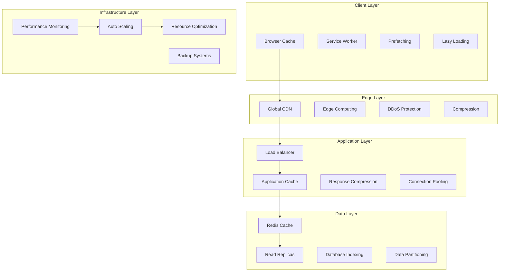

# AURA Villas Bali - Performance Optimization Strategy
## Comprehensive Performance Architecture for Global Scale

### Executive Summary

This performance optimization strategy establishes a comprehensive framework for delivering exceptional user experience across all touchpoints of the AURA Villas Bali platform. The strategy focuses on achieving industry-leading performance metrics while supporting global scale and business growth.

**Performance Goals:**
- Core Web Vitals: >95 score across all devices
- Page Load Time: <1.5 seconds (LCP)
- Time to Interactive: <2.5 seconds
- API Response Time: <200ms (95th percentile)
- Global Availability: 99.9% uptime SLA

**Key Strategies:**
- Multi-layer caching architecture
- Global CDN with edge computing
- Database optimization and scaling
- Image and media optimization
- Real-time performance monitoring

---

## 1. Performance Architecture Overview

### 1.1 Multi-Tier Performance Strategy



### 1.2 Performance Metrics Framework

```typescript
interface PerformanceMetrics {
  coreWebVitals: {
    largestContentfulPaint: {
      target: "<1.5 seconds";
      measurement: "Time to render largest visible element";
      optimization: "Image optimization, critical CSS, server response";
    };
    
    firstInputDelay: {
      target: "<50 milliseconds";
      measurement: "Time from first interaction to browser response";
      optimization: "JavaScript optimization, main thread work reduction";
    };
    
    cumulativeLayoutShift: {
      target: "<0.05";
      measurement: "Visual stability of page loading";
      optimization: "Size attributes, font optimization, dynamic content";
    };
    
    firstContentfulPaint: {
      target: "<1.0 second";
      measurement: "Time to first visible content";
      optimization: "Critical path optimization, server response";
    };
    
    timeToInteractive: {
      target: "<2.5 seconds";
      measurement: "Time until page is fully interactive";
      optimization: "JavaScript bundling, resource prioritization";
    };
  };
  
  applicationMetrics: {
    serverResponseTime: {
      target: "<200ms (95th percentile)";
      measurement: "API response time distribution";
      optimization: "Caching, database optimization, query performance";
    };
    
    throughput: {
      target: ">1000 requests/second";
      measurement: "System request handling capacity";
      optimization: "Load balancing, horizontal scaling, caching";
    };
    
    errorRate: {
      target: "<0.1%";
      measurement: "Application error rate";
      optimization: "Error handling, circuit breakers, monitoring";
    };
    
    availability: {
      target: "99.9% uptime";
      measurement: "System availability percentage";
      optimization: "Redundancy, failover, monitoring";
    };
  };
  
  userExperienceMetrics: {
    searchResponseTime: {
      target: "<500ms";
      measurement: "Villa search response time";
      optimization: "Elasticsearch optimization, caching, indexing";
    };
    
    imageLoadTime: {
      target: "<200ms";
      measurement: "Image loading performance";
      optimization: "CDN, compression, modern formats, lazy loading";
    };
    
    bookingFlowTime: {
      target: "<5 seconds end-to-end";
      measurement: "Complete booking flow time";
      optimization: "Form optimization, payment processing, UX";
    };
    
    mobilePerformance: {
      target: "Same as desktop";
      measurement: "Mobile-specific performance metrics";
      optimization: "Mobile-first design, touch optimization";
    };
  };
}
```

---

## 2. Frontend Performance Optimization

### 2.1 React & Next.js Optimization

```typescript
interface FrontendOptimization {
  nextjsOptimization: {
    staticGeneration: {
      implementation: "Static Site Generation (SSG) for villa pages";
      incrementalRegeneration: "ISR for dynamic content updates";
      prerendering: "Pre-render all villa listing pages";
      caching: "Aggressive caching with stale-while-revalidate";
    };
    
    serverSideRendering: {
      selective: "SSR only for user-specific content";
      streaming: "React 18 streaming SSR";
      partialHydration: "Selective component hydration";
      caching: "Server-side rendering cache";
    };
    
    bundleOptimization: {
      codesplitting: "Route-based and component-based splitting";
      treeshaking: "Remove unused code";
      bundleAnalysis: "Regular bundle size analysis";
      dynamicImports: "Lazy load non-critical components";
    };
    
    imageOptimization: {
      nextImage: "Next.js Image component with optimization";
      formats: "WebP/AVIF with fallbacks";
      sizing: "Responsive image sizing";
      placeholders: "Blur placeholders for smooth loading";
      lazyLoading: "Intersection Observer based lazy loading";
    };
  };
  
  reactOptimization: {
    componentOptimization: {
      memoization: "React.memo for expensive components";
      useMemo: "Memoize expensive calculations";
      useCallback: "Memoize event handlers";
      virtualScrolling: "Virtual scrolling for large lists";
    };
    
    stateManagement: {
      zustand: "Lightweight state management";
      localState: "Component-level state where appropriate";
      contextOptimization: "Minimize context re-renders";
      stateNormalization: "Normalized state structure";
    };
    
    renderOptimization: {
      batchedUpdates: "React 18 automatic batching";
      concurrentFeatures: "Concurrent rendering features";
      suspense: "Suspense for data fetching";
      errorBoundaries: "Error boundaries for resilience";
    };
  };
  
  criticalPathOptimization: {
    criticalCSS: {
      inlining: "Inline critical CSS for above-fold content";
      extraction: "Extract critical CSS per route";
      nonCritical: "Defer non-critical CSS loading";
      optimization: "Minimize and compress CSS";
    };
    
    criticalJavaScript: {
      prioritization: "Load critical JS first";
      deferring: "Defer non-critical scripts";
      inlining: "Inline small critical scripts";
      modulePreloading: "Preload JavaScript modules";
    };
    
    resourceHints: {
      preload: "Preload critical resources";
      prefetch: "Prefetch likely next resources";
      preconnect: "Preconnect to external domains";
      dns: "DNS prefetch for external resources";
    };
  };
}
```

### 2.2 Asset Optimization Strategy

```typescript
interface AssetOptimization {
  imageOptimization: {
    formats: {
      modern: "WebP and AVIF for modern browsers";
      fallback: "JPEG/PNG fallbacks for compatibility";
      svg: "SVG for icons and simple graphics";
      responsive: "Multiple sizes for different viewports";
    };
    
    compression: {
      lossless: "Lossless compression for product images";
      lossy: "Optimized lossy compression for content images";
      quality: "80-85% quality for optimal size/quality ratio";
      automation: "Automated compression pipeline";
    };
    
    delivery: {
      cdn: "Global CDN delivery";
      lazy: "Intersection Observer lazy loading";
      progressive: "Progressive JPEG loading";
      placeholders: "Low-quality image placeholders";
    };
    
    optimization: {
      sizing: "Appropriate sizing for container";
      retina: "High-DPI display support";
      orientation: "Responsive orientation support";
      cropping: "Smart cropping for different ratios";
    };
  };
  
  fontOptimization: {
    strategy: {
      subset: "Subset fonts to required characters";
      preload: "Preload critical font files";
      display: "font-display: swap for FOIT prevention";
      fallback: "System font fallbacks";
    };
    
    delivery: {
      selfHosted: "Self-hosted fonts for performance";
      woff2: "WOFF2 format for modern browsers";
      preconnect: "Preconnect to font CDN";
      caching: "Long-term font caching";
    };
    
    loading: {
      critical: "Load critical fonts immediately";
      secondary: "Load secondary fonts after interaction";
      variable: "Variable fonts where appropriate";
      optimization: "Font loading optimization";
    };
  };
  
  scriptOptimization: {
    bundling: {
      vendor: "Separate vendor bundles";
      common: "Extract common chunks";
      dynamic: "Dynamic imports for routes";
      critical: "Inline critical scripts";
    };
    
    compression: {
      minification: "Aggressive minification";
      gzip: "Gzip compression";
      brotli: "Brotli compression where supported";
      treeshaking: "Dead code elimination";
    };
    
    loading: {
      defer: "Defer non-critical scripts";
      async: "Async loading where appropriate";
      modulePreload: "Module preloading";
      prioritization: "Script loading prioritization";
    };
  };
}
```

### 2.3 Caching Strategy

```typescript
interface ClientCaching {
  browserCaching: {
    staticAssets: {
      images: "Cache-Control: public, max-age=31536000, immutable";
      fonts: "Cache-Control: public, max-age=31536000, immutable";
      css: "Cache-Control: public, max-age=31536000, immutable";
      js: "Cache-Control: public, max-age=31536000, immutable";
    };
    
    dynamicContent: {
      html: "Cache-Control: public, max-age=300, stale-while-revalidate=60";
      api: "Cache-Control: public, max-age=300, stale-while-revalidate=60";
      user: "Cache-Control: private, no-cache";
    };
  };
  
  serviceWorker: {
    strategy: "Workbox with Network First for API, Cache First for assets";
    precaching: "Precache critical resources";
    runtime: "Runtime caching for API responses";
    background: "Background sync for offline actions";
    update: "Automatic service worker updates";
  };
  
  applicationCache: {
    memory: "In-memory cache for frequently accessed data";
    localStorage: "Persistent storage for user preferences";
    sessionStorage: "Session-specific caching";
    indexedDB: "Large data caching (search results, images)";
  };
  
  cdnCaching: {
    cloudflare: {
      static: "Edge caching for static assets";
      dynamic: "Edge caching for dynamic content";
      purging: "Automated cache purging on updates";
      rules: "Custom caching rules per content type";
    };
    
    optimization: {
      compression: "Automatic Gzip/Brotli compression";
      minification: "HTML/CSS/JS minification";
      http2: "HTTP/2 server push optimization";
      http3: "HTTP/3 where supported";
    };
  };
}
```

---

## 3. Backend Performance Optimization

### 3.1 API Performance Strategy

```typescript
interface APIPerformanceStrategy {
  responseOptimization: {
    dataOptimization: {
      pagination: "Cursor-based pagination for large datasets";
      filtering: "Server-side filtering to reduce payload";
      fieldsSelection: "GraphQL field selection optimization";
      compression: "Response compression (Gzip/Brotli)";
    };
    
    caching: {
      redis: "Redis caching for frequently accessed data";
      memoryCache: "In-memory caching for hot data";
      httpCache: "HTTP caching headers optimization";
      queryCache: "Database query result caching";
    };
    
    serialization: {
      json: "Optimized JSON serialization";
      compression: "Response payload compression";
      streaming: "Streaming responses for large data";
      binary: "Binary protocols where appropriate";
    };
  };
  
  databaseOptimization: {
    queries: {
      indexing: "Comprehensive database indexing strategy";
      optimization: "Query execution plan optimization";
      batching: "Request batching and bulk operations";
      pooling: "Connection pooling optimization";
    };
    
    caching: {
      queryCache: "Database query result caching";
      objectCache: "Object-level caching";
      distributedCache: "Distributed caching with Redis";
      invalidation: "Cache invalidation strategies";
    };
    
    scaling: {
      readReplicas: "Read replica scaling";
      partitioning: "Table partitioning strategies";
      sharding: "Database sharding for horizontal scaling";
      archiving: "Data archiving for performance";
    };
  };
  
  concurrency: {
    asyncProcessing: {
      eventLoop: "Non-blocking event loop optimization";
      promises: "Promise-based asynchronous operations";
      streaming: "Stream processing for large data";
      workers: "Worker threads for CPU-intensive tasks";
    };
    
    parallelization: {
      concurrent: "Concurrent request processing";
      batching: "Request batching optimization";
      pipelining: "Database operation pipelining";
      multiplexing: "Connection multiplexing";
    };
    
    resourceManagement: {
      pooling: "Resource pooling (connections, threads)";
      limiting: "Resource usage limiting";
      monitoring: "Resource utilization monitoring";
      scaling: "Automatic resource scaling";
    };
  };
}
```

### 3.2 Database Performance Optimization

```sql
-- High-Performance Database Configuration
-- PostgreSQL optimization for AURA Villas platform

-- Connection and Memory Configuration
-- Optimized for 16GB RAM server
shared_buffers = '4GB'                    -- 25% of total RAM
effective_cache_size = '12GB'             -- 75% of total RAM
work_mem = '64MB'                         -- For complex queries
maintenance_work_mem = '1GB'              -- For maintenance operations
wal_buffers = '16MB'                      -- Write-ahead log buffers

-- Query Performance Configuration
random_page_cost = 1.1                    -- SSD optimization
effective_io_concurrency = 200            -- SSD concurrent I/O
default_statistics_target = 100           -- Query planner statistics
constraint_exclusion = 'partition'        -- Partition constraint exclusion

-- Write Performance Configuration
synchronous_commit = 'on'                 -- Data durability
wal_compression = 'on'                    -- WAL compression
checkpoint_completion_target = 0.9        -- Checkpoint spreading
max_wal_size = '4GB'                      -- Maximum WAL size
min_wal_size = '1GB'                      -- Minimum WAL size

-- Connection Configuration
max_connections = 200                     -- Maximum connections
shared_preload_libraries = 'pg_stat_statements' -- Query statistics

-- Performance Monitoring Views
CREATE VIEW performance_monitor AS
SELECT 
    schemaname,
    tablename,
    attname,
    n_distinct,
    correlation,
    most_common_vals,
    most_common_freqs
FROM pg_stats
WHERE schemaname IN ('villa_core', 'booking_system', 'user_management');

-- Optimized Indexes for Core Queries
-- Villa search optimization
CREATE INDEX CONCURRENTLY idx_villas_search_composite 
ON villa_core.villas (status, featured, base_price, max_guests) 
WHERE status = 'active';

-- Geographic search optimization
CREATE INDEX CONCURRENTLY idx_locations_geo 
ON villa_core.locations USING GIST (coordinates);

-- Booking date range optimization
CREATE INDEX CONCURRENTLY idx_bookings_date_range 
ON booking_system.bookings (villa_id, check_in, check_out) 
WHERE status IN ('confirmed', 'completed');

-- Full-text search optimization
CREATE INDEX CONCURRENTLY idx_villas_fulltext 
ON villa_core.villas USING GIN (
    to_tsvector('english', name || ' ' || COALESCE(story, ''))
);

-- Analytics optimization
CREATE INDEX CONCURRENTLY idx_analytics_time_series 
ON analytics.page_views (created_at DESC, page_path) 
WHERE created_at >= NOW() - INTERVAL '90 days';

-- Materialized Views for Performance
CREATE MATERIALIZED VIEW villa_search_cache AS
SELECT 
    v.id,
    v.name,
    v.slug,
    v.base_price,
    v.max_guests,
    v.rating,
    v.review_count,
    l.area,
    l.coordinates,
    array_agg(DISTINCT a.name) as amenities,
    (SELECT url FROM villa_core.villa_images 
     WHERE villa_id = v.id AND is_primary = true LIMIT 1) as primary_image
FROM villa_core.villas v
JOIN villa_core.locations l ON v.location_id = l.id
LEFT JOIN villa_core.villa_amenities va ON v.id = va.villa_id
LEFT JOIN villa_core.amenities a ON va.amenity_id = a.id
WHERE v.status = 'active'
GROUP BY v.id, l.id;

-- Refresh materialized view every hour
CREATE OR REPLACE FUNCTION refresh_villa_search_cache()
RETURNS void AS $$
BEGIN
    REFRESH MATERIALIZED VIEW CONCURRENTLY villa_search_cache;
END;
$$ LANGUAGE plpgsql;

-- Partitioning Strategy for Analytics Data
CREATE TABLE analytics.page_views_y2024m01 PARTITION OF analytics.page_views
    FOR VALUES FROM ('2024-01-01') TO ('2024-02-01');
    
CREATE TABLE analytics.page_views_y2024m02 PARTITION OF analytics.page_views
    FOR VALUES FROM ('2024-02-01') TO ('2024-03-01');

-- Automated partition management
CREATE OR REPLACE FUNCTION create_monthly_partitions()
RETURNS void AS $$
DECLARE
    start_date date;
    end_date date;
    table_name text;
BEGIN
    start_date := date_trunc('month', CURRENT_DATE + interval '1 month');
    end_date := start_date + interval '1 month';
    table_name := 'analytics.page_views_y' || 
                  extract(year from start_date) || 'm' || 
                  lpad(extract(month from start_date)::text, 2, '0');
    
    EXECUTE format('CREATE TABLE %s PARTITION OF analytics.page_views
                   FOR VALUES FROM (%L) TO (%L)',
                   table_name, start_date, end_date);
END;
$$ LANGUAGE plpgsql;
```

### 3.3 Caching Architecture

```typescript
interface CachingArchitecture {
  multilayerCaching: {
    l1_applicationCache: {
      type: "In-memory application cache";
      technology: "Node.js Map with TTL";
      purpose: "Frequently accessed configuration and static data";
      ttl: "5-60 minutes";
      size: "256MB maximum";
    };
    
    l2_distributedCache: {
      type: "Distributed cache cluster";
      technology: "Redis Cluster";
      purpose: "Session data, API responses, computed results";
      ttl: "15 minutes to 24 hours";
      size: "8GB cluster";
    };
    
    l3_databaseCache: {
      type: "Database query result cache";
      technology: "PostgreSQL shared_buffers + OS cache";
      purpose: "Database query results and indexes";
      ttl: "Automatic with PostgreSQL";
      size: "4GB shared buffers";
    };
    
    l4_persistentCache: {
      type: "Persistent storage cache";
      technology: "SSD storage with read caching";
      purpose: "Large datasets and file storage";
      ttl: "Indefinite with LRU eviction";
      size: "1TB NVMe SSD";
    };
  };
  
  cachingStrategies: {
    cacheAside: {
      useCase: "User profile data, villa details";
      pattern: "Application manages cache population";
      benefits: "Fine-grained control, fault tolerance";
      implementation: "Check cache → DB → populate cache";
    };
    
    writeThrough: {
      useCase: "Critical configuration data";
      pattern: "Write to cache and database simultaneously";
      benefits: "Data consistency, immediate availability";
      implementation: "Write cache + DB in transaction";
    };
    
    writeBack: {
      useCase: "Analytics data, session information";
      pattern: "Write to cache, async write to database";
      benefits: "High write performance";
      implementation: "Write cache → scheduled DB write";
    };
    
    refreshAhead: {
      useCase: "Popular villa listings, search results";
      pattern: "Proactive cache refresh before expiration";
      benefits: "Always fresh data, no cache misses";
      implementation: "Background refresh based on access patterns";
    };
  };
  
  cacheOptimization: {
    keyDesign: {
      hierarchical: "Namespace:Type:ID format";
      versioning: "Include version in cache keys";
      consistency: "Consistent key naming conventions";
      expiration: "Automatic expiration with TTL";
    };
    
    evictionPolicies: {
      lru: "Least Recently Used for general data";
      lfu: "Least Frequently Used for analytics";
      ttl: "Time-based expiration for time-sensitive data";
      manual: "Manual invalidation for critical updates";
    };
    
    compression: {
      algorithm: "LZ4 for speed, Gzip for space";
      threshold: "Compress objects > 1KB";
      tradeoff: "CPU vs memory optimization";
      monitoring: "Compression ratio monitoring";
    };
  };
}
```

---

## 4. Real-time Performance Monitoring

### 4.1 Monitoring Infrastructure

```typescript
interface PerformanceMonitoring {
  realTimeMetrics: {
    applicationPerformanceMonitoring: {
      tool: "New Relic + Custom dashboards";
      metrics: [
        "Response time distribution",
        "Throughput (requests per second)",
        "Error rate and error types",
        "Database query performance",
        "External service latency"
      ];
      alerting: "Real-time alerts for SLA violations";
      retention: "13 months of detailed metrics";
    };
    
    infrastructureMonitoring: {
      tool: "DataDog + CloudWatch";
      metrics: [
        "CPU utilization and load average",
        "Memory usage and garbage collection", 
        "Disk I/O and storage utilization",
        "Network bandwidth and latency",
        "Container and service health"
      ];
      alerting: "Proactive infrastructure alerts";
      retention: "2 years of infrastructure data";
    };
    
    userExperienceMonitoring: {
      tool: "Google Analytics + Core Web Vitals";
      metrics: [
        "Core Web Vitals scores",
        "User journey performance",
        "Conversion funnel timing",
        "Geographic performance variation",
        "Device-specific performance"
      ];
      alerting: "User experience degradation alerts";
      retention: "26 months of UX data";
    };
  };
  
  syntheticMonitoring: {
    uptimeMonitoring: {
      tool: "Pingdom + StatusCake";
      frequency: "30-second intervals";
      locations: "Global monitoring from 15+ locations";
      scenarios: "Critical user journey monitoring";
      alerting: "Multi-channel incident alerting";
    };
    
    performanceTesting: {
      tool: "WebPageTest + Lighthouse CI";
      frequency: "Hourly performance audits";
      metrics: "Complete performance audit";
      regression: "Performance regression detection";
      reporting: "Automated performance reports";
    };
    
    loadTesting: {
      tool: "k6 + Artillery";
      frequency: "Weekly load tests";
      scenarios: "Peak traffic simulation";
      capacity: "Capacity planning data";
      alerting: "Performance threshold alerts";
    };
  };
  
  businessMetrics: {
    conversionTracking: {
      metrics: [
        "Search to villa view conversion",
        "Villa view to inquiry conversion",
        "Inquiry to booking conversion",
        "Performance impact on conversions"
      ];
      correlation: "Performance-conversion correlation";
      optimization: "Performance-driven optimization";
    };
    
    revenueImpact: {
      tracking: "Revenue impact of performance";
      analysis: "Page speed revenue correlation";
      reporting: "Business impact reports";
      roi: "Performance optimization ROI";
    };
  };
}
```

### 4.2 Alerting & Response Strategy

```yaml
Alerting Framework:

Critical Alerts (Immediate Response):
  - Site Down: Response time >30 seconds
  - Error Rate: >1% error rate for 5 minutes
  - Database: Connection failures or >5 second queries
  - Payment: Payment processing failures
  Response: PagerDuty → On-call engineer → 5 minute response

High Priority Alerts (15 minute response):
  - Performance: Core Web Vitals <85 for 10 minutes
  - Capacity: >80% resource utilization
  - Security: Unusual traffic patterns
  - Booking: Booking flow >10 second completion
  Response: Slack + Email → Team lead → 15 minute response

Medium Priority Alerts (1 hour response):
  - Performance: Page load time >3 seconds
  - Search: Search response time >1 second
  - Images: Image load failures >5%
  - Cache: Cache hit rate <85%
  Response: Email → Development team → 1 hour response

Low Priority Alerts (24 hour response):
  - Trends: Week-over-week performance degradation
  - Optimization: Optimization opportunities identified
  - Capacity: Future capacity planning alerts
  - Reports: Weekly performance reports
  Response: Dashboard + Email → Product team → 24 hour review

Escalation Procedures:
  Level 1: Automated resolution attempts
  Level 2: On-call engineer response
  Level 3: Team lead escalation
  Level 4: Management escalation
  Level 5: Executive escalation for business-critical issues
```

### 4.3 Performance Dashboard

```typescript
interface PerformanceDashboard {
  executiveDashboard: {
    kpis: [
      "Overall site performance score",
      "User experience satisfaction",
      "Business impact metrics",
      "Availability and uptime",
      "Performance vs competition"
    ];
    frequency: "Real-time with daily summaries";
    audience: "Executive team and stakeholders";
    format: "High-level metrics with trend analysis";
  };
  
  operationalDashboard: {
    metrics: [
      "Real-time performance metrics",
      "System health indicators",
      "Error rates and incidents",
      "Infrastructure utilization",
      "Performance alerts and status"
    ];
    frequency: "Real-time monitoring";
    audience: "Operations and development teams";
    format: "Detailed technical metrics";
  };
  
  businessDashboard: {
    metrics: [
      "Conversion rate by performance",
      "Revenue impact analysis",
      "User engagement metrics",
      "Geographic performance analysis",
      "Device performance comparison"
    ];
    frequency: "Daily updates with weekly analysis";
    audience: "Product and marketing teams";
    format: "Business-focused insights";
  };
  
  developerDashboard: {
    metrics: [
      "Build performance metrics",
      "Code-level performance insights",
      "Database query performance",
      "API endpoint performance",
      "Deployment impact analysis"
    ];
    frequency: "Real-time with deployment tracking";
    audience: "Development team";
    format: "Technical deep-dive metrics";
  };
}
```

---

## 5. Scaling Strategy

### 5.1 Horizontal Scaling Architecture

```typescript
interface ScalingStrategy {
  applicationScaling: {
    containerization: {
      technology: "Docker + Kubernetes";
      orchestration: "Kubernetes with HPA (Horizontal Pod Autoscaler)";
      scaling: "CPU and memory-based auto-scaling";
      limits: "Resource limits and requests optimization";
    };
    
    loadBalancing: {
      layer7: "Application Load Balancer with health checks";
      algorithm: "Least connections with session affinity";
      ssl: "SSL termination at load balancer";
      monitoring: "Load balancer performance monitoring";
    };
    
    serviceArchitecture: {
      microservices: "Gradual transition to microservices";
      independence: "Service independence and isolation";
      communication: "Async messaging for service communication";
      resilience: "Circuit breakers and fallback mechanisms";
    };
  };
  
  databaseScaling: {
    readReplicas: {
      configuration: "3 read replicas in different AZs";
      routing: "Read queries to replicas, writes to primary";
      monitoring: "Replication lag monitoring";
      failover: "Automatic failover for read replicas";
    };
    
    connectionPooling: {
      technology: "PgBouncer for connection pooling";
      configuration: "Pool size optimization based on load";
      monitoring: "Connection pool utilization monitoring";
      optimization: "Connection lifecycle optimization";
    };
    
    partitioning: {
      strategy: "Time-based partitioning for analytics";
      automation: "Automated partition creation and cleanup";
      querying: "Partition-aware query optimization";
      maintenance: "Automated partition maintenance";
    };
  };
  
  cacheScaling: {
    redisCluster: {
      configuration: "Redis Cluster with 6 nodes (3 masters, 3 replicas)";
      distribution: "Hash-based key distribution";
      failover: "Automatic failover and recovery";
      monitoring: "Cluster health and performance monitoring";
    };
    
    cacheWarming: {
      strategy: "Proactive cache warming for popular content";
      automation: "Automated cache warming based on usage patterns";
      prediction: "ML-based cache warming prediction";
      optimization: "Cache warming cost optimization";
    };
  };
  
  cdnScaling: {
    globalDistribution: {
      network: "CloudFlare global CDN network";
      edgeLocations: "200+ edge locations worldwide";
      optimization: "Edge computing for dynamic content";
      routing: "Intelligent traffic routing";
    };
    
    edgeOptimization: {
      caching: "Aggressive edge caching strategies";
      compression: "Automatic content compression";
      optimization: "Edge-side optimization (minification, image optimization)";
      routing: "Optimal route selection";
    };
  };
}
```

### 5.2 Auto-scaling Configuration

```yaml
Auto-scaling Configuration:

Application Auto-scaling:
  Metrics:
    - CPU utilization: Target 70%
    - Memory utilization: Target 80%
    - Request rate: Scale at >500 RPS per instance
    - Response time: Scale if >500ms average
  
  Scaling Policy:
    - Scale up: Add instance if metrics exceeded for 2 minutes
    - Scale down: Remove instance if metrics low for 10 minutes
    - Minimum instances: 3
    - Maximum instances: 20
    - Cooldown period: 5 minutes

Database Auto-scaling:
  Read Replicas:
    - Scale up: Add replica if read utilization >80%
    - Scale down: Remove replica if utilization <40%
    - Minimum replicas: 2
    - Maximum replicas: 5
  
  Storage:
    - Auto-scaling enabled
    - Growth threshold: 85% utilization
    - Growth increment: 20% of current size
    - Maximum size: 10TB

Cache Auto-scaling:
  Redis:
    - Memory threshold: 80% utilization
    - Scale up: Add node if threshold exceeded
    - Scale down: Remove node if utilization <40%
    - Minimum nodes: 3
    - Maximum nodes: 12

CDN Auto-scaling:
  Dynamic Scaling:
    - Automatic traffic distribution
    - Edge location activation based on traffic
    - Bandwidth auto-scaling
    - Cost optimization algorithms
```

---

## 6. Performance Testing Strategy

### 6.1 Load Testing Framework

```typescript
interface LoadTestingStrategy {
  testTypes: {
    loadTesting: {
      purpose: "Verify system performance under expected load";
      duration: "30 minutes sustained load";
      users: "1000 concurrent users";
      scenarios: "Normal user behavior patterns";
      frequency: "Weekly automated tests";
    };
    
    stressTesting: {
      purpose: "Determine system breaking point";
      duration: "Gradual load increase over 1 hour";
      users: "Up to 5000 concurrent users";
      scenarios: "Peak usage scenarios";
      frequency: "Monthly stress tests";
    };
    
    spikeTesting: {
      purpose: "Test system behavior during traffic spikes";
      duration: "5 minute spike tests";
      users: "Sudden increase to 2000 users";
      scenarios: "Flash sale or viral content scenarios";
      frequency: "Bi-weekly spike tests";
    };
    
    enduranceTesting: {
      purpose: "Test system stability over extended periods";
      duration: "24 hour continuous testing";
      users: "500 concurrent users";
      scenarios: "Sustained normal usage";
      frequency: "Monthly endurance tests";
    };
  };
  
  testScenarios: {
    userJourneys: [
      "Villa search and filtering",
      "Villa detail view and gallery",
      "Booking inquiry submission",
      "User registration and login",
      "Owner dashboard access",
      "Payment processing flow"
    ];
    
    apiEndpoints: [
      "GET /api/v1/villas (search)",
      "GET /api/v1/villas/{id} (details)",
      "POST /api/v1/bookings/inquiry",
      "POST /api/v1/auth/login",
      "GET /api/v1/analytics/dashboard",
      "POST /api/v1/payments/process"
    ];
    
    thirdPartyServices: [
      "Payment gateway integration",
      "Email service calls",
      "WhatsApp API calls",
      "Google Maps API",
      "Image CDN requests"
    ];
  };
  
  performanceCriteria: {
    responseTime: {
      excellent: "<200ms (95th percentile)";
      good: "<500ms (95th percentile)";
      acceptable: "<1000ms (95th percentile)";
      poor: ">1000ms (95th percentile)";
    };
    
    throughput: {
      minimum: "500 requests/second";
      target: "1000 requests/second";
      maximum: "2000 requests/second";
    };
    
    errorRate: {
      excellent: "<0.01%";
      good: "<0.1%";
      acceptable: "<1%";
      poor: ">1%";
    };
    
    availability: {
      target: "99.9% uptime";
      acceptable: "99.5% uptime";
      poor: "<99% uptime";
    };
  };
}
```

### 6.2 Performance Testing Tools

```yaml
Testing Tool Stack:

Load Testing:
  Primary: k6 (JavaScript-based)
    - Scenarios: Complex user journey scripting
    - Reporting: Detailed performance metrics
    - Integration: CI/CD pipeline integration
    - Scaling: Cloud-based load generation
  
  Secondary: Artillery (Node.js)
    - API Testing: RESTful and GraphQL APIs
    - WebSocket: Real-time feature testing
    - Plugins: Custom metrics and reporting
    - AWS Integration: Lambda-based testing

Browser Testing:
  Tool: Playwright + Lighthouse
    - Real Browser: Chromium-based testing
    - Metrics: Core Web Vitals measurement
    - Automation: Automated performance audits
    - Reporting: Detailed performance reports

API Testing:
  Tool: Postman + Newman
    - Collection: Comprehensive API test collections
    - Automation: Automated API performance testing
    - Monitoring: Continuous API monitoring
    - Reporting: API performance dashboards

Monitoring:
  Production: New Relic + DataDog
    - APM: Application performance monitoring
    - Infrastructure: Server and database monitoring
    - Alerting: Real-time performance alerts
    - Analytics: Performance trend analysis

Testing Environment:
  Staging: Production-like environment
    - Hardware: Same specifications as production
    - Data: Production-like test data
    - Configuration: Identical configuration
    - Monitoring: Full monitoring stack
```

---

## 7. Performance Budget & Governance

### 7.1 Performance Budget Framework

```typescript
interface PerformanceBudget {
  metricBudgets: {
    coreWebVitals: {
      largestContentfulPaint: {
        budget: "1.5 seconds";
        tolerance: "±100ms";
        measurement: "75th percentile";
        enforcement: "CI/CD gate";
      };
      
      firstInputDelay: {
        budget: "50 milliseconds";
        tolerance: "±10ms";
        measurement: "95th percentile";
        enforcement: "CI/CD gate";
      };
      
      cumulativeLayoutShift: {
        budget: "0.05";
        tolerance: "±0.01";
        measurement: "Average";
        enforcement: "CI/CD gate";
      };
    };
    
    resourceBudgets: {
      javascript: {
        budget: "250KB compressed";
        tolerance: "±25KB";
        measurement: "Total bundle size";
        enforcement: "Build-time check";
      };
      
      css: {
        budget: "50KB compressed";
        tolerance: "±5KB";
        measurement: "Total CSS size";
        enforcement: "Build-time check";
      };
      
      images: {
        budget: "500KB per page";
        tolerance: "±50KB";
        measurement: "Total image payload";
        enforcement: "Runtime monitoring";
      };
      
      fonts: {
        budget: "100KB compressed";
        tolerance: "±10KB";
        measurement: "Total font payload";
        enforcement: "Build-time check";
      };
    };
    
    timingBudgets: {
      serverResponse: {
        budget: "200ms";
        tolerance: "±50ms";
        measurement: "95th percentile TTFB";
        enforcement: "Production monitoring";
      };
      
      databaseQuery: {
        budget: "50ms";
        tolerance: "±10ms";
        measurement: "95th percentile query time";
        enforcement: "Production monitoring";
      };
      
      apiResponse: {
        budget: "300ms";
        tolerance: "±50ms";
        measurement: "95th percentile API response";
        enforcement: "Production monitoring";
      };
    };
  };
  
  enforcementStrategy: {
    development: {
      tools: "ESLint performance rules, bundle analyzers";
      gates: "Pre-commit hooks for performance checks";
      feedback: "Real-time performance feedback";
      education: "Developer performance training";
    };
    
    cicd: {
      tools: "Lighthouse CI, bundle size analysis";
      gates: "Build fails if budget exceeded";
      reporting: "Performance regression reports";
      rollback: "Automatic rollback on performance regression";
    };
    
    production: {
      tools: "Real-time monitoring, alerting";
      response: "Automatic scaling and optimization";
      analysis: "Post-incident performance analysis";
      improvement: "Continuous performance improvement";
    };
  };
  
  governanceProcess: {
    budgetReview: {
      frequency: "Monthly budget review meetings";
      stakeholders: "Engineering, Product, UX teams";
      process: "Data-driven budget adjustments";
      documentation: "Budget change documentation";
    };
    
    performanceChampions: {
      role: "Performance advocates in each team";
      responsibilities: "Performance guidance and review";
      training: "Regular performance training";
      reporting: "Performance status reporting";
    };
    
    performanceReview: {
      frequency: "Quarterly performance reviews";
      scope: "Overall performance strategy review";
      optimization: "Performance optimization planning";
      investment: "Performance improvement investments";
    };
  };
}
```

---

## 8. Mobile Performance Optimization

### 8.1 Mobile-First Performance Strategy

```typescript
interface MobilePerformanceStrategy {
  mobilePrioritization: {
    designApproach: {
      strategy: "Mobile-first responsive design";
      breakpoints: "320px, 768px, 1024px, 1440px";
      optimization: "Mobile-optimized layouts and interactions";
      testing: "Real device testing across price ranges";
    };
    
    networkOptimization: {
      adaptiveLoading: "Network-aware resource loading";
      dataCompression: "Aggressive compression for mobile";
      prefetching: "Selective prefetching based on connection";
      caching: "Enhanced mobile caching strategies";
    };
    
    resourceOptimization: {
      images: "Mobile-optimized image sizes and formats";
      fonts: "Reduced font sets for mobile";
      javascript: "Mobile-specific bundle splitting";
      css: "Mobile-first CSS architecture";
    };
  };
  
  deviceOptimization: {
    lowEndDevices: {
      targeting: "Android devices with 1GB RAM";
      optimization: "Reduced JavaScript execution";
      fallbacks: "Progressive enhancement for features";
      testing: "Low-end device performance testing";
    };
    
    highEndDevices: {
      targeting: "Latest iOS and Android flagships";
      features: "Enhanced features for capable devices";
      optimization: "Leverage advanced browser features";
      testing: "Latest device feature testing";
    };
    
    crossPlatform: {
      compatibility: "Consistent experience across platforms";
      testing: "Comprehensive device testing";
      performance: "Platform-specific optimizations";
      features: "Progressive enhancement strategy";
    };
  };
  
  mobileSpecificFeatures: {
    touchOptimization: {
      targets: "Minimum 44px touch targets";
      gestures: "Native gesture support";
      interactions: "Optimized touch interactions";
      feedback: "Haptic feedback where supported";
    };
    
    orientationHandling: {
      responsive: "Orientation-aware layouts";
      performance: "Orientation change optimization";
      content: "Adaptive content for orientations";
      testing: "Orientation testing scenarios";
    };
    
    offlineCapability: {
      serviceWorker: "Comprehensive offline support";
      caching: "Smart caching for offline use";
      sync: "Background sync for actions";
      feedback: "Clear offline state indication";
    };
  };
}
```

---

## Conclusion

This comprehensive performance optimization strategy establishes AURA Villas Bali as a performance leader in the luxury villa platform space. The multi-layered approach ensures exceptional user experience while supporting global scale and business growth.

**Key Performance Benefits:**
- **User Experience**: Industry-leading Core Web Vitals scores
- **Business Impact**: Improved conversion rates and customer satisfaction
- **Scalability**: Global performance at scale
- **Competitive Advantage**: Performance-driven differentiation
- **Operational Excellence**: Proactive performance management

**Implementation Roadmap:**
- **Phase 1** (Months 1-3): Foundation performance optimization
- **Phase 2** (Months 4-6): Advanced caching and monitoring
- **Phase 3** (Months 7-12): Global scaling and edge optimization

The strategy provides a sustainable framework for maintaining performance leadership while supporting the platform's evolution and growth objectives.