# AURA Villas Bali - Property Management Service Architecture

## Executive Summary

This document outlines the comprehensive property management service architecture for AURA Villas Bali, designed to address villa owner pain points while leveraging technology for competitive advantage. The architecture focuses on transparency, automation, and exceptional service delivery through a selective, boutique approach.

## Architecture Overview

### Core Design Principles

1. **Owner-Centric Design**: Every system component serves villa owner needs first
2. **Transparency by Default**: Complete visibility into operations and financials
3. **Selective Partnership**: Quality over quantity approach with careful owner screening
4. **Technology-Enhanced Human Touch**: AI and automation support, don't replace, human care
5. **Cultural Integration**: Authentic Balinese hospitality at every touchpoint
6. **Scalable Boutique**: Systems that maintain personal touch while enabling growth

## 1. Service Architecture Framework

### 1.1 Tiered Service Packages

#### Essential Operations (15% Commission)
**Target**: First-time rental owners, smaller properties
- **Guest Services**: Check-in/out coordination, 8AM-8PM support
- **Property Care**: Basic housekeeping supervision, maintenance coordination
- **Operations**: Pool/garden scheduling, inventory management, utility coordination
- **Technology**: Owner portal access, digital guidebook, monthly reporting
- **Communication**: WhatsApp-based guest support, email summaries

#### Premium Experience (18% Commission)
**Target**: Established owners, mid-range properties
- **All Essential Services**, plus:
- **Enhanced Guest Services**: 24/7 concierge support, personalized welcome packages
- **Advanced Property Care**: Weekly inspections with photo/video reports
- **Dedicated Management**: Assigned operations manager, faster response times
- **Quality Assurance**: Quarterly performance reviews, guest feedback analysis
- **Maintenance**: Repairs buffer fund, preventive maintenance planning

#### Boutique Full Service (20-22% Commission)
**Target**: Luxury properties, hands-off owners
- **All Premium Services**, plus:
- **Staff Management**: Full payroll, hiring/training, performance management
- **Financial Management**: Complete P&L preparation, tax reporting assistance
- **Strategic Planning**: Annual CAPEX planning, revenue optimization consulting
- **Premium Amenities**: Custom guest experiences, cultural immersion programs
- **Compliance**: Full regulatory compliance, licensing support

### 1.2 Service Delivery Workflows

```mermaid
graph TB
    subgraph "Service Delivery Layers"
        A["👥 Guest Experience Layer<br/>• Welcome & Check-in<br/>• Concierge Services<br/>• Cultural Experiences<br/>• Check-out Support"]
        
        B["🏠 Property Operations Layer<br/>• Housekeeping Management<br/>• Maintenance Coordination<br/>• Quality Inspections<br/>• Inventory Control"]
        
        C["📊 Owner Communication Layer<br/>• Real-time Updates<br/>• Performance Reports<br/>• Financial Statements<br/>• Strategic Reviews"]
        
        D["⚙️ Backend Operations Layer<br/>• Staff Coordination<br/>• Vendor Management<br/>• System Integration<br/>• Data Analytics"]
    end
    
    A --> B
    B --> C
    B --> D
    C --> D
    
    style A fill:#e3f2fd
    style B fill:#f3e5f5
    style C fill:#e8f5e8
    style D fill:#fff3e0
```



### 1.3 Commission Structure & Pricing Models

#### Dynamic Pricing Framework
- **Base Commission**: Fixed percentage based on service tier
- **Performance Incentives**: Reduced commission for exceeding occupancy targets
- **Volume Discounts**: Lower rates for multiple property owners
- **Seasonal Adjustments**: Flexible rates during low/high seasons

#### Transparent Fee Structure
- **No Hidden Fees**: All costs disclosed upfront
- **Itemized Billing**: Detailed breakdown of all charges
- **Owner Approval**: Pre-approval required for expenses >$100
- **Emergency Fund**: Optional maintenance buffer (2-3% of monthly revenue)

## 2. Owner Portal Architecture

### 2.1 Real-Time Dashboard Design

#### Primary Dashboard Components
```typescript
interface OwnerDashboard {
  // Financial Overview
  monthlyRevenue: RevenueMetrics;
  yearToDatePerformance: PerformanceMetrics;
  upcomingPayouts: PayoutSchedule[];
  
  // Property Status
  currentOccupancy: OccupancyStatus;
  upcomingBookings: Booking[];
  maintenanceAlerts: MaintenanceAlert[];
  
  // Guest Experience
  recentReviews: Review[];
  guestSatisfactionScore: number;
  serviceRequestStatus: ServiceRequest[];
  
  // Performance Analytics
  occupancyTrends: TrendData;
  revenueComparison: ComparisonData;
  marketPositioning: MarketData;
}
```

#### Dashboard Architecture

```mermaid
graph TD
    subgraph "Owner Portal Frontend"
        A["📱 Mobile-First Design<br/>PWA Support"]
        B["🖥️ Desktop Dashboard<br/>Advanced Analytics"]
        C["📊 Data Visualization<br/>Charts & Graphs"]
    end
    
    subgraph "Real-Time Data Layer"
        D["⚡ WebSocket Connection<br/>Live Updates"]
        E["📊 Analytics Engine<br/>Performance Metrics"]
        F["🔄 Data Synchronization<br/>Multi-Source Integration"]
    end
    
    subgraph "Backend Services"
        G["🏠 Property Management API<br/>Booking & Operations Data"]
        H["💰 Financial API<br/>Revenue & Expense Tracking"]
        I["👥 Guest Services API<br/>Reviews & Communications"]
        J["🛠️ Maintenance API<br/>Work Orders & Inspections"]
    end
    
    A --> D
    B --> D
    C --> E
    D --> F
    E --> F
    F --> G
    F --> H
    F --> I
    F --> J
    
    style A fill:#e3f2fd
    style D fill:#f3e5f5
    style G fill:#e8f5e8
```


### 2.2 Financial Reporting Modules

#### Monthly Financial Report Structure
- **Revenue Summary**: Gross revenue, net income, commission breakdown
- **Expense Analysis**: Operational costs, maintenance expenses, vendor payments
- **Occupancy Performance**: Booking trends, average daily rate, RevPAR
- **Comparative Analysis**: Year-over-year, market benchmarking
- **Cash Flow Projection**: Next 3-month outlook

#### Interactive Financial Dashboard Features
- **Drill-Down Capabilities**: Click-through to transaction details
- **Export Options**: PDF reports, Excel spreadsheets, CSV data
- **Customizable Views**: Filter by date ranges, expense categories
- **Automated Insights**: AI-generated performance observations

### 2.3 Booking Calendar Integration

#### Multi-Platform Synchronization


### 2.4 Document Management System

#### Document Categories & Organization
- **Property Documentation**: Licenses, insurance, compliance certificates
- **Guest Documents**: Booking confirmations, guest communications
- **Financial Records**: Invoices, receipts, tax documents, bank statements
- **Maintenance Records**: Work orders, inspection reports, warranty information
- **Marketing Materials**: Photos, descriptions, promotional content

#### Document Management Features
- **Version Control**: Track document changes and updates
- **Automated Backup**: Cloud storage with redundancy
- **Access Control**: Role-based document access permissions
- **Search & Filter**: AI-powered document search capabilities
- **Expiration Alerts**: Automated reminders for license renewals

## 3. Operational Systems Architecture

### 3.1 Staff Management Structure

#### Organizational Hierarchy

```mermaid
graph TD
    A["🎯 Villa Operations Manager<br/>Overall Property Oversight"]
    
    B["🧹 Housekeeping Team Lead<br/>Cleaning & Maintenance"]
    C["👥 Guest Experience Coordinator<br/>Check-in/out & Concierge"]
    D["🔧 Maintenance Supervisor<br/>Property Upkeep"]
    E["🌿 Grounds Keeper<br/>Pool & Garden Care"]
    
    F["🧽 Housekeeping Staff<br/>Daily Cleaning"]
    G["🛠️ Maintenance Technicians<br/>Repairs & Upkeep"]
    H["🌱 Garden Staff<br/>Landscaping & Pool"]
    
    A --> B
    A --> C
    A --> D
    A --> E
    
    B --> F
    D --> G
    E --> H
    
    style A fill:#e3f2fd
    style B fill:#f3e5f5
    style C fill:#f3e5f5
    style D fill:#f3e5f5
    style E fill:#f3e5f5
```


#### Staff Performance Management
- **Skills Assessment**: Regular evaluation of technical and soft skills
- **Training Programs**: Cultural hospitality, technical skills, language development
- **Performance Incentives**: Guest satisfaction bonuses, retention rewards
- **Career Development**: Growth paths within AURA organization
- **Cultural Integration**: Authentic Balinese hospitality training

### 3.2 Maintenance Workflow Systems

#### Preventive Maintenance Schedule


#### Maintenance Request Workflow
1. **Issue Detection**: Staff inspection, guest report, or system alert
2. **Priority Assessment**: Critical, urgent, routine classification
3. **Resource Allocation**: Staff assignment and vendor coordination
4. **Owner Notification**: Real-time updates for significant issues
5. **Work Completion**: Photo/video documentation of repairs
6. **Quality Verification**: Post-completion inspection
7. **Cost Recording**: Detailed expense tracking and reporting

### 3.3 Guest Service Protocols

#### Guest Journey Mapping


#### Service Level Agreements (SLAs)
- **Response Times**: Urgent (15 min), Standard (2 hours), Routine (24 hours)
- **Guest Communication**: Multi-language support (English, Indonesian, Mandarin)
- **Issue Resolution**: 95% of issues resolved within 24 hours
- **Guest Satisfaction**: Maintain 4.8+ average rating across platforms

### 3.4 Quality Control Processes

#### Multi-Tier Quality Assurance
1. **Self-Assessment**: Staff self-inspection using mobile checklists
2. **Peer Review**: Cross-team quality checks and feedback
3. **Supervisor Inspection**: Weekly detailed property inspections
4. **Guest Feedback Integration**: Real-time review monitoring and response
5. **Third-Party Audits**: Quarterly professional service assessments

#### Quality Metrics Dashboard
- **Cleanliness Scores**: Guest ratings and inspection results
- **Maintenance Response Times**: Average resolution periods
- **Guest Satisfaction Trends**: Review analysis and sentiment tracking
- **Staff Performance Indicators**: Task completion rates and quality scores

## 4. Technology Stack Architecture

### 4.1 Property Management System (PMS) Core

#### System Architecture Overview

```mermaid
graph TB
    subgraph "Frontend Applications"
        A["📱 Owner Mobile App<br/>React Native"]
        B["🖥️ Staff Web Portal<br/>Next.js Dashboard"]
        C["👥 Guest Mobile App<br/>PWA/React Native"]
    end
    
    subgraph "API Gateway & Services"
        D["🔌 GraphQL API Gateway<br/>Apollo Federation"]
        E["🏠 Property Service<br/>Node.js/Express"]
        F["📅 Booking Service<br/>Node.js/Express"]
        G["💰 Financial Service<br/>Node.js/Express"]
        H["👤 User Service<br/>Node.js/Express"]
    end
    
    subgraph "Data Layer"
        I["🗄️ Primary Database<br/>PostgreSQL"]
        J["⚡ Cache Layer<br/>Redis Cluster"]
        K["📊 Analytics DB<br/>ClickHouse"]
        L["📁 File Storage<br/>AWS S3"]
    end
    
    subgraph "External Integrations"
        M["🏠 Channel Manager<br/>Hostfully/Guesty"]
        N["💳 Payment Gateway<br/>Stripe"]
        O["📧 Communication<br/>SendGrid/Twilio"]
        P["🤖 AI Services<br/>OpenAI/AWS AI"]
    end
    
    A --> D
    B --> D
    C --> D
    
    D --> E
    D --> F
    D --> G
    D --> H
    
    E --> I
    F --> I
    G --> I
    H --> I
    
    E --> J
    F --> J
    
    G --> K
    
    E --> L
    
    D --> M
    G --> N
    H --> O
    E --> P
    
    style A fill:#e3f2fd
    style D fill:#f3e5f5
    style I fill:#e8f5e8
    style M fill:#fff3e0
```


### 4.2 Channel Manager Integration

#### Multi-Platform Distribution Strategy
- **Primary Channels**: Airbnb, Booking.com, Agoda, VRBO
- **Regional Channels**: Traveloka, Tiket.com, local Indonesian platforms
- **Direct Booking**: AURA website with booking engine
- **B2B Channels**: Travel agent portals, corporate booking systems

#### Real-Time Synchronization Features
- **Instant Calendar Updates**: Bi-directional booking synchronization
- **Rate Management**: Dynamic pricing across all channels
- **Content Sync**: Property descriptions, photos, amenities
- **Review Aggregation**: Centralized review management and response

### 4.3 Revenue Management Tools

#### Dynamic Pricing Engine
```typescript
interface DynamicPricingEngine {
  // Market Intelligence
  competitorAnalysis: CompetitorData;
  demandForecasting: DemandMetrics;
  seasonalTrends: SeasonalData;
  
  // Property Factors
  propertyFeatures: PropertyAttributes;
  historicalPerformance: HistoricalData;
  occupancyTargets: OccupancyGoals;
  
  // Pricing Strategy
  basePricing: PricingStrategy;
  minimumRates: PriceFloor;
  maximumRates: PriceCeiling;
  
  // AI Recommendations
  priceOptimization: () => PriceRecommendation;
  revenueProjection: () => RevenueForcast;
  competitivePositioning: () => MarketPosition;
}
```

#### Revenue Optimization Features
- **Automated Price Adjustments**: ML-driven pricing recommendations
- **Yield Management**: Optimize for revenue vs. occupancy balance
- **Seasonal Optimization**: Adjust strategies for peak/off-peak periods
- **Event-Based Pricing**: Dynamic rates for local events and holidays

### 4.4 IoT Integration Architecture

#### Smart Property Management

```mermaid
graph TD
    subgraph "IoT Sensors & Devices"
        A["🌡️ Climate Sensors<br/>Temperature/Humidity"]
        B["💧 Pool Monitors<br/>Chemical/Temperature"]
        C["🔋 Energy Management<br/>Usage Monitoring"]
        D["🔐 Smart Locks<br/>Access Control"]
        E["📹 Security Cameras<br/>Property Monitoring"]
    end
    
    subgraph "Edge Computing"
        F["📡 IoT Gateway<br/>Local Processing"]
        G["🔄 Data Aggregation<br/>Sensor Data Fusion"]
    end
    
    subgraph "Cloud Platform"
        H["☁️ IoT Platform<br/>AWS IoT Core"]
        I["⚙️ Automation Engine<br/>Rules & Triggers"]
        J["📊 Analytics Dashboard<br/>Real-time Monitoring"]
    end
    
    subgraph "Action Systems"
        K["📱 Staff Notifications<br/>Mobile Alerts"]
        L["🛠️ Maintenance Triggers<br/>Automated Work Orders"]
        M["👥 Guest Communications<br/>Service Alerts"]
    end
    
    A --> F
    B --> F
    C --> F
    D --> F
    E --> F
    
    F --> G
    G --> H
    H --> I
    I --> J
    
    J --> K
    J --> L
    J --> M
    
    style A fill:#e3f2fd
    style F fill:#f3e5f5
    style H fill:#e8f5e8
    style K fill:#fff3e0
```


#### IoT Use Cases
- **Predictive Maintenance**: Equipment health monitoring and failure prediction
- **Energy Optimization**: Automated HVAC and lighting control
- **Security Enhancement**: Real-time intrusion detection and alerts
- **Guest Comfort**: Automated climate and ambiance control
- **Resource Conservation**: Water and energy usage optimization

## 5. Financial Architecture

### 5.1 Transparent Pricing Structure

#### Commission Breakdown Visualization


#### Cost Transparency Framework
- **Real-Time Cost Tracking**: Every expense logged and categorized
- **Approval Workflows**: Owner consent for non-routine expenses
- **Vendor Rate Transparency**: Disclosed markup on all services
- **Performance-Based Adjustments**: Commission reductions for exceeding targets

### 5.2 Revenue Sharing Models

#### Flexible Revenue Structures
1. **Standard Model**: Fixed percentage commission
2. **Performance Model**: Lower base rate + performance bonuses
3. **Hybrid Model**: Tiered rates based on revenue milestones
4. **Annual Contract**: Reduced rates for long-term commitments

#### Revenue Optimization Incentives
- **Occupancy Bonuses**: Commission reduction for >85% occupancy
- **Review Score Rewards**: Rate reduction for maintaining 4.8+ rating
- **Direct Booking Incentives**: Lower commission on direct reservations
- **Referral Rewards**: Commission credits for successful owner referrals

### 5.3 Expense Tracking Systems

#### Automated Expense Management


#### Expense Categories & Controls
- **Routine Operations**: Pre-approved recurring expenses
- **Maintenance & Repairs**: Categorized by urgency and cost
- **Guest Amenities**: Welcome packages, amenities, experiences
- **Marketing & Photography**: Promotional content creation
- **Utilities & Services**: Ongoing operational costs

### 5.4 Payout Automation

#### Monthly Payout Process
1. **Revenue Calculation**: Aggregate all booking income
2. **Expense Deduction**: Subtract approved operational costs
3. **Commission Calculation**: Apply agreed percentage rate
4. **Report Generation**: Detailed financial statement creation
5. **Owner Review Period**: 48-hour review and approval window
6. **Automated Transfer**: Direct bank deposit on agreed date

#### Payment Security & Compliance
- **Multi-Factor Authentication**: Secure payment authorization
- **Audit Trail**: Complete transaction history and documentation
- **Regulatory Compliance**: Indonesian tax and banking regulations
- **International Transfers**: Multi-currency support for foreign owners

## 6. Differentiation Architecture

### 6.1 AI-Powered Revenue Optimization

#### Machine Learning Models
```typescript
interface AIRevenueOptimizer {
  // Predictive Models
  demandForecasting: MLModel<DemandPrediction>;
  priceOptimization: MLModel<PriceRecommendation>;
  seasonalAnalysis: MLModel<SeasonalTrends>;
  
  // Competitor Intelligence
  marketPositioning: MLModel<CompetitorAnalysis>;
  rateComparison: MLModel<PriceComparison>;
  
  // Performance Analytics
  occupancyOptimization: MLModel<OccupancyStrategy>;
  revenueMaximization: MLModel<RevenueStrategy>;
  
  // Real-time Processing
  processMarketData: () => MarketInsights;
  generateRecommendations: () => ActionableInsights;
  trackPerformance: () => PerformanceMetrics;
}
```

#### AI Applications
- **Dynamic Pricing**: Real-time rate optimization based on demand signals
- **Market Intelligence**: Competitor analysis and positioning recommendations
- **Occupancy Forecasting**: Predictive analytics for booking demand
- **Guest Preference Learning**: Personalized service recommendations
- **Operational Efficiency**: Staff scheduling and resource optimization

### 6.2 Predictive Maintenance Systems

#### Maintenance Prediction Pipeline

```mermaid
flowchart LR
    A["📊 IoT Data Collection<br/>• Equipment Sensors<br/>• Usage Patterns<br/>• Environmental Data"] --> B["🤖 ML Processing<br/>• Anomaly Detection<br/>• Failure Prediction<br/>• Maintenance Scheduling"]
    
    B --> C["📋 Work Order Generation<br/>• Priority Assignment<br/>• Resource Allocation<br/>• Timeline Planning"]
    
    C --> D["👨‍🔧 Maintenance Execution<br/>• Staff Notification<br/>• Vendor Coordination<br/>• Progress Tracking"]
    
    D --> E["📊 Performance Feedback<br/>• Model Refinement<br/>• Accuracy Improvement<br/>• Cost Optimization"]
    
    E --> A
    
    style A fill:#e3f2fd
    style B fill:#f3e5f5
    style C fill:#e8f5e8
    style D fill:#fff3e0
```


#### Predictive Maintenance Benefits
- **Cost Reduction**: Prevent major equipment failures through early intervention
- **Guest Experience**: Minimize disruptions through proactive maintenance
- **Equipment Longevity**: Extend asset lifespan through optimal care timing
- **Resource Optimization**: Efficient scheduling of maintenance staff and materials

### 6.3 Guest Experience Personalization

#### Personalization Engine Architecture

```mermaid
graph TD
    subgraph "Data Collection"
        A["👤 Guest Profile Data<br/>Demographics, Preferences"]
        B["📖 Booking History<br/>Past Stays, Patterns"]
        C["⭐ Feedback Analysis<br/>Reviews, Ratings"]
        D["🔍 Behavioral Data<br/>Website, App Usage"]
    end
    
    subgraph "AI Processing"
        E["🧠 ML Models<br/>Preference Learning"]
        F["📊 Pattern Recognition<br/>Behavior Analysis"]
        G["🎯 Recommendation Engine<br/>Experience Suggestions"]
    end
    
    subgraph "Personalized Experiences"
        H["🏠 Property Matching<br/>Ideal Villa Selection"]
        I["🎁 Custom Amenities<br/>Personalized Packages"]
        J["🗺️ Activity Recommendations<br/>Cultural Experiences"]
        K["💬 Communication Style<br/>Preferred Channels"]
    end
    
    A --> E
    B --> E
    C --> F
    D --> F
    
    E --> G
    F --> G
    
    G --> H
    G --> I
    G --> J
    G --> K
    
    style A fill:#e3f2fd
    style E fill:#f3e5f5
    style H fill:#e8f5e8
```


### 6.4 Cultural Integration Framework

#### Authentic Balinese Hospitality Program
- **Cultural Training**: Staff education on traditional Balinese values and practices
- **Guest Education**: Cultural orientation programs for international visitors
- **Local Partnerships**: Collaboration with authentic local experiences and artisans
- **Community Integration**: Supporting local communities and sustainable tourism
- **Spiritual Elements**: Optional traditional blessing ceremonies and cultural rituals

#### Sustainability Tracking System
- **Environmental Impact**: Carbon footprint tracking and reduction goals
- **Local Economic Impact**: Measuring community benefits and local employment
- **Resource Conservation**: Water and energy usage optimization
- **Waste Management**: Comprehensive recycling and waste reduction programs
- **Cultural Preservation**: Supporting traditional arts, crafts, and practices

## Implementation Strategy

### Phase 1: Foundation (Months 1-3)
- Core PMS system deployment
- Basic owner portal with essential features
- Staff recruitment and training program
- Initial IoT sensor installation

### Phase 2: Enhancement (Months 4-6)
- AI revenue optimization system
- Advanced owner portal features
- Predictive maintenance implementation
- Guest personalization engine

### Phase 3: Expansion (Months 7-12)
- Full IoT integration
- Advanced analytics and reporting
- Multi-property management capabilities
- International expansion readiness

## Success Metrics

### Owner Satisfaction KPIs
- Owner retention rate >95%
- Average response time <2 hours
- Financial reporting accuracy >99%
- Owner portal usage >80% monthly active

### Operational Excellence KPIs
- Property occupancy rate >85%
- Guest satisfaction score >4.8/5
- Maintenance response time <4 hours
- Staff retention rate >90%

### Financial Performance KPIs
- Revenue per available room (RevPAR) growth >15% annually
- Operating expense ratio <45%
- Technology ROI >300%
- Commission competitiveness within 5% of market rates

This comprehensive property management service architecture positions AURA Villas Bali as a premium, technology-enabled property management company that delivers exceptional value to villa owners while maintaining the authentic Balinese hospitality experience that guests expect.