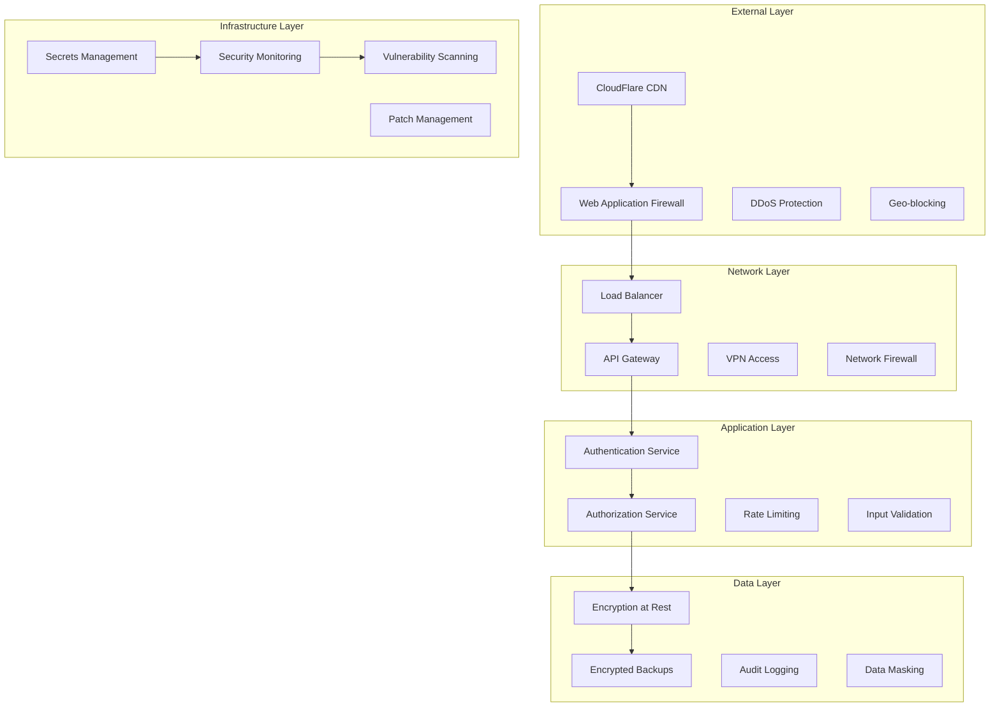

# AURA Villas Bali - Security Architecture Design
## Comprehensive Security Framework for Luxury Villa Platform

### Executive Summary

This security architecture design establishes a comprehensive, multi-layered security framework for AURA Villas Bali platform. The design prioritizes data protection, user privacy, regulatory compliance, and business continuity while maintaining excellent user experience and platform performance.

**Security Principles:**
- Zero Trust Architecture
- Defense in Depth
- Privacy by Design
- Compliance First
- Continuous Monitoring

**Compliance Standards:**
- GDPR (General Data Protection Regulation)
- PCI DSS (Payment Card Industry Data Security Standard)
- SOC 2 Type II
- ISO 27001
- Indonesian Data Protection Laws

---

## 1. Security Architecture Overview

### 1.1 Multi-Layer Security Model



### 1.2 Zero Trust Security Model

```typescript
interface ZeroTrustArchitecture {
  principles: {
    neverTrust: "Never trust, always verify";
    leastPrivilege: "Minimum necessary access";
    assumeBreach: "Assume compromise, limit blast radius";
    verifyExplicitly: "Authenticate and authorize everything";
    continuousMonitoring: "Monitor all activities in real-time";
  };
  
  implementation: {
    identity: "Multi-factor authentication for all users";
    device: "Device compliance and health verification";
    network: "Micro-segmentation and zero trust networking";
    application: "Application-layer security controls";
    data: "Data classification and protection";
  };
  
  verification: {
    user: "Identity verification + MFA";
    device: "Device trust and compliance";
    application: "Application security posture";
    transaction: "Real-time risk assessment";
    context: "Behavioral and contextual analysis";
  };
}
```

---

## 2. Identity & Access Management (IAM)

### 2.1 Authentication Architecture

```typescript
interface AuthenticationSystem {
  multiFactorAuthentication: {
    factors: {
      knowledge: "Password with complexity requirements";
      possession: "TOTP authenticator apps, SMS backup";
      inherence: "Biometric authentication (mobile)";
      location: "Geo-location verification";
      behavior: "Behavioral biometrics";
    };
    
    requirements: {
      guests: "Single factor (password) + email verification";
      owners: "Two factors required (password + TOTP)";
      staff: "Two factors required + session management";
      admins: "Three factors required + privileged access";
    };
    
    riskBasedAuth: {
      lowRisk: "Single factor authentication";
      mediumRisk: "Two factor authentication required";
      highRisk: "Additional verification + manual review";
      suspiciousActivity: "Account lock + security team review";
    };
  };
  
  passwordSecurity: {
    requirements: {
      minLength: 12;
      complexity: "Upper, lower, digit, special character";
      history: "Cannot reuse last 12 passwords";
      expiration: "No forced expiration (NIST guidelines)";
      commonPasswordCheck: "Prevent common/breached passwords";
    };
    
    storage: {
      algorithm: "Argon2id with high cost parameters";
      saltLength: 32;
      iterations: "Adaptive based on hardware";
      pepperKey: "Server-side secret for additional security";
    };
  };
  
  sessionManagement: {
    tokens: {
      accessToken: {
        type: "JWT with RS256 signing";
        expiry: "15 minutes";
        claims: ["user_id", "role", "permissions", "session_id"];
      };
      refreshToken: {
        type: "Secure random token";
        expiry: "30 days";
        storage: "Redis with encryption";
        rotation: "On each refresh";
      };
    };
    
    security: {
      csrfProtection: "Double-submit cookies + SameSite";
      sessionFixation: "Regenerate session on login";
      concurrentSessions: "Limited based on user role";
      inactivityTimeout: "Automatic logout after 30 minutes";
    };
  };
}
```

### 2.2 Authorization Framework

```typescript
interface AuthorizationSystem {
  rbac: {
    roles: {
      guest: {
        permissions: [
          "villa:read",
          "booking:create_inquiry",
          "booking:read_own",
          "review:create_own"
        ];
        restrictions: [
          "No admin access",
          "Own data only",
          "Public information only"
        ];
      };
      
      owner: {
        permissions: [
          "villa:read",
          "villa:create_own",
          "villa:update_own",
          "booking:read_villa",
          "booking:manage_villa",
          "analytics:view_villa",
          "maintenance:manage_villa"
        ];
        restrictions: [
          "Own villas only",
          "No system admin",
          "Villa-scoped data"
        ];
      };
      
      staff: {
        permissions: [
          "villa:read",
          "villa:update",
          "booking:read",
          "booking:manage",
          "user:read",
          "review:moderate",
          "support:handle"
        ];
        restrictions: [
          "No system configuration",
          "No user creation",
          "Activity logging required"
        ];
      };
      
      admin: {
        permissions: ["*:*"];
        restrictions: [
          "All actions logged",
          "Approval required for sensitive operations",
          "Time-limited elevated access"
        ];
      };
    };
  };
  
  attributeBasedAccess: {
    contextualFactors: [
      "User location and IP address",
      "Time of access and business hours",
      "Device type and trust level",
      "Risk score and behavioral patterns",
      "Data sensitivity classification"
    ];
    
    dynamicPolicies: [
      "Sensitive operations require additional verification",
      "High-value transactions need approval",
      "Unusual access patterns trigger review",
      "Geographic restrictions for admin access"
    ];
  };
  
  privilegedAccess: {
    justInTimeAccess: {
      description: "Temporary elevated privileges";
      approval: "Automated for standard, manual for sensitive";
      duration: "Maximum 8 hours, typically 1-2 hours";
      auditing: "Full session recording and logging";
    };
    
    privilegedAccountManagement: {
      sharedAccounts: "Eliminated - individual accounts only";
      serviceAccounts: "Minimal permissions, regular rotation";
      emergencyAccess: "Break-glass procedures with full audit";
      accessReview: "Quarterly privileged access reviews";
    };
  };
}
```

### 2.3 Single Sign-On (SSO) Integration

```yaml
SSO Configuration:
  Primary Provider: "NextAuth.js with multiple providers"
  
  Supported Providers:
    - Google OAuth 2.0
    - Facebook Login
    - Apple Sign In
    - WhatsApp Business (for certain regions)
    
  Enterprise SSO:
    - SAML 2.0 for property management companies
    - OpenID Connect for partner integrations
    - LDAP integration for large clients
    
  Implementation:
    Authorization Code Flow: "OAuth 2.0 + PKCE"
    Token Storage: "Encrypted HTTP-only cookies"
    Provider Mapping: "Automatic account linking"
    Fallback: "Email/password for unsupported regions"
    
  Security Features:
    - State parameter validation
    - Nonce validation for OIDC
    - Issuer validation
    - Audience validation
    - Token expiration enforcement
```

---

## 3. Data Protection & Privacy

### 3.1 Data Classification & Handling

```typescript
interface DataClassification {
  categories: {
    public: {
      description: "Publicly available information";
      examples: ["Villa descriptions", "Public images", "Area guides"];
      protection: "Basic integrity controls";
      retention: "Indefinite with regular review";
    };
    
    internal: {
      description: "Internal business information";
      examples: ["Business metrics", "Internal documents", "Process data"];
      protection: "Access controls + encryption in transit";
      retention: "7 years or business requirement";
    };
    
    confidential: {
      description: "Sensitive business information";
      examples: ["Financial data", "Strategy documents", "Partner agreements"];
      protection: "Strong access controls + encryption";
      retention: "Defined by business/legal requirements";
    };
    
    restricted: {
      description: "Highly sensitive personal/financial data";
      examples: ["Payment data", "Identity documents", "Private communications"];
      protection: "Maximum security controls + field-level encryption";
      retention: "Minimum required by law/business";
    };
  };
  
  personalDataHandling: {
    lawfulBasis: {
      consent: "Explicit consent for marketing communications";
      contract: "Processing necessary for booking fulfillment";
      legitimateInterest: "Service improvement and fraud prevention";
      legalObligation: "Tax records and compliance reporting";
    };
    
    dataMinimization: {
      collection: "Only collect necessary data for stated purpose";
      processing: "Process only for original or compatible purpose";
      retention: "Retain only as long as necessary";
      sharing: "Share only with explicit consent or legal basis";
    };
    
    rightsManagement: {
      access: "Provide data portability in machine-readable format";
      rectification: "Allow correction of inaccurate data";
      erasure: "Right to be forgotten with technical deletion";
      restriction: "Temporary suspension of processing";
      objection: "Opt-out mechanisms for marketing";
    };
  };
}
```

### 3.2 Encryption Strategy

```typescript
interface EncryptionStrategy {
  dataAtRest: {
    database: {
      method: "AES-256-GCM encryption";
      keyManagement: "AWS KMS / Google Cloud KMS";
      granularity: "Field-level encryption for PII";
      implementation: "Transparent database encryption + application-level";
    };
    
    fileStorage: {
      method: "AES-256 encryption";
      keyManagement: "Separate encryption keys per file type";
      implementation: "Server-side encryption with customer keys";
      backup: "Encrypted backups with separate key hierarchy";
    };
    
    logs: {
      method: "ChaCha20-Poly1305";
      keyRotation: "Monthly automatic rotation";
      retention: "Encrypted logs with limited access";
      sanitization: "Automatic PII detection and masking";
    };
  };
  
  dataInTransit: {
    external: {
      protocol: "TLS 1.3 minimum";
      cipherSuites: "Modern, secure cipher suites only";
      certificates: "Extended Validation SSL certificates";
      hsts: "Strict Transport Security with preload";
    };
    
    internal: {
      protocol: "mTLS for service-to-service communication";
      certificates: "Short-lived certificates with automatic rotation";
      validation: "Certificate pinning and validation";
      monitoring: "TLS connection monitoring and alerting";
    };
    
    api: {
      authentication: "Bearer tokens with signature verification";
      payload: "End-to-end encryption for sensitive data";
      validation: "Message integrity with HMAC";
      replay: "Nonce-based replay attack prevention";
    };
  };
  
  keyManagement: {
    hierarchy: {
      masterKey: "Hardware Security Module (HSM) protected";
      dataEncryptionKeys: "Generated and managed by KMS";
      applicationKeys: "Separate keys per application/service";
      userKeys: "Per-user encryption for highly sensitive data";
    };
    
    rotation: {
      frequency: "Quarterly for high-sensitivity, annually for others";
      automation: "Automated key rotation with zero downtime";
      versioning: "Key versioning for backward compatibility";
      revocation: "Immediate key revocation capability";
    };
    
    access: {
      principle: "Least privilege access to keys";
      authentication: "Multi-factor authentication for key access";
      auditing: "Complete audit trail for key operations";
      separation: "Separation of duties for key management";
    };
  };
}
```

### 3.3 Privacy by Design Implementation

```yaml
Privacy by Design Principles:

Proactive vs Reactive:
  - Privacy impact assessments for new features
  - Data protection integrated into development lifecycle
  - Regular privacy reviews and updates
  - Proactive threat modeling

Privacy as Default:
  - Minimal data collection by default
  - Opt-in for non-essential data processing
  - Secure default configurations
  - Regular privacy setting reviews

Privacy Embedded into Design:
  - Privacy requirements in technical specifications
  - Data minimization in system architecture
  - Built-in consent management
  - Technical privacy controls

Full Functionality:
  - Privacy protection without compromising functionality
  - User-friendly privacy controls
  - Transparent data practices
  - Enhanced features through privacy

End-to-End Security:
  - Comprehensive security throughout data lifecycle
  - Secure data transmission and storage
  - Secure data disposal
  - Continuous security monitoring

Visibility and Transparency:
  - Clear privacy policies and notices
  - Data processing transparency
  - Regular privacy reports
  - User dashboard for privacy controls

Respect for User Privacy:
  - User-centric privacy controls
  - Easy consent withdrawal
  - Granular privacy preferences
  - Privacy-preserving analytics
```

---

## 4. Application Security

### 4.1 Secure Development Lifecycle (SDL)

```typescript
interface SecureDevelopmentLifecycle {
  planning: {
    threatModeling: "STRIDE methodology for threat identification";
    securityRequirements: "Security requirements definition";
    privacyImpactAssessment: "PIA for features processing personal data";
    complianceReview: "Regulatory compliance verification";
  };
  
  design: {
    securityArchitecture: "Security controls in system design";
    dataFlowAnalysis: "Data flow security review";
    attackSurfaceAnalysis: "Minimize attack surface";
    securityPatterns: "Secure design patterns implementation";
  };
  
  implementation: {
    secureCodeGuidelines: "Language-specific secure coding standards";
    codeReviews: "Security-focused peer reviews";
    staticAnalysis: "Automated static code analysis";
    dependencyScanning: "Third-party dependency vulnerability scanning";
  };
  
  testing: {
    securityTesting: "Automated security test integration";
    penetrationTesting: "Regular penetration testing";
    vulnerabilityAssessment: "Systematic vulnerability identification";
    complianceTesting: "Regulatory compliance verification";
  };
  
  deployment: {
    secureConfiguration: "Secure deployment configurations";
    secretsManagement: "Secure secrets handling";
    infrastructureSecurity: "Infrastructure security verification";
    securityMonitoring: "Security monitoring activation";
  };
  
  maintenance: {
    patchManagement: "Timely security patch application";
    vulnerabilityManagement: "Continuous vulnerability management";
    incidentResponse: "Security incident response procedures";
    securityUpdates: "Regular security updates and reviews";
  };
}
```

### 4.2 Input Validation & Output Encoding

```typescript
interface InputValidationStrategy {
  validation: {
    whitelistApproach: "Accept only known good input";
    lengthValidation: "Enforce maximum input lengths";
    typeValidation: "Strong type checking";
    formatValidation: "Regular expression validation for formats";
    businessLogicValidation: "Domain-specific validation rules";
  };
  
  sanitization: {
    htmlSanitization: "DOMPurify for HTML content";
    sqlParameterization: "Parameterized queries only";
    pathTraversal: "Path traversal prevention";
    commandInjection: "Command injection prevention";
    ldapInjection: "LDAP injection prevention";
  };
  
  outputEncoding: {
    htmlEncoding: "HTML entity encoding";
    urlEncoding: "URL parameter encoding";
    jsonEncoding: "JSON response encoding";
    xmlEncoding: "XML content encoding";
    csvEncoding: "CSV injection prevention";
  };
  
  fileUploadSecurity: {
    fileTypeValidation: "MIME type and extension validation";
    fileSizeLimit: "Maximum file size enforcement";
    virusScanning: "Automated malware scanning";
    sandboxedStorage: "Isolated file storage";
    contentValidation: "File content validation";
  };
}
```

### 4.3 API Security Controls

```typescript
interface APISecurityControls {
  authentication: {
    jwtValidation: "JWT signature and expiration validation";
    apiKeyManagement: "Secure API key generation and rotation";
    oauthImplementation: "OAuth 2.0 + PKCE implementation";
    rateLimiting: "Per-user and per-endpoint rate limiting";
  };
  
  authorization: {
    resourceBasedAccess: "Resource-level access control";
    scopeValidation: "OAuth scope validation";
    permissionChecks: "Fine-grained permission verification";
    contextualAccess: "Context-aware access decisions";
  };
  
  dataProtection: {
    requestValidation: "Request schema validation";
    responseFiltering: "Sensitive data filtering";
    encryptionInTransit: "TLS 1.3 for all API calls";
    dataMinimization: "Return only necessary data";
  };
  
  monitoring: {
    apiLogging: "Comprehensive API request logging";
    anomalyDetection: "Unusual API usage detection";
    threatDetection: "Real-time threat detection";
    performanceMonitoring: "API performance and security metrics";
  };
  
  resilience: {
    ddosProtection: "DDoS attack mitigation";
    circuitBreaker: "Circuit breaker for failing services";
    gracefulDegradation: "Graceful service degradation";
    backupSystems: "Backup and failover systems";
  };
}
```

---

## 5. Infrastructure Security

### 5.1 Cloud Security Architecture

```typescript
interface CloudSecurityArchitecture {
  networkSecurity: {
    vpc: "Isolated Virtual Private Cloud";
    subnets: "Public/private subnet segregation";
    securityGroups: "Restrictive security group rules";
    nacl: "Network ACLs for additional protection";
    waf: "Web Application Firewall configuration";
  };
  
  computeSecurity: {
    instanceHardening: "Minimal OS installation and hardening";
    patchManagement: "Automated security patch management";
    antiMalware: "Enterprise anti-malware solution";
    hostBasedIDS: "Host-based intrusion detection";
    configurationManagement: "Infrastructure as Code";
  };
  
  storageService: {
    encryptionAtRest: "Storage-level encryption";
    accessControls: "IAM-based storage access";
    versioning: "Object versioning for data integrity";
    lifecycle: "Automated data lifecycle management";
    backup: "Encrypted backup with geographic distribution";
  };
  
  identityAndAccess: {
    iamPolicies: "Least privilege IAM policies";
    serviceAccounts: "Minimal service account permissions";
    accessReview: "Regular access review and cleanup";
    mfa: "Multi-factor authentication enforcement";
    federatedAccess: "Federated identity management";
  };
  
  monitoring: {
    cloudTrail: "Comprehensive audit logging";
    securityHub: "Centralized security findings";
    guardDuty: "Threat detection service";
    inspector: "Vulnerability assessment";
    configRules: "Configuration compliance monitoring";
  };
}
```

### 5.2 Container Security

```typescript
interface ContainerSecurity {
  imageSecurity: {
    baseImages: "Minimal, hardened base images";
    scanning: "Container image vulnerability scanning";
    signing: "Container image signing and verification";
    registry: "Private container registry";
    compliance: "Container compliance scanning";
  };
  
  runtimeSecurity: {
    networkPolicies: "Kubernetes network policies";
    podSecurityPolicies: "Pod security policy enforcement";
    rbac: "Role-based access control";
    serviceAccounts: "Minimal service account permissions";
    secretsManagement: "Kubernetes secrets encryption";
  };
  
  orchestrationSecurity: {
    apiSecurity: "Kubernetes API server security";
    etcdEncryption: "etcd encryption at rest";
    nodeSecurity: "Node hardening and monitoring";
    admissionControllers: "Security admission controllers";
    networkSegmentation: "Microsegmentation";
  };
  
  monitoring: {
    runtimeMonitoring: "Container runtime monitoring";
    behaviorAnalysis: "Anomalous behavior detection";
    complianceMonitoring: "Continuous compliance monitoring";
    auditLogging: "Comprehensive audit logging";
    incidentResponse: "Automated incident response";
  };
}
```

### 5.3 Database Security

```typescript
interface DatabaseSecurity {
  accessControl: {
    authentication: "Strong authentication mechanisms";
    authorization: "Role-based database access";
    connectionSecurity: "Encrypted database connections";
    privilegedAccess: "Database administrator access controls";
    auditAccess: "Database access auditing";
  };
  
  dataProtection: {
    encryptionAtRest: "Transparent data encryption";
    encryptionInTransit: "TLS for all connections";
    fieldLevelEncryption: "Application-level encryption for PII";
    keyManagement: "Database encryption key management";
    dataLossPrevention: "DLP for sensitive data";
  };
  
  configuration: {
    hardening: "Database server hardening";
    patchManagement: "Regular security updates";
    configurationReview: "Security configuration review";
    defaultAccounts: "Default account removal/hardening";
    servicePorts: "Non-standard port configuration";
  };
  
  monitoring: {
    activityMonitoring: "Database activity monitoring";
    anomalyDetection: "Unusual access pattern detection";
    performanceMonitoring: "Security-related performance monitoring";
    alerting: "Real-time security alerting";
    forensics: "Database forensics capabilities";
  };
  
  backup: {
    encryptedBackups: "Encrypted database backups";
    backupTesting: "Regular backup restoration testing";
    offSiteStorage: "Geographically distributed backups";
    retentionPolicies: "Data retention policy enforcement";
    accessControls: "Backup access controls";
  };
}
```

---

## 6. Security Monitoring & Incident Response

### 6.1 Security Operations Center (SOC)

```typescript
interface SecurityOperations {
  monitoring: {
    siem: {
      platform: "Splunk/Elastic Security";
      logSources: [
        "Application logs",
        "Infrastructure logs", 
        "Security device logs",
        "Cloud service logs",
        "Database audit logs"
      ];
      correlationRules: "Automated threat detection rules";
      alerting: "Real-time security alerting";
    };
    
    threatIntelligence: {
      feeds: "Commercial and open source threat feeds";
      iocs: "Indicators of compromise monitoring";
      attribution: "Threat actor attribution";
      contextualAnalysis: "Contextual threat analysis";
    };
    
    behaviorAnalytics: {
      userBehavior: "User and entity behavior analytics";
      networkBehavior: "Network behavior analysis";
      applicationBehavior: "Application behavior monitoring";
      anomalyDetection: "Machine learning anomaly detection";
    };
  };
  
  incidentResponse: {
    preparation: {
      responseTeam: "Dedicated incident response team";
      procedures: "Documented response procedures";
      tools: "Incident response tooling";
      training: "Regular IR training and exercises";
    };
    
    detection: {
      automated: "Automated threat detection";
      manual: "Manual threat hunting";
      external: "External threat notifications";
      reporting: "Incident reporting mechanisms";
    };
    
    containment: {
      isolation: "Network and system isolation";
      preservation: "Digital evidence preservation";
      communication: "Stakeholder communication";
      coordination: "Cross-team coordination";
    };
    
    recovery: {
      restoration: "System restoration procedures";
      validation: "Security validation";
      monitoring: "Enhanced monitoring";
      documentation: "Lessons learned documentation";
    };
  };
  
  forensics: {
    evidence: {
      collection: "Digital evidence collection";
      preservation: "Chain of custody maintenance";
      analysis: "Forensic analysis capabilities";
      reporting: "Forensic reporting";
    };
    
    capabilities: {
      network: "Network forensics";
      host: "Host-based forensics";
      memory: "Memory forensics";
      mobile: "Mobile device forensics";
      cloud: "Cloud forensics";
    };
  };
}
```

### 6.2 Threat Detection & Response

```yaml
Threat Detection Framework:

Signature-Based Detection:
  - Known malware signatures
  - Attack pattern recognition
  - IOC matching
  - Rule-based detection

Behavioral Analysis:
  - User behavior analytics
  - Network traffic analysis
  - Application behavior monitoring
  - Deviation from baseline

Machine Learning Detection:
  - Anomaly detection algorithms
  - Predictive threat modeling
  - Automated pattern recognition
  - Adaptive threat detection

Threat Hunting:
  - Proactive threat hunting
  - Hypothesis-driven investigations
  - Advanced persistent threat detection
  - Threat landscape analysis

Response Automation:
  - Automated incident triage
  - Response orchestration
  - Containment automation
  - Communication automation

Metrics and KPIs:
  - Mean time to detection (MTTD): <15 minutes
  - Mean time to response (MTTR): <1 hour
  - False positive rate: <5%
  - Threat detection coverage: >95%
```

---

## 7. Compliance & Governance

### 7.1 Regulatory Compliance

```typescript
interface ComplianceFramework {
  gdpr: {
    applicability: "EU residents and data processing";
    requirements: {
      lawfulBasis: "Clear lawful basis for processing";
      consent: "Explicit consent mechanisms";
      dataSubjectRights: "Rights fulfillment procedures";
      dataBreaches: "72-hour breach notification";
      dpo: "Data Protection Officer appointment";
    };
    
    implementation: {
      privacyByDesign: "Built-in privacy controls";
      dataMapping: "Complete data flow mapping";
      impactAssessments: "Privacy impact assessments";
      vendorManagement: "Third-party processor agreements";
      training: "Regular GDPR training";
    };
  };
  
  pciDss: {
    applicability: "Payment card data processing";
    requirements: {
      network: "Secure network architecture";
      cardholder: "Cardholder data protection";
      vulnerability: "Vulnerability management";
      access: "Access control measures";
      monitoring: "Network monitoring";
      policy: "Information security policy";
    };
    
    implementation: {
      tokenization: "Payment card tokenization";
      encryption: "Cardholder data encryption";
      segmentation: "Network segmentation";
      testing: "Regular security testing";
      compliance: "Quarterly compliance reporting";
    };
  };
  
  soc2: {
    applicability: "Service organization controls";
    principles: {
      security: "System security controls";
      availability: "System availability";
      processing: "Processing integrity";
      confidentiality: "Information confidentiality";
      privacy: "Personal information privacy";
    };
    
    implementation: {
      controls: "SOC 2 control implementation";
      documentation: "Control documentation";
      testing: "Control effectiveness testing";
      reporting: "SOC 2 Type II reporting";
      remediation: "Control deficiency remediation";
    };
  };
  
  localCompliance: {
    indonesia: {
      dataProtection: "Indonesian Personal Data Protection";
      financialServices: "Financial Services Authority regulations";
      telecommunications: "Ministry of Communication regulations";
      taxation: "Tax reporting and compliance";
    };
    
    implementation: {
      localDataResidency: "Indonesian data residency requirements";
      localPartnership: "Local partnership compliance";
      reporting: "Regulatory reporting requirements";
      licensing: "Business licensing compliance";
    };
  };
}
```

### 7.2 Risk Management

```typescript
interface RiskManagementFramework {
  riskAssessment: {
    identification: {
      threatModeling: "Systematic threat identification";
      vulnerabilityScanning: "Technical vulnerability assessment";
      businessRiskAnalysis: "Business impact analysis";
      complianceRisk: "Regulatory compliance risk";
    };
    
    analysis: {
      probabilityAssessment: "Threat probability calculation";
      impactAssessment: "Business impact evaluation";
      riskScoring: "Quantitative risk scoring";
      riskCategorization: "Risk category classification";
    };
    
    evaluation: {
      riskAppetite: "Organizational risk appetite";
      riskTolerance: "Risk tolerance thresholds";
      costBenefitAnalysis: "Risk treatment cost-benefit";
      prioritization: "Risk prioritization matrix";
    };
  };
  
  riskTreatment: {
    mitigation: {
      securityControls: "Technical security controls";
      processes: "Security processes and procedures";
      training: "Security awareness training";
      monitoring: "Continuous risk monitoring";
    };
    
    transfer: {
      insurance: "Cyber insurance coverage";
      contracts: "Risk transfer through contracts";
      outsourcing: "Risk transfer to service providers";
      partnerships: "Risk sharing partnerships";
    };
    
    acceptance: {
      residualRisk: "Accepted residual risk levels";
      justification: "Risk acceptance justification";
      monitoring: "Accepted risk monitoring";
      review: "Regular risk acceptance review";
    };
    
    avoidance: {
      featureChanges: "Feature modifications to avoid risk";
      processChanges: "Process changes to eliminate risk";
      technologyChanges: "Technology changes for risk avoidance";
      businessDecisions: "Business decisions to avoid risk";
    };
  };
}
```

---

## 8. Security Testing & Validation

### 8.1 Security Testing Strategy

```typescript
interface SecurityTestingStrategy {
  staticTesting: {
    codeAnalysis: {
      tools: ["SonarQube", "Checkmarx", "Veracode"];
      coverage: "100% of custom code";
      frequency: "Every commit";
      integration: "CI/CD pipeline integration";
    };
    
    dependencyScanning: {
      tools: ["Snyk", "OWASP Dependency Check"];
      scope: "All third-party dependencies";
      frequency: "Daily scans";
      remediation: "Automated vulnerability patching";
    };
    
    configurationReview: {
      infrastructure: "Infrastructure as Code scanning";
      applications: "Application configuration review";
      cloud: "Cloud security posture assessment";
      compliance: "Compliance configuration validation";
    };
  };
  
  dynamicTesting: {
    vulnerabilityScanning: {
      tools: ["Nessus", "Qualys", "Rapid7"];
      scope: "All public-facing and internal systems";
      frequency: "Weekly automated scans";
      validation: "Manual validation of findings";
    };
    
    webApplicationTesting: {
      tools: ["OWASP ZAP", "Burp Suite"];
      coverage: "All web applications and APIs";
      frequency: "Every major release";
      methodology: "OWASP Testing Guide";
    };
    
    apiTesting: {
      tools: ["Postman", "Custom security tests"];
      coverage: "All API endpoints";
      tests: "Authentication, authorization, input validation";
      automation: "Automated API security testing";
    };
  };
  
  penetrationTesting: {
    external: {
      scope: "External-facing systems";
      frequency: "Quarterly";
      methodology: "OWASP/NIST methodologies";
      reporting: "Executive and technical reports";
    };
    
    internal: {
      scope: "Internal network and systems";
      frequency: "Semi-annually";
      methodology: "Network penetration testing";
      reporting: "Detailed technical findings";
    };
    
    application: {
      scope: "Web applications and mobile apps";
      frequency: "Before major releases";
      methodology: "OWASP Application Security Testing";
      reporting: "Application-specific findings";
    };
    
    social: {
      scope: "Social engineering testing";
      frequency: "Annually";
      methodology: "Phishing and social engineering";
      reporting: "Awareness and training recommendations";
    };
  };
}
```

### 8.2 Security Metrics & KPIs

```yaml
Security Metrics Dashboard:

Technical Metrics:
  - Vulnerability count by severity (Critical, High, Medium, Low)
  - Mean time to patch (MTTP): Target <7 days for critical
  - Security test coverage: Target >95%
  - False positive rate: Target <5%
  - System uptime: Target 99.9%

Process Metrics:
  - Security review completion rate: Target 100%
  - Incident response time: Target <1 hour
  - Compliance audit findings: Target zero critical
  - Security training completion: Target 100%
  - Risk assessment frequency: Quarterly

Business Metrics:
  - Customer trust score: Target >4.5/5
  - Regulatory compliance status: Target 100%
  - Security incident cost: Target <$10K annually
  - Business continuity time: Target <4 hours
  - Data breach incidents: Target zero

Operational Metrics:
  - Security tool effectiveness: Target >90%
  - Alert fatigue ratio: Target <10%
  - Threat detection accuracy: Target >95%
  - Security automation coverage: Target >80%
  - Mean time to remediation: Target <24 hours
```

---

## 9. Business Continuity & Disaster Recovery

### 9.1 Business Continuity Planning

```typescript
interface BusinessContinuityPlan {
  riskAssessment: {
    threats: [
      "Cyber attacks and data breaches",
      "Natural disasters and physical damage", 
      "Technology failures and outages",
      "Personnel unavailability",
      "Supplier and vendor disruptions"
    ];
    
    impactAnalysis: {
      criticalProcesses: "Booking system, payment processing, customer support";
      recoveryObjectives: "RTO: 4 hours, RPO: 1 hour";
      dependencyMapping: "System and process dependencies";
      resourceRequirements: "Minimum resources for operation";
    };
  };
  
  continuityStrategies: {
    preventive: {
      redundancy: "System redundancy and failover";
      monitoring: "Proactive monitoring and alerting";
      maintenance: "Preventive maintenance schedules";
      training: "Regular staff training and exercises";
    };
    
    responsive: {
      incidentResponse: "Rapid incident response procedures";
      communication: "Crisis communication protocols";
      alternativeSites: "Alternative processing locations";
      vendorSupport: "Vendor emergency support agreements";
    };
    
    recovery: {
      dataRecovery: "Data backup and recovery procedures";
      systemRestore: "System restoration procedures";
      processRestart: "Business process restart procedures";
      testing: "Regular recovery testing and validation";
    };
  };
  
  governance: {
    leadership: "Crisis leadership and decision-making";
    communication: "Internal and external communication";
    coordination: "Multi-team coordination procedures";
    documentation: "Comprehensive documentation maintenance";
    review: "Regular plan review and updates";
  };
}
```

### 9.2 Disaster Recovery Implementation

```yaml
Disaster Recovery Architecture:

Primary Site:
  Location: "Primary cloud region (Asia-Pacific)"
  Infrastructure: "Production systems and databases"
  Backup: "Continuous replication to secondary site"
  Monitoring: "24/7 monitoring and alerting"

Secondary Site:
  Location: "Secondary cloud region (geographically distant)"
  Infrastructure: "Standby systems with automatic failover"
  Data: "Real-time data synchronization"
  Activation: "Automatic or manual activation"

Backup Strategy:
  Frequency: "Continuous for critical data, hourly for others"
  Retention: "30 days daily, 12 months monthly, 7 years yearly"
  Testing: "Monthly restoration testing"
  Encryption: "Full encryption at rest and in transit"

Recovery Procedures:
  Detection: "Automated failure detection and alerting"
  Assessment: "Rapid impact assessment procedures"
  Activation: "DR site activation procedures"
  Communication: "Stakeholder notification procedures"
  Validation: "System and data validation procedures"

Testing Schedule:
  Quarterly: "Comprehensive DR testing"
  Monthly: "Backup restoration testing"
  Weekly: "Failover mechanism testing"
  Daily: "Backup verification"
```

---

## 10. Security Awareness & Training

### 10.1 Security Training Program

```typescript
interface SecurityTrainingProgram {
  generalTraining: {
    allEmployees: {
      frequency: "Quarterly mandatory training";
      topics: [
        "Password security and MFA",
        "Phishing recognition and reporting",
        "Data handling and classification",
        "Incident reporting procedures",
        "Clean desk and physical security"
      ];
      delivery: "Interactive online modules";
      assessment: "Knowledge validation tests";
    };
    
    roleSpecific: {
      developers: {
        topics: [
          "Secure coding practices",
          "OWASP Top 10",
          "Code review security",
          "Dependency management",
          "API security"
        ];
        frequency: "Monthly technical sessions";
      };
      
      administrators: {
        topics: [
          "System hardening",
          "Access control management",
          "Incident response",
          "Vulnerability management",
          "Compliance requirements"
        ];
        frequency: "Quarterly specialized training";
      };
      
      support: {
        topics: [
          "Customer data protection",
          "Social engineering awareness",
          "Incident escalation",
          "Privacy regulations",
          "Secure communication"
        ];
        frequency: "Bi-monthly training sessions";
      };
    };
  };
  
  specializedTraining: {
    securityTeam: {
      certifications: [
        "CISSP", "CISM", "GSEC", "CEH", "GCIH"
      ];
      conferences: "Annual security conference attendance";
      workshops: "Hands-on security workshops";
      research: "Dedicated research and learning time";
    };
    
    complianceTeam: {
      certifications: [
        "CISA", "CIPP", "CIPM", "FIP"
      ];
      updates: "Regular regulatory updates";
      training: "Compliance-specific training";
      networking: "Professional association participation";
    };
  };
  
  awarenessProgram: {
    campaigns: {
      phishing: "Monthly phishing simulation campaigns";
      awareness: "Quarterly security awareness campaigns";
      updates: "Security news and threat updates";
      recognition: "Security champion recognition program";
    };
    
    metrics: {
      participation: "Training participation rates";
      effectiveness: "Knowledge retention testing";
      behavior: "Security behavior observation";
      incidents: "Security incident correlation";
    };
  };
}
```

---

## Conclusion

This comprehensive security architecture provides AURA Villas Bali with enterprise-grade security controls while maintaining usability and performance. The multi-layered approach ensures protection against evolving threats while supporting business growth and regulatory compliance.

**Key Security Benefits:**
- **Defense in Depth**: Multiple security layers for comprehensive protection
- **Zero Trust Model**: Never trust, always verify approach
- **Regulatory Compliance**: GDPR, PCI DSS, SOC 2, and local compliance
- **Incident Response**: Rapid detection and response capabilities
- **Business Continuity**: Minimal disruption during security incidents

**Implementation Priorities:**
1. **Foundation** (Months 1-3): Core security controls and compliance
2. **Enhancement** (Months 4-6): Advanced monitoring and automation
3. **Optimization** (Months 7-12): AI-powered security and threat hunting

The architecture is designed to scale with the business while maintaining the highest security standards and enabling market leadership through trust and reliability.