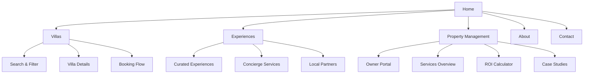
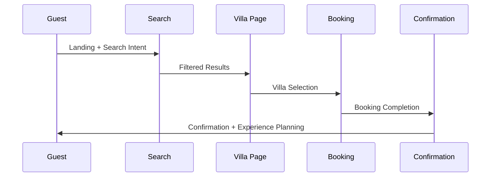
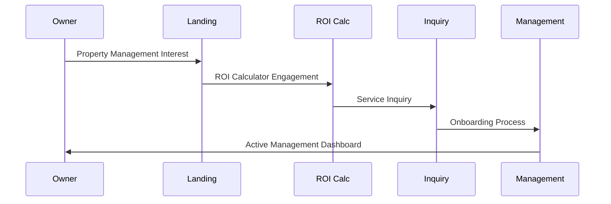
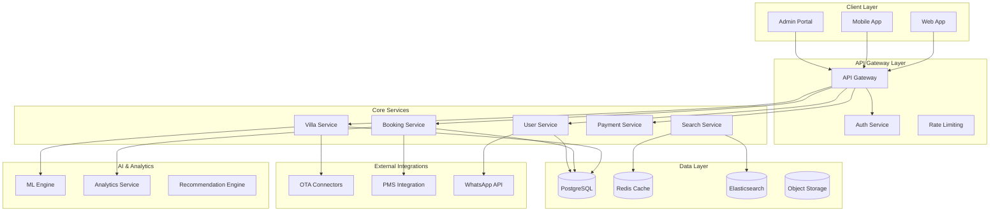
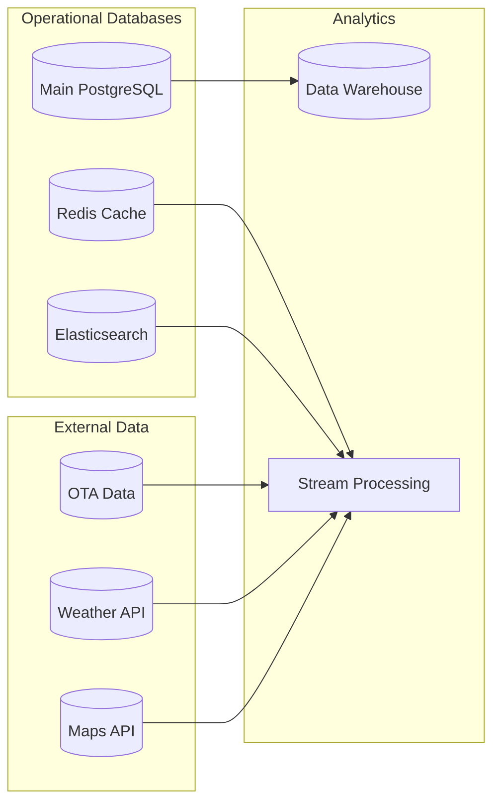
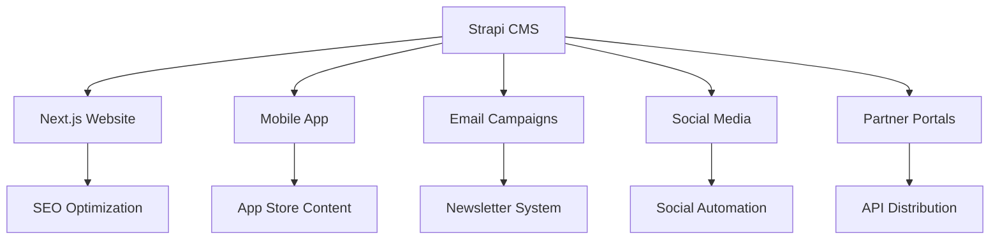
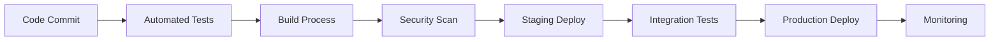

# AURA Villas Bali - Strategic Rebuild Plan
## Comprehensive Architecture & Implementation Roadmap

### Executive Summary

Based on comprehensive competitive analysis and gap assessment, this strategic rebuild plan outlines a technology-first approach to capture market leadership in Bali's boutique villa management sector. The plan leverages modern architecture patterns, AI-driven optimization, and mobile-first design to create sustainable competitive advantages.

**Strategic Goals:**
- Achieve 25% market share within 18 months
- Generate $50M+ ARR through technology differentiation
- Establish 2-3 year competitive moats through innovation
- Scale to 200+ properties under management

---

## 1. Information Architecture

### 1.1 Site Structure & Navigation



#### Primary Navigation Structure
1. **Home** - Hero search, featured villas, trust signals
2. **Villas** - Advanced search, filtering, villa stories
3. **Experiences** - Curated packages, concierge services
4. **Property Management** - Owner services, ROI tools
5. **About** - Company story, team, values
6. **Contact** - Multiple contact options, location info

#### Secondary Navigation Elements
- **Language Selector** (EN/ID/RU/CN)
- **Currency Converter** (USD/IDR/AUD/EUR)
- **User Account** (Guest/Owner login)
- **Booking Status** (Inquiry tracker)
- **Support Chat** (AI + Human hybrid)

### 1.2 Content Hierarchy Optimization

#### Level 1: Primary Content (High Priority SEO)
```yaml
Villa Listings:
  - Villa story and narrative
  - Professional photography (8K+ resolution)
  - 360° virtual tours
  - Amenity details with icons
  - Location insights and attractions
  - Availability calendar
  - Pricing with seasonal rates

Experience Packages:
  - Curated experience collections
  - Local partner integrations
  - Booking workflows
  - Guest testimonials
  - Photo galleries

Property Management:
  - Service descriptions
  - ROI calculators
  - Case studies
  - Owner testimonials
  - Process workflows
```

#### Level 2: Supporting Content (Medium Priority)
```yaml
Area Guides:
  - Seminyak lifestyle & attractions
  - Ubud wellness & nature
  - Canggu surf & beachlife
  - Uluwatu boutique & seclusion
  - Sanur family & culture
  - Nusa Dua resort & golf

Guest Resources:
  - Travel planning guides
  - Local recommendations
  - Transportation options
  - Cultural etiquette
  - Emergency contacts
  - Weather & climate info
```

#### Level 3: Operational Content (Lower Priority)
```yaml
Legal & Compliance:
  - Terms of service
  - Privacy policy
  - Cancellation policies
  - Insurance information
  - Safety protocols
  - GDPR compliance

Company Information:
  - About AURA story
  - Team profiles
  - Press releases
  - Career opportunities
  - Partner network
  - Contact information
```

### 1.3 User Flow Optimization

#### Guest Journey Optimization


**Critical Success Metrics:**
- Search to villa view: <2 clicks
- Villa view to inquiry: <3 clicks
- Inquiry to confirmation: <5 minutes
- Mobile conversion rate: >3.5%

#### Owner Journey Optimization


### 1.4 SEO-Friendly URL Structure

#### URL Architecture Pattern
```typescript
interface URLStructure {
  // Villa listings
  villas: "/villas/{area}/{villa-slug}";
  search: "/villas?location={area}&guests={number}&checkin={date}";
  
  // Experiences
  experiences: "/experiences/{category}/{experience-slug}";
  packages: "/experiences/packages/{package-slug}";
  
  // Property management
  management: "/property-management";
  calculator: "/property-management/roi-calculator";
  services: "/property-management/{service-slug}";
  
  // Area guides
  areas: "/bali/{area-slug}";
  attractions: "/bali/{area-slug}/{attraction-slug}";
  
  // User flows
  booking: "/booking/{villa-slug}";
  inquiry: "/inquiry/{type}";
  owner: "/owner/dashboard";
}
```

#### SEO Optimization Strategy
```yaml
URL Patterns:
  - Descriptive keywords in paths
  - Hyphens for word separation
  - Lowercase convention
  - Canonical URL enforcement
  - Automatic redirect handling

Meta Data Structure:
  - Dynamic title generation
  - Optimized descriptions (150-160 chars)
  - Relevant keyword integration
  - Geo-specific optimization
  - Schema markup implementation
```

---

## 2. Technical Architecture

### 2.1 Architecture Decision: Hybrid Microservices

#### Core Architecture Philosophy
```typescript
interface AuraArchitecture {
  pattern: "Hybrid Microservices with Monolithic Foundation";
  rationale: "Gradual decomposition for scalability";
  deployment: "Containerized with Kubernetes";
  communication: "Event-driven + API Gateway";
  dataStrategy: "Database per service + Shared read replicas";
}
```

#### System Architecture Overview


### 2.2 Service Decomposition Strategy

#### Phase 1: Monolithic Foundation (Months 1-3)
```typescript
interface MonolithicFoundation {
  scope: "Core functionality in Next.js application";
  benefits: [
    "Faster initial development",
    "Simpler deployment",
    "Easier debugging",
    "Reduced operational complexity"
  ];
  
  modules: {
    villaManagement: "Villa CRUD + search";
    userManagement: "Authentication + profiles";
    bookingFlow: "Inquiry + reservation system";
    contentManagement: "CMS for villa data";
    paymentProcessing: "Stripe + local payment gateways";
  };
}
```

#### Phase 2: Strategic Decomposition (Months 4-8)
```typescript
interface ServiceDecomposition {
  extractionPriority: [
    "Search Service", // High traffic, independent scaling
    "Payment Service", // Security isolation, compliance
    "Analytics Service", // Data processing intensive
    "ML Engine", // Computational requirements
    "Integration Hub" // External API management
  ];
  
  migrationStrategy: "Strangler Fig Pattern";
  rollbackPlan: "Feature flags + circuit breakers";
}
```

#### Phase 3: Full Microservices (Months 9-12)
```yaml
Final Architecture:
  services:
    - villa-service: Villa data management
    - booking-service: Reservation workflows  
    - user-service: User management + auth
    - payment-service: Payment processing
    - search-service: Search + filtering
    - analytics-service: Data analysis
    - ml-service: AI/ML algorithms
    - notification-service: Communication
    - integration-service: External APIs
    - media-service: Image/video processing
```

### 2.3 Database Architecture Design

#### Multi-Database Strategy


#### Core Database Schema
```sql
-- Core villa management schema
CREATE SCHEMA villa_core;

-- Villa entities
CREATE TABLE villa_core.villas (
    id UUID PRIMARY KEY DEFAULT gen_random_uuid(),
    name VARCHAR(255) NOT NULL,
    slug VARCHAR(255) UNIQUE NOT NULL,
    story TEXT,
    story_teaser VARCHAR(500),
    location_id UUID REFERENCES villa_core.locations(id),
    bedrooms INTEGER NOT NULL,
    bathrooms INTEGER NOT NULL,
    max_guests INTEGER NOT NULL,
    base_price DECIMAL(10,2) NOT NULL,
    currency VARCHAR(3) DEFAULT 'USD',
    status villa_status DEFAULT 'active',
    featured BOOLEAN DEFAULT false,
    rating DECIMAL(3,2) DEFAULT 0,
    created_at TIMESTAMPTZ DEFAULT NOW(),
    updated_at TIMESTAMPTZ DEFAULT NOW()
);

-- Location and area management
CREATE TABLE villa_core.locations (
    id UUID PRIMARY KEY DEFAULT gen_random_uuid(),
    area villa_area NOT NULL,
    address TEXT NOT NULL,
    coordinates POINT NOT NULL,
    nearby_attractions TEXT[],
    created_at TIMESTAMPTZ DEFAULT NOW()
);

-- Booking and availability
CREATE TABLE villa_core.bookings (
    id UUID PRIMARY KEY DEFAULT gen_random_uuid(),
    villa_id UUID REFERENCES villa_core.villas(id),
    guest_name VARCHAR(255) NOT NULL,
    guest_email VARCHAR(255) NOT NULL,
    guest_phone VARCHAR(50),
    check_in DATE NOT NULL,
    check_out DATE NOT NULL,
    guests INTEGER NOT NULL,
    total_amount DECIMAL(10,2),
    status booking_status DEFAULT 'inquiry',
    special_requests TEXT[],
    created_at TIMESTAMPTZ DEFAULT NOW(),
    updated_at TIMESTAMPTZ DEFAULT NOW()
);

-- Availability calendar
CREATE TABLE villa_core.availability (
    id UUID PRIMARY KEY DEFAULT gen_random_uuid(),
    villa_id UUID REFERENCES villa_core.villas(id),
    date DATE NOT NULL,
    available BOOLEAN DEFAULT true,
    price DECIMAL(10,2),
    minimum_stay INTEGER DEFAULT 1,
    created_at TIMESTAMPTZ DEFAULT NOW(),
    UNIQUE(villa_id, date)
);

-- Custom types
CREATE TYPE villa_status AS ENUM ('active', 'inactive', 'maintenance');
CREATE TYPE villa_area AS ENUM ('Seminyak', 'Ubud', 'Canggu', 'Uluwatu', 'Sanur', 'Nusa Dua');
CREATE TYPE booking_status AS ENUM ('inquiry', 'confirmed', 'cancelled', 'completed');
```

#### Caching Strategy
```typescript
interface CachingStrategy {
  layers: {
    cdn: "CloudFlare for static assets";
    redis: "Application-level caching";
    database: "Query result caching";
    browser: "Client-side caching";
  };
  
  patterns: {
    villaData: "Cache-aside with 1-hour TTL";
    searchResults: "Write-through with 15-minute TTL";
    userSessions: "Redis-backed sessions";
    pricing: "Cache-aside with 5-minute TTL";
  };
  
  invalidation: {
    strategy: "Event-driven cache invalidation";
    triggers: ["villa updates", "booking changes", "pricing updates"];
  };
}
```

### 2.4 API Design Strategy

#### RESTful API Architecture
```typescript
// Villa Management API
interface VillaAPI {
  // Core villa operations
  "GET /api/v1/villas": "List villas with filtering";
  "GET /api/v1/villas/{id}": "Get villa details";
  "POST /api/v1/villas": "Create villa (admin)";
  "PUT /api/v1/villas/{id}": "Update villa (admin)";
  "DELETE /api/v1/villas/{id}": "Delete villa (admin)";
  
  // Search and filtering
  "GET /api/v1/villas/search": "Search villas with filters";
  "GET /api/v1/villas/featured": "Get featured villas";
  "GET /api/v1/villas/by-location/{area}": "Get villas by location";
  
  // Availability and pricing
  "GET /api/v1/villas/{id}/availability": "Check availability";
  "GET /api/v1/villas/{id}/pricing": "Get pricing for dates";
  "POST /api/v1/villas/{id}/booking-inquiry": "Submit booking inquiry";
}

// Booking Management API
interface BookingAPI {
  "GET /api/v1/bookings": "List bookings (authenticated)";
  "GET /api/v1/bookings/{id}": "Get booking details";
  "POST /api/v1/bookings": "Create new booking";
  "PUT /api/v1/bookings/{id}": "Update booking status";
  "DELETE /api/v1/bookings/{id}": "Cancel booking";
  
  // Payment processing
  "POST /api/v1/bookings/{id}/payment": "Process payment";
  "GET /api/v1/bookings/{id}/payment-status": "Check payment status";
}

// Analytics and Reporting API
interface AnalyticsAPI {
  "GET /api/v1/analytics/villa-performance": "Villa performance metrics";
  "GET /api/v1/analytics/revenue-trends": "Revenue trending data";
  "GET /api/v1/analytics/occupancy-rates": "Occupancy analytics";
  "GET /api/v1/analytics/guest-insights": "Guest behavior analytics";
}
```

#### GraphQL Implementation for Complex Queries
```graphql
# Villa and related data schema
type Villa {
  id: ID!
  name: String!
  slug: String!
  story: String
  location: Location!
  images: [VillaImage!]!
  amenities: [Amenity!]!
  pricing: VillaPricing!
  availability(startDate: Date!, endDate: Date!): [AvailabilitySlot!]!
  reviews(limit: Int, offset: Int): ReviewConnection!
  similarVillas(limit: Int): [Villa!]!
}

type Location {
  area: VillaArea!
  address: String!
  coordinates: Coordinates!
  nearbyAttractions: [Attraction!]!
  areaGuide: AreaGuide
}

type Query {
  # Villa queries
  villa(id: ID, slug: String): Villa
  villas(filters: VillaFilters, sort: VillaSortInput, pagination: PaginationInput): VillaConnection!
  featuredVillas(limit: Int): [Villa!]!
  
  # Search queries
  searchVillas(query: String!, filters: VillaFilters): VillaSearchResult!
  villaRecommendations(guestPreferences: GuestPreferences!): [Villa!]!
  
  # Analytics queries (authenticated)
  villaAnalytics(villaId: ID!): VillaAnalytics!
  ownerDashboard: OwnerDashboard!
}

type Mutation {
  # Booking mutations
  submitBookingInquiry(input: BookingInquiryInput!): BookingInquiryResult!
  confirmBooking(bookingId: ID!, paymentInput: PaymentInput!): BookingConfirmationResult!
  
  # Villa management (admin/owner)
  createVilla(input: VillaInput!): Villa!
  updateVilla(id: ID!, input: VillaUpdateInput!): Villa!
  updateVillaAvailability(villaId: ID!, dates: [AvailabilityInput!]!): [AvailabilitySlot!]!
}

type Subscription {
  # Real-time updates
  bookingUpdates(villaId: ID!): BookingUpdate!
  availabilityChanges(villaId: ID!): AvailabilityUpdate!
  priceUpdates(villaId: ID!): PriceUpdate!
}
```

### 2.5 Security Architecture

#### Multi-Layer Security Approach
```typescript
interface SecurityArchitecture {
  authentication: {
    strategy: "JWT + Refresh Token";
    providers: ["Email/Password", "Google OAuth", "WhatsApp OTP"];
    mfa: "TOTP for admin users";
    sessionManagement: "Redis-backed sessions";
  };
  
  authorization: {
    model: "Role-Based Access Control (RBAC)";
    roles: ["guest", "owner", "staff", "admin"];
    permissions: "Fine-grained resource permissions";
    policies: "Attribute-based policies for data access";
  };
  
  dataProtection: {
    encryption: {
      atRest: "AES-256 for sensitive data";
      inTransit: "TLS 1.3 for all connections";
      application: "Field-level encryption for PII";
    };
    anonymization: "GDPR-compliant data anonymization";
    retention: "Automated data retention policies";
  };
  
  apiSecurity: {
    rateLimiting: "Sliding window rate limits";
    inputValidation: "Comprehensive input sanitization";
    outputFiltering: "Response data filtering";
    cors: "Strict CORS policies";
    csrf: "CSRF token validation";
  };
}
```

#### Security Implementation Strategy
```yaml
Security Layers:
  Network Level:
    - WAF (Web Application Firewall)
    - DDoS protection
    - IP allowlisting for admin functions
    - Geographic restrictions
  
  Application Level:
    - Authentication middleware
    - Authorization checks
    - Input validation
    - Output encoding
    - SQL injection prevention
    
  Data Level:
    - Field-level encryption
    - Database access controls
    - Audit logging
    - Data masking for non-production
    
  Infrastructure Level:
    - Container security scanning
    - Secrets management
    - Network segmentation
    - Regular security updates
```

---

## 3. Content Strategy

### 3.1 Content Type Framework

#### Primary Content Types
```typescript
interface ContentTypes {
  villaStories: {
    purpose: "Emotional connection + SEO optimization";
    structure: "Hero narrative + practical details";
    wordCount: "800-1200 words per villa";
    mediaRequirements: "8-12 high-quality images + 1 video";
    updateFrequency: "Quarterly refresh";
    seoTargets: "{area} boutique villa rental";
  };
  
  experiencePackages: {
    purpose: "Revenue generation + guest value";
    structure: "Package overview + detailed itinerary";
    wordCount: "400-600 words per package";
    mediaRequirements: "4-6 experience images";
    updateFrequency: "Monthly updates";
    seoTargets: "{experience type} in {area}";
  };
  
  areaGuides: {
    purpose: "Local expertise + search visibility";
    structure: "Area overview + attractions + recommendations";
    wordCount: "1500-2000 words per area";
    mediaRequirements: "10-15 location images";
    updateFrequency: "Bi-annual major updates";
    seoTargets: "what to do in {area} Bali";
  };
  
  propertyManagementContent: {
    purpose: "Owner acquisition + trust building";
    structure: "Service benefits + case studies + ROI data";
    wordCount: "600-800 words per service";
    mediaRequirements: "Infographics + testimonial videos";
    updateFrequency: "Quarterly optimization";
    seoTargets: "Bali villa property management";
  };
}
```

#### Content Production Workflow

```mermaid
graph LR
    A[Content Brief] --> B[Research Phase]
    B --> C[Content Creation]
    C --> D[Editorial Review]
    D --> E[SEO Optimization]
    E --> F[Visual Asset Creation]
    F --> G[Technical Implementation]
    G --> H[Quality Assurance]
    H --> I[Publication]
    I --> J[Performance Monitoring]
```


### 3.2 Editorial Workflow

#### Content Creation Process
```yaml
Content Workflow Stages:

Planning Phase (Week 1):
  - Content calendar creation
  - SEO keyword research
  - Competitive content analysis
  - Photo shoot coordination
  - Stakeholder interviews

Creation Phase (Week 2-3):
  - Content writing and editing
  - Photography and videography
  - Graphic design and infographics
  - Technical asset optimization
  - Translation preparation

Review Phase (Week 4):
  - Editorial review and fact-checking
  - SEO optimization verification
  - Brand compliance check
  - Legal review for claims
  - Technical quality assurance

Publication Phase (Week 5):
  - CMS implementation
  - Cross-platform distribution
  - Social media coordination
  - Email newsletter inclusion
  - Performance tracking setup
```

#### Quality Standards
```typescript
interface QualityStandards {
  writingGuidelines: {
    tone: "Sophisticated yet approachable";
    voice: "Expert storyteller with local insights";
    style: "Narrative-driven with practical information";
    readabilityScore: "Flesch-Kincaid 9th-10th grade level";
  };
  
  visualStandards: {
    photography: "Professional 8K+ resolution";
    videoQuality: "4K minimum, 60fps preferred";
    imageCopyright: "Fully owned or properly licensed";
    brandConsistency: "AURA visual identity compliance";
  };
  
  seoRequirements: {
    keywordDensity: "1-2% for primary keywords";
    headingStructure: "Proper H1-H6 hierarchy";
    metaDescriptions: "150-160 characters optimized";
    internalLinking: "3-5 relevant internal links per page";
    externalAuthority: "1-2 high-authority external links";
  };
}
```

### 3.3 Multilingual Strategy

#### Language Prioritization
```typescript
interface MultilingualStrategy {
  primaryLanguages: {
    english: {
      priority: 1;
      coverage: "100% of content";
      localization: "International English";
      seoFocus: "Global + Australian markets";
    };
    
    indonesian: {
      priority: 2;
      coverage: "80% of content (excluding villa stories)";
      localization: "Bahasa Indonesia";
      seoFocus: "Domestic Indonesian market";
    };
    
    russian: {
      priority: 3;
      coverage: "60% of content (villa listings + essential info)";
      localization: "Russian";
      seoFocus: "Russian tourist market";
    };
    
    mandarin: {
      priority: 4;
      coverage: "40% of content (key pages only)";
      localization: "Simplified Chinese";
      seoFocus: "Chinese tourist market";
    };
  };
  
  implementationStrategy: {
    phase1: "English content foundation";
    phase2: "Indonesian localization";
    phase3: "Russian market expansion";
    phase4: "Chinese market entry";
  };
}
```

#### Translation Management System
```yaml
Translation Workflow:
  Content Source: English (master language)
  
  Translation Process:
    - Professional translation services
    - Cultural adaptation review
    - Local market optimization
    - Native speaker validation
    - SEO keyword localization
    
  Technology Stack:
    - Crowdin for translation management
    - Next.js i18n for implementation
    - Automated translation workflows
    - Quality assurance processes
    
  Quality Control:
    - Native speaker review
    - Cultural sensitivity check
    - Local SEO optimization
    - Brand voice consistency
    - Technical implementation testing
```

### 3.4 Content Management Approach

#### Headless CMS Implementation
```typescript
interface CMSArchitecture {
  cms: "Strapi (Self-hosted) + Vercel hosting";
  
  benefits: [
    "Developer-friendly API",
    "Flexible content modeling",
    "Role-based permissions",
    "Webhook integrations",
    "Media library management"
  ];
  
  contentModels: {
    villas: "Rich content with media galleries";
    experiences: "Package details with booking integration";
    areaGuides: "Location-based content with maps";
    blogPosts: "SEO-optimized articles";
    testimonials: "Guest and owner reviews";
    teamMembers: "About page content";
  };
  
  workflowFeatures: {
    draftPreview: "Content preview before publication";
    scheduledPublishing: "Automated content release";
    versionControl: "Content revision tracking";
    approvalWorkflow: "Multi-stage content review";
    seoOptimization: "Built-in SEO field validation";
  };
}
```

#### Content Distribution Strategy


---

## 4. Feature Roadmap

### 4.1 MVP Features (Launch - Month 3)

#### Core MVP Functionality
```typescript
interface MVPFeatures {
  guestExperience: {
    villaSearch: {
      features: ["Location filter", "Date availability", "Guest count", "Price range"];
      implementation: "Real-time search with Elasticsearch";
      performance: "<2 second response time";
      mobileOptimized: true;
    };
    
    villaDetails: {
      features: ["Villa story", "Image gallery", "Amenities", "Location map", "Reviews"];
      implementation: "Dynamic pages with SSG";
      seoOptimized: true;
      schemaMarkup: "Property schema with rich snippets";
    };
    
    bookingInquiry: {
      features: ["Inquiry form", "WhatsApp integration", "Email automation"];
      implementation: "Form validation + backend processing";
      responseTime: "<5 minutes for inquiry confirmation";
      conversionOptimized: true;
    };
    
    userAccount: {
      features: ["Guest registration", "Booking history", "Profile management"];
      implementation: "JWT authentication with Supabase";
      socialLogin: ["Google", "Facebook"];
      mobileApp: "Progressive Web App";
    };
  };
  
  ownerExperience: {
    propertyOnboarding: {
      features: ["Villa registration", "Photo upload", "Amenity selection"];
      implementation: "Multi-step form with validation";
      mediaHandling: "Drag-drop with automatic optimization";
      approvalWorkflow: "Admin review process";
    };
    
    basicDashboard: {
      features: ["Inquiry notifications", "Booking calendar", "Basic analytics"];
      implementation: "Real-time dashboard with WebSocket";
      mobileResponsive: true;
      dataVisualization: "Charts and graphs";
    };
    
    communicationTools: {
      features: ["Guest messaging", "Staff coordination", "Automated responses"];
      implementation: "WhatsApp Business API integration";
      notificationSystem: "Email + SMS + push notifications";
      responseTracking: "Message status and analytics";
    };
  };
  
  adminFeatures: {
    contentManagement: {
      features: ["Villa CRUD", "Content editing", "Media management"];
      implementation: "Strapi headless CMS";
      permissions: "Role-based access control";
      workflow: "Draft, review, publish states";
    };
    
    bookingManagement: {
      features: ["Inquiry handling", "Booking confirmation", "Payment tracking"];
      implementation: "Admin dashboard with filters";
      automation: "Status updates and notifications";
      reporting: "Booking analytics and trends";
    };
    
    analytics: {
      features: ["Traffic analytics", "Conversion tracking", "Revenue reporting"];
      implementation: "Google Analytics 4 + custom events";
      dashboards: "Real-time performance monitoring";
      insights: "Automated trend analysis";
    };
  };
}
```

#### MVP Success Metrics
```yaml
Performance Targets:
  Page Load Speed: <3 seconds (LCP)
  Mobile Performance: >90 Lighthouse score
  Search Response: <2 seconds
  Inquiry Conversion: >3% of villa views
  
User Experience Metrics:
  Bounce Rate: <60%
  Session Duration: >3 minutes
  Pages per Session: >2.5
  Mobile Traffic: >65%
  
Business Metrics:
  Monthly Inquiries: 100+
  Inquiry to Booking: >15%
  Average Booking Value: $1,200+
  Owner Signups: 25+
```

### 4.2 Phase 1 Expansion (Months 4-6)

#### Advanced Features
```typescript
interface Phase1Features {
  enhancedBooking: {
    realTimeBooking: {
      features: ["Live availability", "Instant confirmation", "Payment processing"];
      implementation: "Stripe integration with calendar sync";
      userExperience: "Single-page booking flow";
      mobileFriendly: "Native mobile booking experience";
    };
    
    experiencePackages: {
      features: ["Curated experiences", "Add-on services", "Local partnerships"];
      implementation: "Package builder with dynamic pricing";
      partnerIntegration: "API connections with local providers";
      revenueModel: "Commission-based earnings";
    };
    
    guestCommunication: {
      features: ["Pre-arrival planning", "Concierge services", "Post-stay follow-up"];
      implementation: "Automated email sequences + WhatsApp";
      personalization: "Guest preference tracking";
      satisfaction: "Feedback collection and analysis";
    };
  };
  
  ownerPortal: {
    advancedAnalytics: {
      features: ["Revenue optimization", "Occupancy trends", "Market insights"];
      implementation: "Data warehouse with BI tools";
      predictiveAnalytics: "ML-based forecasting";
      competitiveBenchmarking: "Market position analysis";
    };
    
    revenueManagement: {
      features: ["Dynamic pricing", "Seasonal rates", "Promotional campaigns"];
      implementation: "AI-powered pricing engine";
      optimization: "Revenue maximization algorithms";
      automation: "Hands-off pricing management";
    };
    
    propertyManagement: {
      features: ["Maintenance scheduling", "Staff coordination", "Quality monitoring"];
      implementation: "Task management with mobile app";
      iotIntegration: "Smart property monitoring";
      qualityAssurance: "Guest satisfaction tracking";
    };
  };
  
  marketplaceFeatures: {
    serviceEcosystem: {
      features: ["Partner directory", "Service booking", "Commission tracking"];
      implementation: "Multi-vendor marketplace";
      partnerOnboarding: "Vendor registration and verification";
      qualityControl: "Service provider ratings";
    };
    
    loyaltyProgram: {
      features: ["Guest rewards", "Repeat booking incentives", "VIP services"];
      implementation: "Points-based reward system";
      personalization: "Tailored offers and experiences";
      retention: "Long-term guest relationship building";
    };
  };
}
```

### 4.3 Phase 2 Innovation (Months 7-12)

#### AI-Powered Features
```typescript
interface Phase2Innovation {
  artificialIntelligence: {
    smartRecommendations: {
      features: ["Personalized villa matching", "Experience suggestions", "Optimal pricing"];
      implementation: "Machine learning recommendation engine";
      dataSource: "Guest behavior + preferences + market data";
      accuracy: ">85% recommendation satisfaction";
    };
    
    predictiveAnalytics: {
      features: ["Demand forecasting", "Revenue prediction", "Maintenance alerts"];
      implementation: "Time series analysis with neural networks";
      businessValue: "20-30% revenue optimization";
      operationalEfficiency: "40% reduction in reactive maintenance";
    };
    
    conversationalAI: {
      features: ["24/7 guest support", "Booking assistance", "Local recommendations"];
      implementation: "GPT-powered chatbot with local knowledge";
      integration: "WhatsApp + website + mobile app";
      humanHandoff: "Seamless escalation to human agents";
    };
  };
  
  emergingTechnologies: {
    virtualReality: {
      features: ["360° villa tours", "VR property viewing", "Remote experiences"];
      implementation: "WebXR + 360° photography";
      hardware: "VR headset partnerships";
      conversionImpact: "60% reduction in booking uncertainty";
    };
    
    iotIntegration: {
      features: ["Smart property monitoring", "Environmental controls", "Security systems"];
      implementation: "IoT sensor network with cloud analytics";
      proactiveManagement: "Automated issue detection";
      guestExperience: "Optimal comfort and safety";
    };
    
    blockchainFeatures: {
      features: ["Property verification", "Smart contracts", "Transparent reviews"];
      implementation: "Ethereum-based smart contracts";
      trustBuilding: "Immutable property records";
      paymentOptions: "Cryptocurrency acceptance";
    };
  };
  
  scalabilityFeatures: {
    internationalExpansion: {
      features: ["Multi-country support", "Local payment methods", "Cultural adaptation"];
      implementation: "Microservices architecture with localization";
      markets: ["Thailand", "Mexico", "Costa Rica"];
      partnerships: "Local property management alliances";
    };
    
    franchiseModel: {
      features: ["White-label platform", "Partner onboarding", "Revenue sharing"];
      implementation: "Multi-tenant SaaS architecture";
      scalability: "Automated partner provisioning";
      businessModel: "Subscription + transaction fees";
    };
  };
}
```

### 4.4 Phase 3 Market Leadership (Months 13-24)

#### Industry Innovation
```typescript
interface MarketLeadershipPhase {
  industryDisruption: {
    aiPropertyManagement: {
      features: ["Fully automated operations", "Predictive guest services", "Autonomous pricing"];
      implementation: "Advanced AI orchestration platform";
      competitiveAdvantage: "3-5 year technology moat";
      operationalExcellence: "90% automation of routine tasks";
    };
    
    sustainabilityPlatform: {
      features: ["Carbon footprint tracking", "Eco-certification", "Sustainable experiences"];
      implementation: "Environmental impact measurement";
      marketDifferentiation: "First sustainable villa platform";
      guestAppeal: "Eco-conscious traveler attraction";
    };
    
    communityEcosystem: {
      features: ["Local community integration", "Cultural preservation", "Economic impact"];
      implementation: "Community benefit tracking";
      socialImpact: "Positive local economic contribution";
      brandBuilding: "Responsible tourism leadership";
    };
  };
  
  globalExpansion: {
    worldwidePresence: {
      coverage: ["Asia-Pacific", "Latin America", "Europe", "Africa"];
      properties: "1000+ villas across 20+ countries";
      localization: "15+ languages with cultural adaptation";
      partnerships: "Regional property management alliances";
    };
    
    brandRecognition: {
      positioning: "Global boutique villa platform leader";
      marketShare: "Top 3 in boutique villa management";
      brandValue: "$100M+ brand valuation";
      industry: "Technology innovation thought leadership";
    };
  };
}
```

---

## 5. Implementation Plan

### 5.1 Sprint Breakdown

#### Sprint Planning Framework
```typescript
interface SprintStructure {
  sprintLength: "2 weeks";
  velocityTarget: "40-50 story points per sprint";
  teamComposition: {
    developers: 3;
    designer: 1;
    productManager: 1;
    qaEngineer: 1;
  };
  
  ceremonies: {
    planning: "2 hours every 2 weeks";
    dailyStandups: "15 minutes daily";
    retrospectives: "1 hour every 2 weeks";
    reviews: "1 hour every 2 weeks";
  };
}
```

#### Phase 1 Sprint Breakdown (Months 1-3, 6 Sprints)

**Sprint 1-2: Foundation & Infrastructure**
```yaml
Sprint 1 (Weeks 1-2):
  Goals: "Setup development environment and core infrastructure"
  
  Backend Tasks:
    - Setup Supabase database and authentication
    - Create villa and user data models
    - Implement basic API endpoints
    - Setup development and staging environments
  
  Frontend Tasks:
    - Setup Next.js project with TypeScript
    - Implement design system and component library
    - Create homepage with hero section
    - Build basic navigation and layout
  
  DevOps Tasks:
    - Setup CI/CD pipeline
    - Configure monitoring and logging
    - Implement automated testing framework
    - Setup staging environment

Sprint 2 (Weeks 3-4):
  Goals: "Core villa listing and search functionality"
  
  Backend Tasks:
    - Villa CRUD operations
    - Search API with filtering
    - Image upload and processing
    - Basic availability system
  
  Frontend Tasks:
    - Villa listing page with search
    - Villa detail pages
    - Image gallery component
    - Search filters and results
  
  Integration Tasks:
    - Connect frontend to backend APIs
    - Implement error handling
    - Add loading states
    - Mobile responsiveness testing
```

**Sprint 3-4: User Experience & Booking Flow**
```yaml
Sprint 3 (Weeks 5-6):
  Goals: "User authentication and inquiry system"
  
  Backend Tasks:
    - User registration and authentication
    - Booking inquiry API
    - Email notification system
    - WhatsApp integration setup
  
  Frontend Tasks:
    - User authentication pages
    - Booking inquiry form
    - User dashboard basic
    - Email templates design
  
  Business Tasks:
    - Content creation for initial villas
    - Professional photography coordination
    - Legal pages and terms setup
    - SEO optimization implementation

Sprint 4 (Weeks 7-8):
  Goals: "Admin panel and content management"
  
  Backend Tasks:
    - Admin authentication and permissions
    - Content management APIs
    - Villa approval workflow
    - Analytics tracking setup
  
  Frontend Tasks:
    - Admin dashboard interface
    - Villa management interface
    - Content editing capabilities
    - Basic analytics dashboard
  
  Quality Assurance:
    - Comprehensive testing suite
    - Performance optimization
    - Security audit and fixes
    - Mobile app testing
```

**Sprint 5-6: Launch Preparation**
```yaml
Sprint 5 (Weeks 9-10):
  Goals: "Launch readiness and optimization"
  
  Content Tasks:
    - Villa content and photo completion
    - SEO metadata optimization
    - Legal compliance review
    - Marketing materials preparation
  
  Technical Tasks:
    - Performance optimization
    - Security hardening
    - Backup and monitoring setup
    - Load testing and scaling
  
  Business Tasks:
    - Partner integrations testing
    - Payment processing setup
    - Customer support system
    - Marketing campaign preparation

Sprint 6 (Weeks 11-12):
  Goals: "Soft launch and iteration"
  
  Launch Activities:
    - Soft launch with limited villa inventory
    - User feedback collection
    - Performance monitoring
    - Issue resolution and fixes
  
  Optimization:
    - Conversion rate optimization
    - Search experience improvement
    - Mobile experience refinement
    - Analytics and tracking verification
```

### 5.2 Resource Allocation Strategy

#### Team Structure and Scaling
```typescript
interface TeamScaling {
  month1_3: {
    teamSize: 6;
    roles: {
      fullStackDeveloper: 2;
      frontendDeveloper: 1;
      productDesigner: 1;
      productManager: 1;
      qaEngineer: 1;
    };
    monthlyBudget: "$45,000";
    focus: "MVP development and launch";
  };
  
  month4_6: {
    teamSize: 9;
    roles: {
      fullStackDeveloper: 3;
      frontendDeveloper: 2;
      backendDeveloper: 1;
      productDesigner: 1;
      productManager: 1;
      qaEngineer: 1;
    };
    monthlyBudget: "$65,000";
    focus: "Feature expansion and optimization";
  };
  
  month7_12: {
    teamSize: 12;
    roles: {
      fullStackDeveloper: 4;
      frontendDeveloper: 2;
      backendDeveloper: 2;
      mlEngineer: 1;
      productDesigner: 1;
      productManager: 1;
      qaEngineer: 1;
    };
    monthlyBudget: "$90,000";
    focus: "AI features and scale optimization";
  };
}
```

#### Technology Investment Timeline
```yaml
Infrastructure Costs:
  Month 1-3: $2,000/month
    - Basic cloud hosting
    - Development tools
    - Third-party services
    
  Month 4-6: $4,000/month
    - Scaled hosting
    - Analytics platforms
    - Payment processing
    
  Month 7-12: $8,000/month
    - Enterprise features
    - AI/ML infrastructure
    - Advanced monitoring

External Services:
  Photography: $15,000 (one-time)
  Legal & Compliance: $10,000 (setup)
  Marketing Materials: $20,000
  Security Audit: $15,000
  Performance Testing: $8,000
```

### 5.3 Technology Decision Matrix

#### Core Technology Stack
```typescript
interface TechnologyStack {
  frontend: {
    framework: "Next.js 15";
    rationale: "SSR, SEO optimization, performance";
    styling: "Tailwind CSS";
    stateManagement: "Zustand for complex state";
    testing: "Jest + React Testing Library";
  };
  
  backend: {
    runtime: "Node.js with TypeScript";
    framework: "Next.js API routes + tRPC";
    database: "PostgreSQL with Prisma ORM";
    authentication: "NextAuth.js + Supabase Auth";
    fileStorage: "Supabase Storage + CloudFlare CDN";
  };
  
  infrastructure: {
    hosting: "Vercel for frontend + Railway for backend";
    database: "Supabase managed PostgreSQL";
    monitoring: "Sentry + Vercel Analytics";
    search: "Algolia for villa search";
    email: "Resend for transactional emails";
  };
  
  thirdPartyIntegrations: {
    payments: "Stripe + Xendit (Indonesia)";
    messaging: "WhatsApp Business API";
    maps: "Google Maps API";
    analytics: "Google Analytics 4 + Posthog";
    cms: "Sanity.io for content management";
  };
}
```

#### Decision Rationale
```yaml
Technology Choices Rationale:

Next.js 15:
  Pros: ["SEO optimization", "Performance", "Developer experience", "Vercel integration"]
  Cons: ["Framework lock-in", "Server costs"]
  Decision: "Chosen for SEO and performance benefits"

PostgreSQL + Supabase:
  Pros: ["ACID compliance", "Complex queries", "Managed service", "Real-time features"]
  Cons: ["Cost at scale", "PostgreSQL learning curve"]
  Decision: "Chosen for reliability and managed features"

Tailwind CSS:
  Pros: ["Rapid development", "Consistent design", "Performance", "Mobile-first"]
  Cons: ["HTML bloat", "Learning curve"]
  Decision: "Chosen for development speed and consistency"

Stripe + Xendit:
  Pros: ["Global coverage", "Local payment methods", "Developer experience"]
  Cons: ["Transaction fees", "Compliance complexity"]
  Decision: "Chosen for comprehensive payment coverage"
```

### 5.4 Testing Strategy

#### Multi-Layer Testing Approach
```typescript
interface TestingStrategy {
  unitTesting: {
    framework: "Jest + React Testing Library";
    coverage: ">80% code coverage";
    automation: "Runs on every commit";
    scope: "Component logic, utility functions, API endpoints";
  };
  
  integrationTesting: {
    framework: "Cypress for E2E";
    coverage: "Critical user journeys";
    automation: "Runs on deployment";
    scope: "Booking flow, search, authentication";
  };
  
  performanceTesting: {
    tools: "Lighthouse CI + WebPageTest";
    metrics: "Core Web Vitals";
    automation: "Runs on staging deployments";
    targets: "LCP <2.5s, FID <100ms, CLS <0.1";
  };
  
  securityTesting: {
    tools: "OWASP ZAP + Snyk";
    frequency: "Monthly security scans";
    scope: "Vulnerability assessment, dependency checks";
    compliance: "OWASP Top 10 compliance";
  };
  
  userAcceptanceTesting: {
    approach: "Beta user testing program";
    frequency: "Before major releases";
    scope: "Feature usability, business workflows";
    participants: "5-10 beta users per test cycle";
  };
}
```

#### Quality Gates
```yaml
Deployment Quality Gates:

Pre-commit:
  - Linting and formatting
  - Unit test coverage >80%
  - TypeScript compilation
  - Security vulnerability scan

Pre-staging:
  - Integration test suite
  - Performance benchmarks
  - Accessibility compliance
  - Cross-browser testing

Pre-production:
  - User acceptance testing
  - Security penetration testing
  - Load testing (2x expected traffic)
  - Final performance audit

Post-deployment:
  - Monitoring and alerting verification
  - Smoke test execution
  - Performance monitoring
  - Error tracking confirmation
```

### 5.5 Deployment Approach

#### Continuous Deployment Pipeline


#### Environment Strategy
```typescript
interface DeploymentEnvironments {
  development: {
    purpose: "Local development and testing";
    infrastructure: "Local Docker containers";
    database: "Local PostgreSQL";
    features: "All features enabled, debug mode";
  };
  
  staging: {
    purpose: "Pre-production testing and demos";
    infrastructure: "Vercel preview deployments";
    database: "Supabase staging instance";
    features: "Production-like with test data";
  };
  
  production: {
    purpose: "Live user-facing application";
    infrastructure: "Vercel production + global CDN";
    database: "Supabase production with backups";
    features: "Optimized performance, monitoring";
  };
}
```

#### Rollback and Recovery Strategy
```yaml
Deployment Safety:

Blue-Green Deployment:
  - Zero-downtime deployments
  - Instant rollback capability
  - Traffic switching in <30 seconds
  - Database migration safety

Feature Flags:
  - Gradual feature rollout
  - A/B testing capability
  - Emergency feature disable
  - User segment targeting

Monitoring and Alerts:
  - Real-time error tracking
  - Performance degradation alerts
  - Automated rollback triggers
  - Business metric monitoring

Backup Strategy:
  - Hourly database backups
  - Point-in-time recovery
  - Cross-region backup storage
  - Recovery testing monthly
```

---

## 6. Success Metrics and KPIs

### 6.1 Business Metrics
```typescript
interface BusinessKPIs {
  revenueMetrics: {
    monthlyRecurringRevenue: "Target: $50K by month 6";
    averageBookingValue: "Target: $1,200+";
    conversionRate: "Target: 3.5% villa view to inquiry";
    revenuePerProperty: "Target: $5,000/month per villa";
  };
  
  growthMetrics: {
    villaOnboarding: "Target: 100+ villas by month 6";
    monthlyActiveUsers: "Target: 15,000 by month 12";
    repeatBookingRate: "Target: 25% within 12 months";
    marketShare: "Target: 15% of boutique villa market";
  };
  
  operationalMetrics: {
    inquiryResponseTime: "Target: <2 hours";
    bookingConfirmationRate: "Target: >80%";
    customerSatisfactionScore: "Target: >4.7/5";
    ownerRetentionRate: "Target: >90%";
  };
}
```

### 6.2 Technical Performance Metrics
```yaml
Performance Targets:

Core Web Vitals:
  Largest Contentful Paint: <2.5 seconds
  First Input Delay: <100 milliseconds
  Cumulative Layout Shift: <0.1
  Time to Interactive: <3.5 seconds

Availability and Reliability:
  Uptime: >99.9%
  Error Rate: <0.1%
  Response Time: <500ms (95th percentile)
  API Success Rate: >99.5%

Scalability Metrics:
  Concurrent Users: 1,000+
  Search Response Time: <2 seconds
  Image Load Time: <1 second
  Database Query Performance: <100ms average
```

### 6.3 User Experience Metrics
```typescript
interface UXMetrics {
  engagementMetrics: {
    bounceRate: "Target: <45%";
    sessionDuration: "Target: >4 minutes";
    pagesPerSession: "Target: >3.5";
    returnVisitorRate: "Target: >35%";
  };
  
  conversionFunnel: {
    searchToView: "Target: >25%";
    viewToInquiry: "Target: >3.5%";
    inquiryToBooking: "Target: >20%";
    bookingToCompletion: "Target: >95%";
  };
  
  satisfactionScores: {
    netPromoterScore: "Target: >50";
    customerSatisfaction: "Target: >4.5/5";
    usabilityScore: "Target: >85 (SUS)";
    mobileExperience: "Target: >4.0/5";
  };
}
```

---

## Conclusion

This strategic rebuild plan positions AURA Villas Bali for market leadership through technology innovation, operational excellence, and superior user experience. The phased approach ensures sustainable growth while maintaining quality and building competitive advantages.

**Key Success Factors:**
1. **Technology Leadership** - AI-powered optimization and mobile-first approach
2. **Market Timing** - First-mover advantage in technology adoption
3. **Quality Focus** - Premium experience throughout the platform
4. **Scalable Architecture** - Foundation for international expansion
5. **Data-Driven Optimization** - Continuous improvement through analytics

**Expected Outcomes:**
- **6 months**: $50K+ MRR, 100+ properties, market recognition
- **12 months**: $200K+ MRR, 200+ properties, technology leadership
- **24 months**: $500K+ MRR, international expansion, industry innovation

The implementation timeline provides clear milestones, resource requirements, and success metrics to ensure execution excellence and market capture within the boutique villa management sector.