# Technical Architecture Diagrams
# Aura Villas Bali - SEO-Optimized System Architecture

## C4 Model Architecture Diagrams

### Level 1: System Context Diagram

```mermaid
graph TB
    User["👤 Users<br/>(Travelers, Guests)"] 
    Owner["🏠 Villa Owners<br/>(Property Managers)"]
    Admin["👨‍💼 Admin<br/>(Content Managers)"]
    
    System["🏝️ Aura Villas Bali<br/>Villa Rental Platform<br/><br/>• Villa Search & Booking<br/>• Content Management<br/>• SEO Optimization<br/>• Multi-language Support"]
    
    Google["🔍 Google Services<br/>Search Console, Analytics,<br/>Business Profile, Maps"]
    Social["📱 Social Media<br/>Instagram, Facebook,<br/>TikTok, Pinterest"]
    Booking["🛏️ Booking Platforms<br/>Airbnb, Booking.com,<br/>VRBO, Agoda"]
    Payment["💳 Payment Systems<br/>Stripe, PayPal,<br/>Bank Transfers"]
    CMS["📝 Content Management<br/>Sanity CMS,<br/>Media Library"]
    Email["📧 Email Services<br/>SendGrid, Mailchimp,<br/>Customer Communication"]
    
    User -->|Search & Book Villas| System
    Owner -->|Manage Properties| System
    Admin -->|Manage Content| System
    
    System <-->|SEO Data & Analytics| Google
    System <-->|Content Syndication| Social
    System <-->|Property Distribution| Booking
    System <-->|Process Payments| Payment
    System <-->|Content & Media| CMS
    System <-->|Guest Communication| Email
    
    classDef userClass fill:#e1f5fe
    classDef systemClass fill:#f3e5f5
    classDef externalClass fill:#fff3e0
    
    class User,Owner,Admin userClass
    class System systemClass
    class Google,Social,Booking,Payment,CMS,Email externalClass
```

### Level 2: Container Diagram

```mermaid
graph TB
    subgraph "Client Devices"
        Web["🌐 Web Browser<br/>React/Next.js App<br/>Responsive Design"]
        Mobile["📱 Mobile Browser<br/>PWA Support<br/>Touch Optimized"]
    end
    
    subgraph "Aura Villas Platform"
        Frontend["⚛️ Frontend Application<br/>Next.js 15 App Router<br/>• Server Components<br/>• ISR & SSG<br/>• SEO Optimization<br/>• Multi-language"]
        
        API["🔌 API Gateway<br/>Next.js API Routes<br/>• RESTful Endpoints<br/>• GraphQL Support<br/>• Rate Limiting<br/>• Authentication"]
        
        Database["🗄️ Primary Database<br/>Supabase PostgreSQL<br/>• Villa Data<br/>• User Management<br/>• Booking Records<br/>• Review System"]
        
        Cache["⚡ Caching Layer<br/>Redis<br/>• Session Storage<br/>• Search Results<br/>• Computed Data<br/>• Rate Limiting"]
        
        Search["🔍 Search Service<br/>Integrated Search<br/>• Villa Filtering<br/>• Location Search<br/>• Availability Check<br/>• Price Optimization"]
        
        CDN["🌍 Content Delivery<br/>Cloudflare CDN<br/>• Static Assets<br/>• Image Optimization<br/>• Global Distribution<br/>• DDoS Protection"]
        
        Queue["📤 Background Jobs<br/>Queue System<br/>• Email Processing<br/>• Data Sync<br/>• SEO Updates<br/>• Analytics"]
    end
    
    subgraph "External Services"
        CMS["📝 Sanity CMS<br/>Headless CMS<br/>• Blog Content<br/>• SEO Metadata<br/>• Media Management"]
        
        Analytics["📊 Analytics Stack<br/>• Google Analytics 4<br/>• Search Console<br/>• Core Web Vitals<br/>• Custom Metrics"]
        
        Payments["💳 Payment Processing<br/>Stripe Platform<br/>• Secure Transactions<br/>• Multi-currency<br/>• Subscription Billing"]
        
        Email["📧 Email Service<br/>SendGrid/Resend<br/>• Transactional Emails<br/>• Marketing Campaigns<br/>• Automated Sequences"]
    end
    
    Web --> CDN
    Mobile --> CDN
    CDN --> Frontend
    Frontend <--> API
    API <--> Database
    API <--> Cache
    API <--> Search
    API <--> Queue
    
    Frontend <--> CMS
    API --> Analytics
    API <--> Payments
    Queue --> Email
    
    classDef frontend fill:#e3f2fd
    classDef backend fill:#f3e5f5
    classDef data fill:#e8f5e8
    classDef external fill:#fff3e0
    
    class Web,Mobile,Frontend,CDN frontend
    class API,Search,Queue backend
    class Database,Cache data
    class CMS,Analytics,Payments,Email external
```

### Level 3: Component Diagram - Frontend Application

```mermaid
graph TB
    subgraph "Next.js App Router Structure"
        subgraph "App Directory"
            Layout["🎨 Root Layout<br/>• Global SEO Head<br/>• Navigation<br/>• Footer<br/>• Theme Provider"]
            
            Homepage["🏠 Homepage<br/>app/page.tsx<br/>• Hero Section<br/>• Featured Villas<br/>• Location Grid<br/>• SEO Schema"]
            
            VillaPages["🏘️ Villa Routes<br/>app/villas/[...slug]<br/>• Dynamic Routes<br/>• SSG with ISR<br/>• Villa Details<br/>• Booking Widget"]
            
            BlogPages["📝 Blog Routes<br/>app/blog/[category]/[slug]<br/>• Content Pages<br/>• SEO Optimized<br/>• Related Content<br/>• Social Sharing"]
            
            API["🔌 API Routes<br/>app/api/*<br/>• Villa Search<br/>• Booking API<br/>• Contact Forms<br/>• Webhooks"]
        end
        
        subgraph "Components Layer"
            SEOComponents["🎯 SEO Components<br/>• SEOHead<br/>• SchemaMarkup<br/>• Breadcrumbs<br/>• MetaTags"]
            
            VillaComponents["🏠 Villa Components<br/>• VillaCard<br/>• VillaGallery<br/>• BookingForm<br/>• ReviewDisplay"]
            
            SearchComponents["🔍 Search Components<br/>• SearchBar<br/>• FilterSidebar<br/>• MapView<br/>• ResultsList"]
            
            UIComponents["🎨 UI Components<br/>• Design System<br/>• Layout Grids<br/>• Forms<br/>• Navigation"]
        end
        
        subgraph "Business Logic"
            VillaDomain["🏠 Villa Domain<br/>• Villa Service<br/>• Search Logic<br/>• Availability Check<br/>• Pricing Calculator"]
            
            BookingDomain["📅 Booking Domain<br/>• Booking Service<br/>• Payment Logic<br/>• Email Triggers<br/>• Calendar Sync"]
            
            ContentDomain["📝 Content Domain<br/>• CMS Integration<br/>• SEO Generator<br/>• Blog Service<br/>• Media Handler"]
            
            UserDomain["👤 User Domain<br/>• Authentication<br/>• Profile Management<br/>• Preferences<br/>• Review System"]
        end
        
        subgraph "Infrastructure"
            Database["🗄️ Database Layer<br/>• Supabase Client<br/>• Query Builder<br/>• Real-time Subs<br/>• Connection Pool"]
            
            Cache["⚡ Caching Layer<br/>• Redis Client<br/>• Query Cache<br/>• Session Cache<br/>• Search Cache"]
            
            External["🌐 External APIs<br/>• CMS Client<br/>• Payment APIs<br/>• Analytics<br/>• Email Service"]
        end
    end
    
    Layout --> Homepage
    Layout --> VillaPages
    Layout --> BlogPages
    
    Homepage --> SEOComponents
    VillaPages --> VillaComponents
    BlogPages --> SEOComponents
    
    VillaComponents --> VillaDomain
    SearchComponents --> VillaDomain
    
    VillaDomain --> Database
    BookingDomain --> Database
    ContentDomain --> Cache
    UserDomain --> External
    
    API --> VillaDomain
    API --> BookingDomain
    API --> UserDomain
    
    classDef routes fill:#e3f2fd
    classDef components fill:#f3e5f5
    classDef domain fill:#e8f5e8
    classDef infra fill:#fff3e0
    
    class Layout,Homepage,VillaPages,BlogPages,API routes
    class SEOComponents,VillaComponents,SearchComponents,UIComponents components
    class VillaDomain,BookingDomain,ContentDomain,UserDomain domain
    class Database,Cache,External infra
```

### Level 4: Code Diagram - SEO Architecture

## Data Flow Diagrams

### SEO Data Processing Flow

```mermaid
flowchart TD
    A["📝 Content Creation<br/>(CMS/Database)"] --> B["🔄 Content Processing<br/>Markdown → HTML<br/>Image Optimization"]
    
    B --> C["🎯 SEO Analysis<br/>• Keyword Extraction<br/>• Meta Optimization<br/>• Schema Generation"]
    
    C --> D["📊 SEO Data Store<br/>• Meta Tags<br/>• Structured Data<br/>• URL Structure"]
    
    D --> E["🚀 Page Generation<br/>• SSG/ISR<br/>• Dynamic Routing<br/>• Component Assembly"]
    
    E --> F["🌐 Static Assets<br/>• HTML Pages<br/>• Sitemap.xml<br/>• Robots.txt"]
    
    F --> G["📡 CDN Distribution<br/>Cloudflare Edge<br/>Global Caching"]
    
    G --> H["🔍 Search Engine<br/>Crawling & Indexing"]
    
    H --> I["📈 SEO Monitoring<br/>• Search Console<br/>• Analytics<br/>• Performance"]
    
    I --> J["🔄 Optimization Loop<br/>• A/B Testing<br/>• Content Updates<br/>• Schema Refinement"]
    
    J --> A
    
    style A fill:#e8f5e8
    style D fill:#fff3e0
    style G fill:#e3f2fd
    style H fill:#f3e5f5
```

### Villa Search & Booking Flow

### Content Management & SEO Update Flow

```mermaid
flowchart LR
    subgraph "Content Creation"
        A1["✍️ Content Author<br/>Creates/Updates Content"]
        A2["📝 Sanity CMS<br/>Content Management"]
        A3["🔍 SEO Review<br/>Meta Tags & Schema"]
    end
    
    subgraph "Processing Pipeline"
        B1["🔄 Webhook Trigger<br/>Content Change Event"]
        B2["⚙️ Build Process<br/>Next.js Generation"]
        B3["🎯 SEO Generation<br/>Meta & Schema Update"]
        B4["🗺️ Sitemap Update<br/>Add/Modify URLs"]
    end
    
    subgraph "Deployment"
        C1["📦 Static Assets<br/>Generated Pages"]
        C2["🌍 CDN Deploy<br/>Cloudflare Push"]
        C3["♻️ Cache Invalidation<br/>Selective Purge"]
    end
    
    subgraph "SEO Impact"
        D1["🔍 Search Console<br/>Submit Sitemap"]
        D2["📊 Analytics Update<br/>Track Changes"]
        D3["🎯 Indexing Request<br/>Priority Pages"]
    end
    
    A1 --> A2
    A2 --> A3
    A3 --> B1
    B1 --> B2
    B2 --> B3
    B3 --> B4
    B4 --> C1
    C1 --> C2
    C2 --> C3
    C3 --> D1
    D1 --> D2
    D2 --> D3
    
    style A1 fill:#e8f5e8
    style B2 fill:#e3f2fd
    style C2 fill:#fff3e0
    style D1 fill:#f3e5f5
```

## Performance Architecture

### Caching Strategy Diagram

```mermaid
graph TD
    subgraph "Client Side"
        Browser["🌐 Browser Cache<br/>• Static Assets<br/>• API Responses<br/>• Service Worker"]
    end
    
    subgraph "Edge Layer"
        CDN["🌍 Cloudflare CDN<br/>• Global Edge Cache<br/>• Image Optimization<br/>• DDoS Protection<br/>• TTL: 24h"]
    end
    
    subgraph "Application Layer"
        NextCache["⚡ Next.js Cache<br/>• Page Cache (ISR)<br/>• API Route Cache<br/>• Data Cache<br/>• TTL: 1h"]
        
        Redis["🔴 Redis Cache<br/>• Search Results<br/>• Session Data<br/>• Rate Limiting<br/>• TTL: 15min"]
    end
    
    subgraph "Database Layer"
        DBCache["🗄️ DB Query Cache<br/>• Prepared Statements<br/>• Connection Pool<br/>• Query Optimization"]
        
        Database["📊 Primary Database<br/>Supabase PostgreSQL<br/>• Read Replicas<br/>• Automated Backups"]
    end
    
    Browser --> CDN
    CDN --> NextCache
    NextCache --> Redis
    Redis --> DBCache
    DBCache --> Database
    
    CDN -.->|Cache Miss| NextCache
    NextCache -.->|Cache Miss| Redis
    Redis -.->|Cache Miss| Database
    
    style Browser fill:#e3f2fd
    style CDN fill:#fff3e0
    style NextCache fill:#f3e5f5
    style Redis fill:#ffebee
    style Database fill:#e8f5e8
```

### Performance Monitoring Architecture

```mermaid
graph TB
    subgraph "Real User Monitoring"
        RUM["👥 Real User Metrics<br/>• Core Web Vitals<br/>• Page Load Times<br/>• User Interactions<br/>• Error Tracking"]
    end
    
    subgraph "Synthetic Monitoring"
        Lighthouse["🔍 Lighthouse CI<br/>• Performance Audits<br/>• SEO Checks<br/>• Accessibility Tests<br/>• Best Practices"]
        
        Uptime["⏰ Uptime Monitoring<br/>• Endpoint Health<br/>• Response Times<br/>• Availability Checks<br/>• Alert System"]
    end
    
    subgraph "Analytics Platform"
        GA4["📊 Google Analytics 4<br/>• User Behavior<br/>• Conversion Tracking<br/>• E-commerce Events<br/>• Custom Metrics"]
        
        Console["🔍 Search Console<br/>• Indexing Status<br/>• Search Performance<br/>• Core Web Vitals<br/>• Manual Actions"]
    end
    
    subgraph "Custom Monitoring"
        Dashboard["📈 Performance Dashboard<br/>• Real-time Metrics<br/>• Historical Trends<br/>• Alert Management<br/>• Report Generation"]
        
        Alerts["🚨 Alert System<br/>• Performance Degradation<br/>• Error Rate Spikes<br/>• SEO Issues<br/>• Downtime Alerts"]
    end
    
    RUM --> Dashboard
    Lighthouse --> Dashboard
    Uptime --> Alerts
    GA4 --> Dashboard
    Console --> Dashboard
    Dashboard --> Alerts
    
    style RUM fill:#e3f2fd
    style Lighthouse fill:#f3e5f5
    style GA4 fill:#e8f5e8
    style Dashboard fill:#fff3e0
```

This comprehensive technical architecture provides the foundation for a scalable, SEO-optimized villa rental platform that can efficiently handle 100+ properties while maintaining excellent performance and search engine visibility.